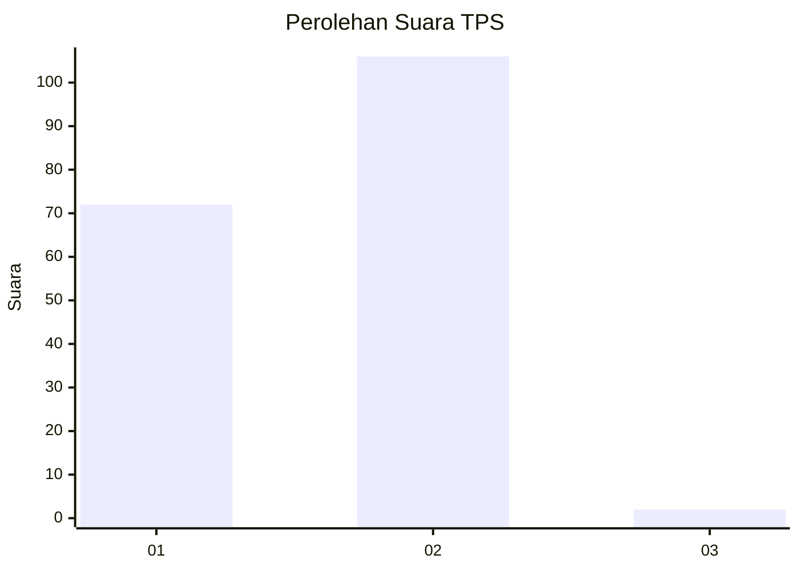
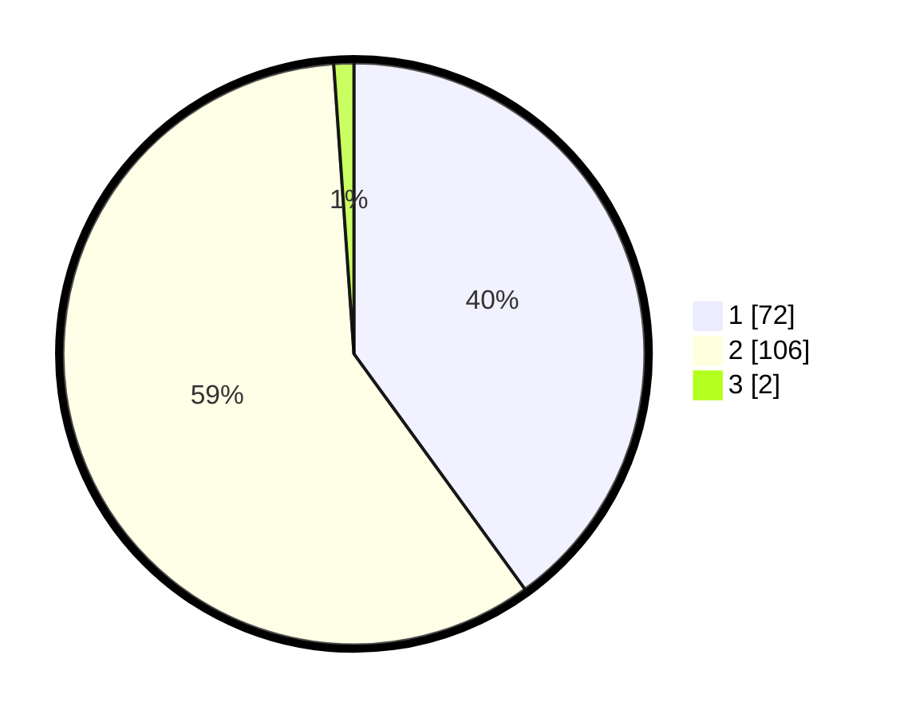

# Hasil

## Grafik

## Tabel

| No. | Nama Paslon    | Suara | Suara (raw) | Persentase |
|:--- |:-------------- | -----:| -----------:| ----------:|
| 1   | ANIES MUHAIMIN | 72    | [72][p-1]   | 40,00      |
| 2   | PRABOWO GIBRAN | 106   | [106][p-2]  | 58,89      |
| 3   | GANJAR MAHFUD  | 2     | [2][p-3]    | 1,11       |

[p-1]: https://github.com/gigit-pemilu/pemilu-2024-81-maluku/blob/main/pilpres/hitung-suara/sub/81-maluku/sub/01-maluku-tengah/sub/01-amahai/sub/1009-hollo/sub/001-tps/sub/paslon-1.txt
[p-2]: https://github.com/gigit-pemilu/pemilu-2024-81-maluku/blob/main/pilpres/hitung-suara/sub/81-maluku/sub/01-maluku-tengah/sub/01-amahai/sub/1009-hollo/sub/001-tps/sub/paslon-2.txt
[p-3]: https://github.com/gigit-pemilu/pemilu-2024-81-maluku/blob/main/pilpres/hitung-suara/sub/81-maluku/sub/01-maluku-tengah/sub/01-amahai/sub/1009-hollo/sub/001-tps/sub/paslon-3.txt

## Foto C Plano

https://sirekap-obj-formc.kpu.go.id/b7e2/pemilu/ppwp/81/01/01/10/09/8101011009001-20240215-101432--bb7bbfb2-d2b3-4a1d-9659-80ea2c259e5d.jpg

https://sirekap-obj-formc.kpu.go.id/b7e2/pemilu/ppwp/81/01/01/10/09/8101011009001-20240215-101930--31d3a4e2-fd29-4d66-91c0-e2bbe84bb839.jpg

https://sirekap-obj-formc.kpu.go.id/b7e2/pemilu/ppwp/81/01/01/10/09/8101011009001-20240215-102731--98027ee6-429b-40a5-81c7-685cc3424206.jpg

## Metadata

| Key        | Value               |
| ---------- | ------------------- |
| Time Stamp | 2024-02-15 21:01:18 |

