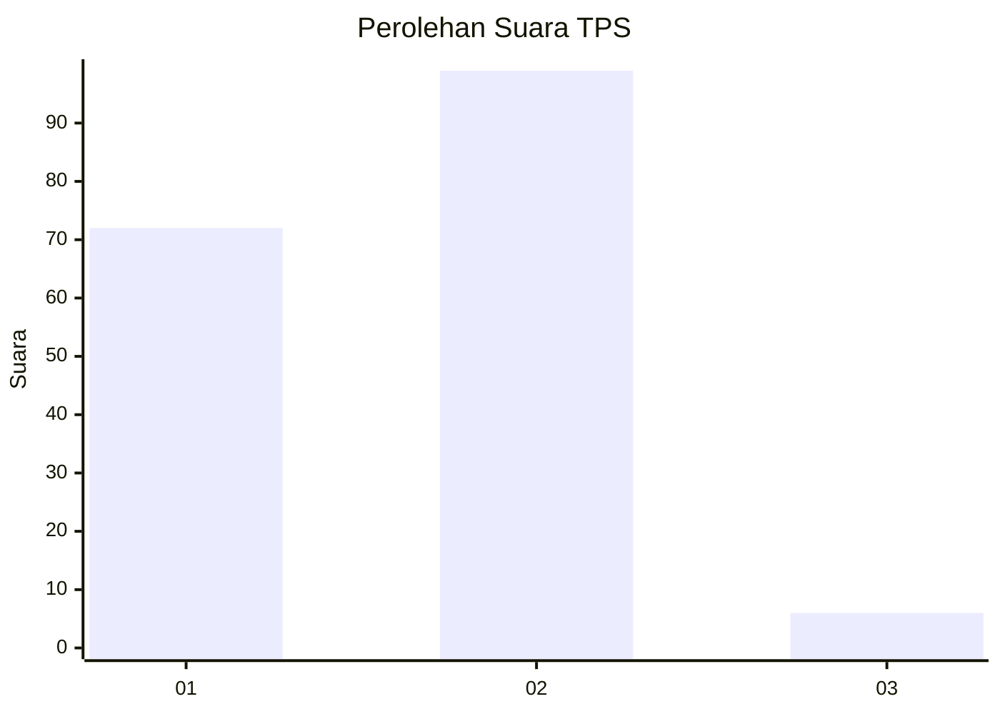
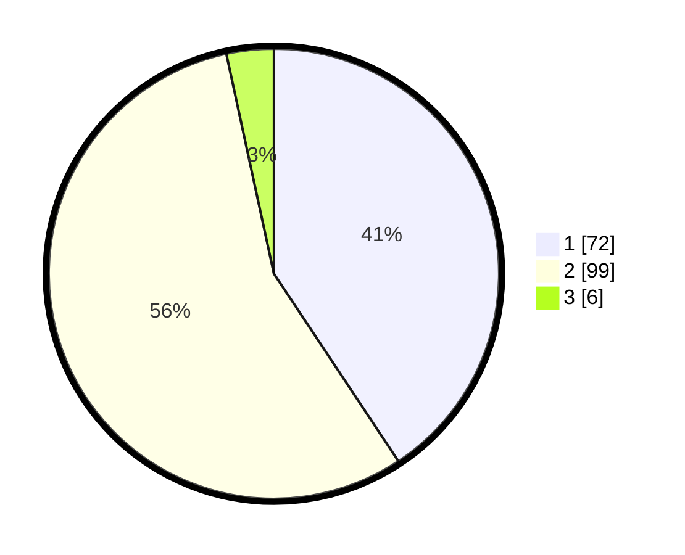

# Hasil

## Grafik

## Tabel

| No. | Nama Paslon    | Suara | Suara (raw) | Persentase |
|:--- |:-------------- | -----:| -----------:| ----------:|
| 1   | ANIES MUHAIMIN | 72    | [72][p-1]   | 40,68      |
| 2   | PRABOWO GIBRAN | 99    | [99][p-2]   | 55,93      |
| 3   | GANJAR MAHFUD  | 6     | [6][p-3]    | 3,39       |

[p-1]: https://github.com/gigit-pemilu/pemilu-2024-81-maluku/blob/main/pilpres/hitung-suara/sub/81-maluku/sub/01-maluku-tengah/sub/01-amahai/sub/1009-hollo/sub/003-tps/sub/paslon-1.txt
[p-2]: https://github.com/gigit-pemilu/pemilu-2024-81-maluku/blob/main/pilpres/hitung-suara/sub/81-maluku/sub/01-maluku-tengah/sub/01-amahai/sub/1009-hollo/sub/003-tps/sub/paslon-2.txt
[p-3]: https://github.com/gigit-pemilu/pemilu-2024-81-maluku/blob/main/pilpres/hitung-suara/sub/81-maluku/sub/01-maluku-tengah/sub/01-amahai/sub/1009-hollo/sub/003-tps/sub/paslon-3.txt

## Foto C Plano

https://sirekap-obj-formc.kpu.go.id/c70e/pemilu/ppwp/81/01/01/10/09/8101011009003-20240215-151114--9b45fe0d-aa29-4aa8-862a-e23aecb7e03f.jpg

https://sirekap-obj-formc.kpu.go.id/c70e/pemilu/ppwp/81/01/01/10/09/8101011009003-20240215-151402--e5c7a35b-e4f3-49f3-9679-8711ccb7454c.jpg

https://sirekap-obj-formc.kpu.go.id/c70e/pemilu/ppwp/81/01/01/10/09/8101011009003-20240215-151745--3f342487-6b08-452f-8f01-319fc1c4beae.jpg

## Metadata

| Key        | Value               |
| ---------- | ------------------- |
| Time Stamp | 2024-02-19 06:16:00 |

## DATA PEMILIH TETAP

Jumlah pemilih dalam DPT: **281**.
 * L: **136**.
 * P: **145**.

## DATA PENGGUNA HAK PILIH

Jumlah pengguna hak pilih dalam DPT: **172**.
 * L: **84**.
 * P: **88**.

Jumlah pengguna hak pilih dalam DPTb: **0**.
 * L: **0**.
 * P: **0**.

Jumlah pengguna hak pilih dalam DPK: **8**.
 * L: **4**.
 * P: **4**.

Jumlah pengguna hak pilih: **180**.
 * L: **88**.
 * P: **92**.

## JUMLAH SUARA SAH DAN TIDAK SAH

JUMLAH SELURUH SUARA SAH: **177**.

JUMLAH SUARA TIDAK SAH: **3**.

JUMLAH SELURUH SUARA SAH DAN SUARA TIDAK SAH: **180**.

