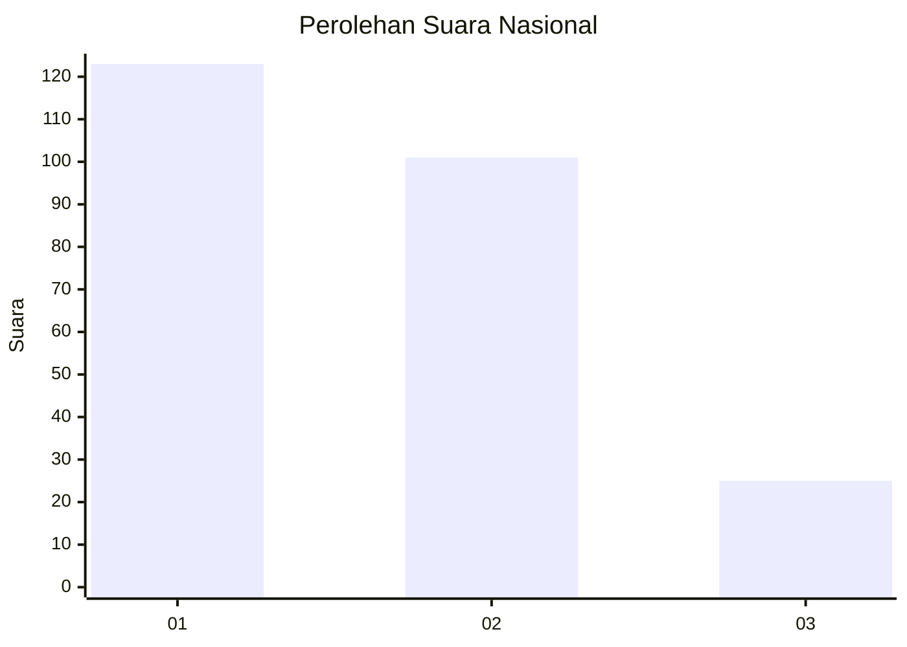
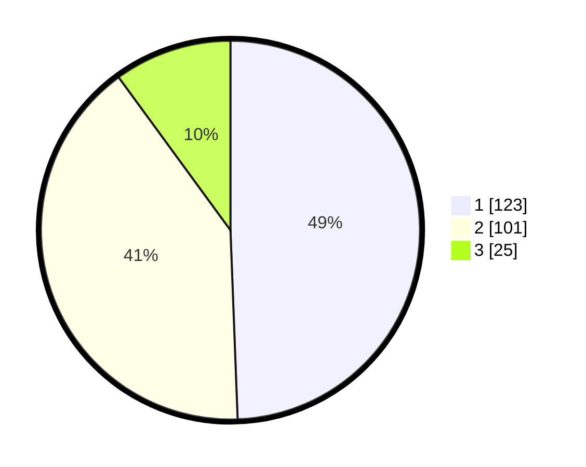

# Hasil

## Grafik

## Tabel

| No. | Nama Paslon    | Suara | Suara (raw) | Persentase |
|:--- |:-------------- | -----:| -----------:| ----------:|
| 1   | ANIES MUHAIMIN | 123   | [123][p-1]  | 49,40      |
| 2   | PRABOWO GIBRAN | 101   | [101][p-2]  | 40,56      |
| 3   | GANJAR MAHFUD  | 25    | [25][p-3]   | 10,04      |

[p-1]: https://github.com/gigit-pemilu/pemilu-2024/blob/main/pilpres/hitung-suara/sub/81-maluku/sub/01-maluku-tengah/sub/01-amahai/sub/2001-tamilouw/sub/001-tps/sub/paslon-1.txt
[p-2]: https://github.com/gigit-pemilu/pemilu-2024/blob/main/pilpres/hitung-suara/sub/81-maluku/sub/01-maluku-tengah/sub/01-amahai/sub/2001-tamilouw/sub/001-tps/sub/paslon-2.txt
[p-3]: https://github.com/gigit-pemilu/pemilu-2024/blob/main/pilpres/hitung-suara/sub/81-maluku/sub/01-maluku-tengah/sub/01-amahai/sub/2001-tamilouw/sub/001-tps/sub/paslon-3.txt

## Foto C Plano

https://sirekap-obj-formc.kpu.go.id/4cf9/pemilu/ppwp/81/01/01/20/01/8101012001001-20240215-163839--8bac72b5-b232-4c57-992c-c5c9f06fa0a2.jpg

https://sirekap-obj-formc.kpu.go.id/4cf9/pemilu/ppwp/81/01/01/20/01/8101012001001-20240215-164006--a0f844bd-47db-424d-a912-b88a733c8cd1.jpg

https://sirekap-obj-formc.kpu.go.id/4cf9/pemilu/ppwp/81/01/01/20/01/8101012001001-20240215-164120--64d09252-ba9f-48df-a0f8-0dd85f8addc7.jpg

## Metadata

| Key        | Value               |
| ---------- | ------------------- |
| Time Stamp | 2024-02-15 22:30:27 |

