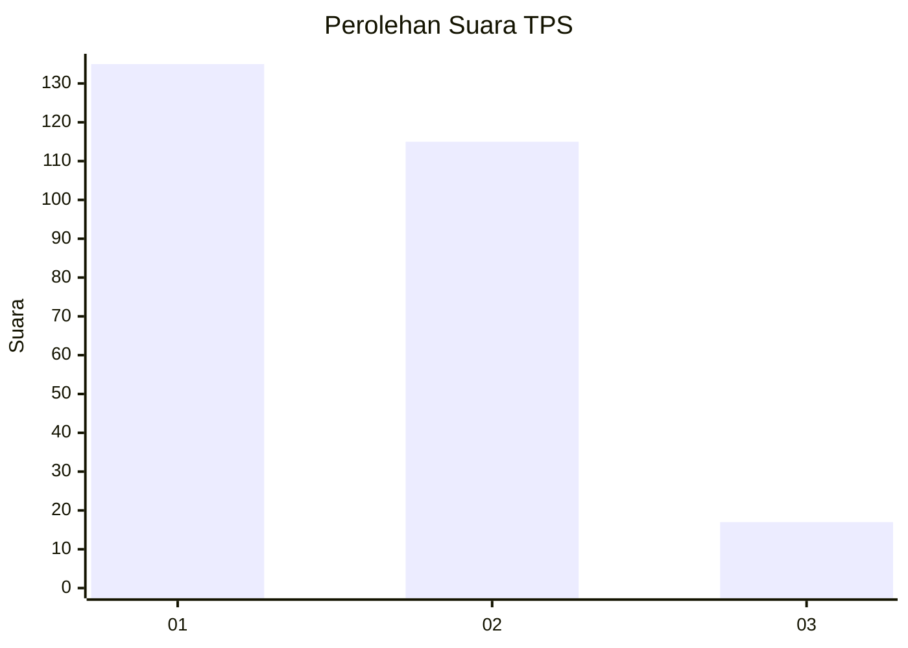
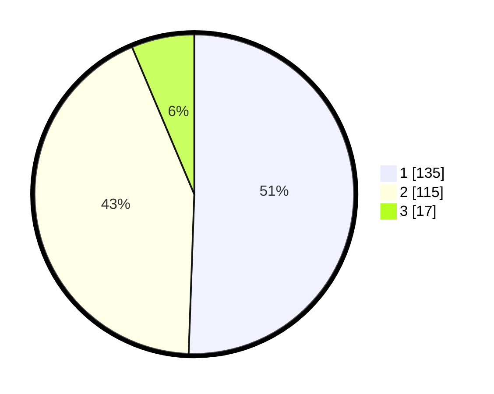

# Hasil

## Grafik

## Tabel

| No. | Nama Paslon    | Suara | Suara (raw) | Persentase |
|:--- |:-------------- | -----:| -----------:| ----------:|
| 1   | ANIES MUHAIMIN | 135   | [135][p-1]  | 50,56      |
| 2   | PRABOWO GIBRAN | 115   | [115][p-2]  | 43,07      |
| 3   | GANJAR MAHFUD  | 17    | [17][p-3]   | 6,37       |

[p-1]: https://github.com/gigit-pemilu/pemilu-2024-81-maluku/blob/main/pilpres/hitung-suara/sub/81-maluku/sub/01-maluku-tengah/sub/01-amahai/sub/2001-tamilouw/sub/002-tps/sub/paslon-1.txt
[p-2]: https://github.com/gigit-pemilu/pemilu-2024-81-maluku/blob/main/pilpres/hitung-suara/sub/81-maluku/sub/01-maluku-tengah/sub/01-amahai/sub/2001-tamilouw/sub/002-tps/sub/paslon-2.txt
[p-3]: https://github.com/gigit-pemilu/pemilu-2024-81-maluku/blob/main/pilpres/hitung-suara/sub/81-maluku/sub/01-maluku-tengah/sub/01-amahai/sub/2001-tamilouw/sub/002-tps/sub/paslon-3.txt

## Foto C Plano

https://sirekap-obj-formc.kpu.go.id/872c/pemilu/ppwp/81/01/01/20/01/8101012001002-20240215-165632--6d53bf9b-1246-4151-ad5c-3e42db75965c.jpg

https://sirekap-obj-formc.kpu.go.id/872c/pemilu/ppwp/81/01/01/20/01/8101012001002-20240215-170012--5b9ea83a-9b55-4066-b28b-700b3db8a955.jpg

https://sirekap-obj-formc.kpu.go.id/872c/pemilu/ppwp/81/01/01/20/01/8101012001002-20240215-170205--1875a6c1-f0fe-42ef-b54d-0a0c2fddc98b.jpg

## Metadata

| Key        | Value               |
| ---------- | ------------------- |
| Time Stamp | 2024-02-15 22:00:27 |

