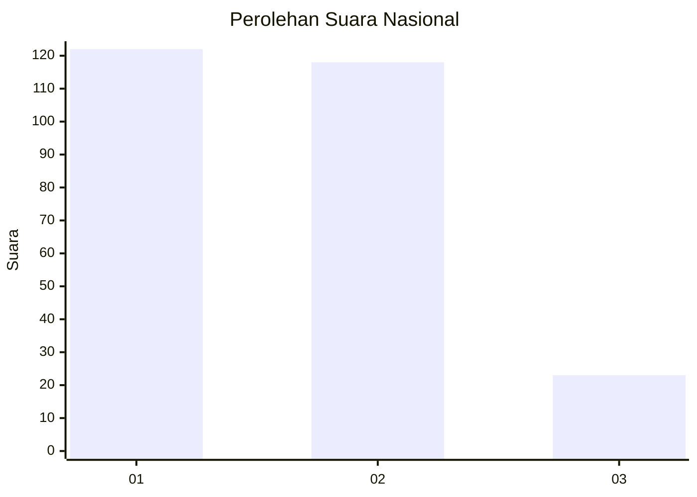
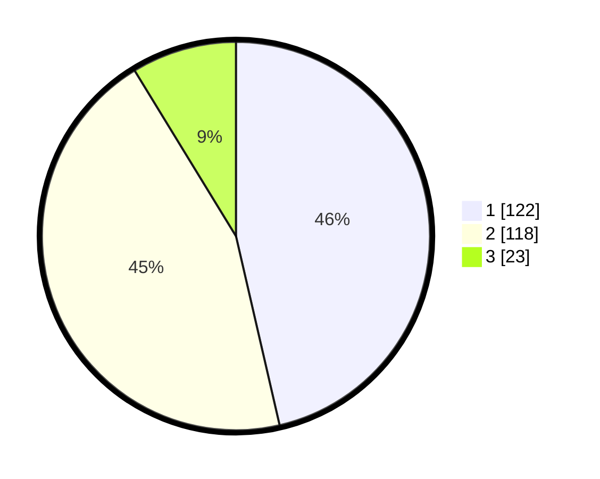

# Hasil

## Grafik

## Tabel

| No. | Nama Paslon    | Suara | Suara (raw) | Persentase |
|:--- |:-------------- | -----:| -----------:| ----------:|
| 1   | ANIES MUHAIMIN | 122   | [122][p-1]  | 46,39      |
| 2   | PRABOWO GIBRAN | 118   | [118][p-2]  | 44,87      |
| 3   | GANJAR MAHFUD  | 23    | [23][p-3]   | 8,75       |

[p-1]: https://github.com/gigit-pemilu/pemilu-2024/blob/main/pilpres/hitung-suara/sub/81-maluku/sub/01-maluku-tengah/sub/01-amahai/sub/2001-tamilouw/sub/005-tps/sub/paslon-1.txt
[p-2]: https://github.com/gigit-pemilu/pemilu-2024/blob/main/pilpres/hitung-suara/sub/81-maluku/sub/01-maluku-tengah/sub/01-amahai/sub/2001-tamilouw/sub/005-tps/sub/paslon-2.txt
[p-3]: https://github.com/gigit-pemilu/pemilu-2024/blob/main/pilpres/hitung-suara/sub/81-maluku/sub/01-maluku-tengah/sub/01-amahai/sub/2001-tamilouw/sub/005-tps/sub/paslon-3.txt

## Foto C Plano

https://sirekap-obj-formc.kpu.go.id/b5be/pemilu/ppwp/81/01/01/20/01/8101012001005-20240215-192143--8190f5d4-9d76-4df6-911c-688f45896e2c.jpg

https://sirekap-obj-formc.kpu.go.id/b5be/pemilu/ppwp/81/01/01/20/01/8101012001005-20240215-214009--c9a0b6cf-6c20-477f-8c95-0a4057175ade.jpg

https://sirekap-obj-formc.kpu.go.id/b5be/pemilu/ppwp/81/01/01/20/01/8101012001005-20240216-144520--606f1e96-692e-48f7-b379-06fb61b94714.jpg

## Metadata

| Key        | Value               |
| ---------- | ------------------- |
| Time Stamp | 2024-02-16 16:25:10 |

