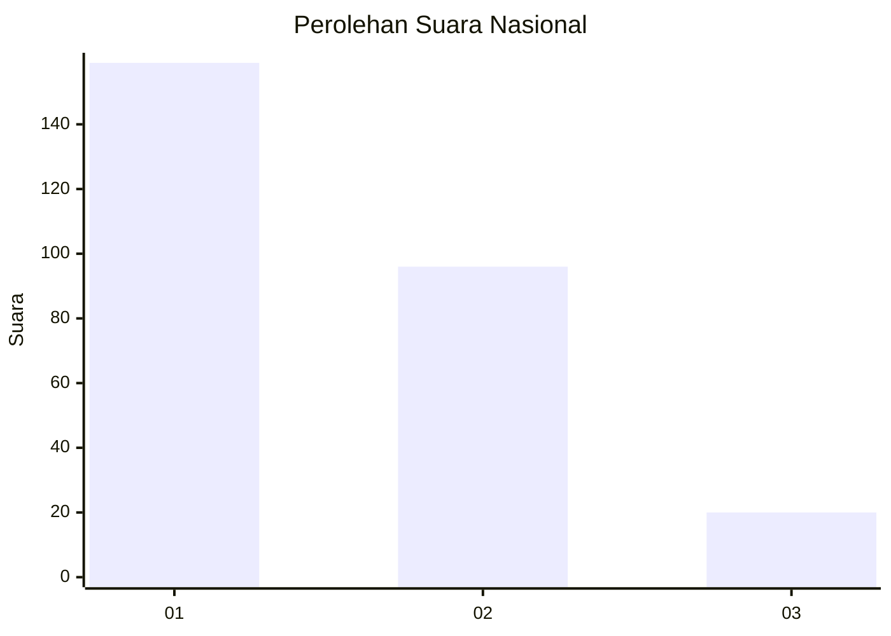
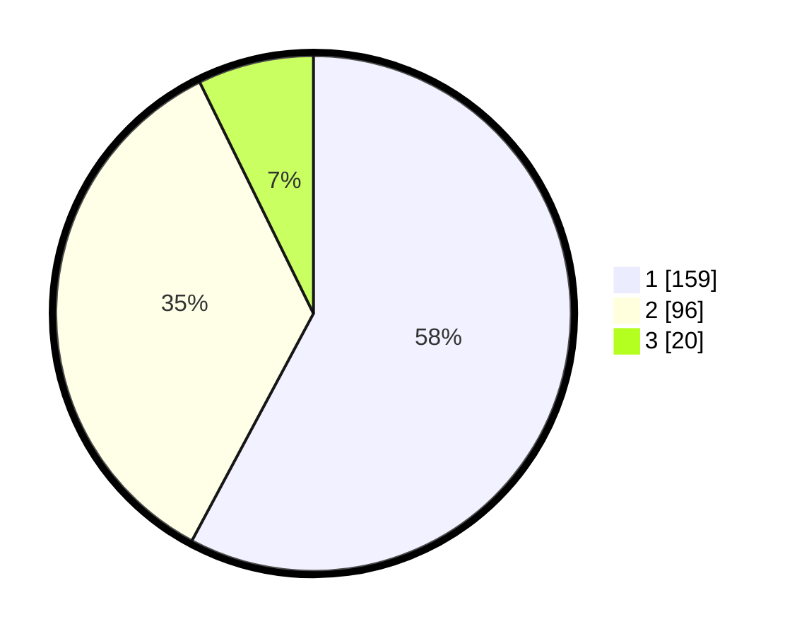

# Hasil

## Grafik

## Tabel

| No. | Nama Paslon    | Suara | Suara (raw) | Persentase |
|:--- |:-------------- | -----:| -----------:| ----------:|
| 1   | ANIES MUHAIMIN | 159   | [159][p-1]  | 57,82      |
| 2   | PRABOWO GIBRAN | 96    | [96][p-2]   | 34,91      |
| 3   | GANJAR MAHFUD  | 20    | [20][p-3]   | 7,27       |

[p-1]: https://github.com/gigit-pemilu/pemilu-2024/blob/main/pilpres/hitung-suara/sub/81-maluku/sub/01-maluku-tengah/sub/01-amahai/sub/2001-tamilouw/sub/009-tps/sub/paslon-1.txt
[p-2]: https://github.com/gigit-pemilu/pemilu-2024/blob/main/pilpres/hitung-suara/sub/81-maluku/sub/01-maluku-tengah/sub/01-amahai/sub/2001-tamilouw/sub/009-tps/sub/paslon-2.txt
[p-3]: https://github.com/gigit-pemilu/pemilu-2024/blob/main/pilpres/hitung-suara/sub/81-maluku/sub/01-maluku-tengah/sub/01-amahai/sub/2001-tamilouw/sub/009-tps/sub/paslon-3.txt

## Foto C Plano

https://sirekap-obj-formc.kpu.go.id/abaa/pemilu/ppwp/81/01/01/20/01/8101012001009-20240215-212645--4705f0ab-4086-4c59-8ad3-f4eb70101a5c.jpg

https://sirekap-obj-formc.kpu.go.id/abaa/pemilu/ppwp/81/01/01/20/01/8101012001009-20240215-212826--c32292ef-e439-4dfb-a250-056c31f3d252.jpg

https://sirekap-obj-formc.kpu.go.id/abaa/pemilu/ppwp/81/01/01/20/01/8101012001009-20240215-213012--e954a510-6472-4d36-90d8-c0f91a62e736.jpg

## Metadata

| Key        | Value               |
| ---------- | ------------------- |
| Time Stamp | 2024-02-15 22:30:27 |

