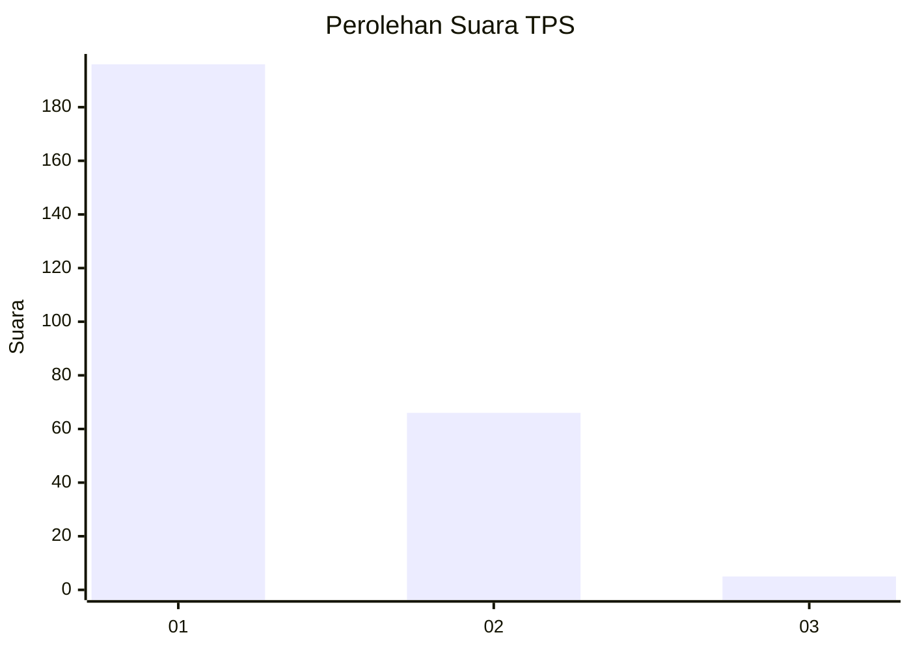
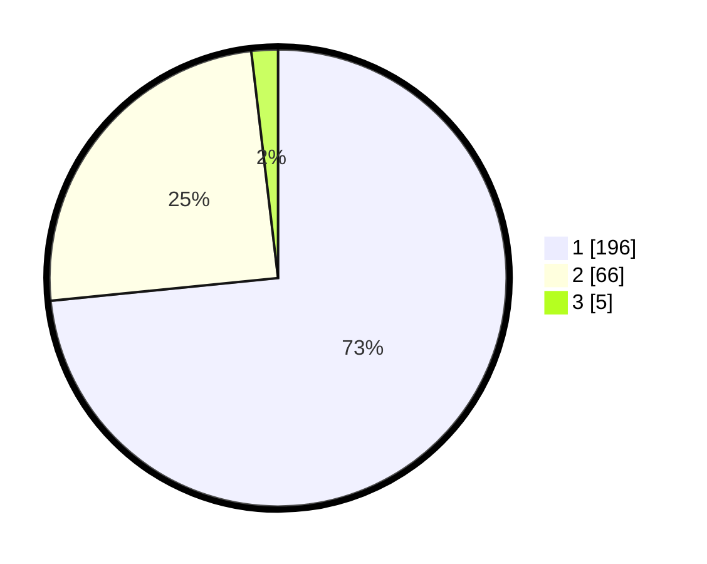

# Hasil

## Grafik

## Tabel

| No. | Nama Paslon    | Suara | Suara (raw) | Persentase |
|:--- |:-------------- | -----:| -----------:| ----------:|
| 1   | ANIES MUHAIMIN | 196   | [196][p-1]  | 73,41      |
| 2   | PRABOWO GIBRAN | 66    | [66][p-2]   | 24,72      |
| 3   | GANJAR MAHFUD  | 5     | [5][p-3]    | 1,87       |

[p-1]: https://github.com/gigit-pemilu/pemilu-2024-81-maluku/blob/main/pilpres/hitung-suara/sub/81-maluku/sub/01-maluku-tengah/sub/01-amahai/sub/2002-sepa/sub/009-tps/sub/paslon-1.txt
[p-2]: https://github.com/gigit-pemilu/pemilu-2024-81-maluku/blob/main/pilpres/hitung-suara/sub/81-maluku/sub/01-maluku-tengah/sub/01-amahai/sub/2002-sepa/sub/009-tps/sub/paslon-2.txt
[p-3]: https://github.com/gigit-pemilu/pemilu-2024-81-maluku/blob/main/pilpres/hitung-suara/sub/81-maluku/sub/01-maluku-tengah/sub/01-amahai/sub/2002-sepa/sub/009-tps/sub/paslon-3.txt

## Foto C Plano

https://sirekap-obj-formc.kpu.go.id/2c80/pemilu/ppwp/81/01/01/20/02/8101012002009-20240215-191754--80098936-3cc9-4422-b636-02baf9db193b.jpg

https://sirekap-obj-formc.kpu.go.id/2c80/pemilu/ppwp/81/01/01/20/02/8101012002009-20240215-221030--867fee55-5535-4bc6-a4ec-8e9edc5b9a0e.jpg

https://sirekap-obj-formc.kpu.go.id/2c80/pemilu/ppwp/81/01/01/20/02/8101012002009-20240215-221105--cbe833d6-2611-4640-9475-311bff569969.jpg

## Metadata

| Key        | Value               |
| ---------- | ------------------- |
| Time Stamp | 2024-02-15 22:40:13 |

