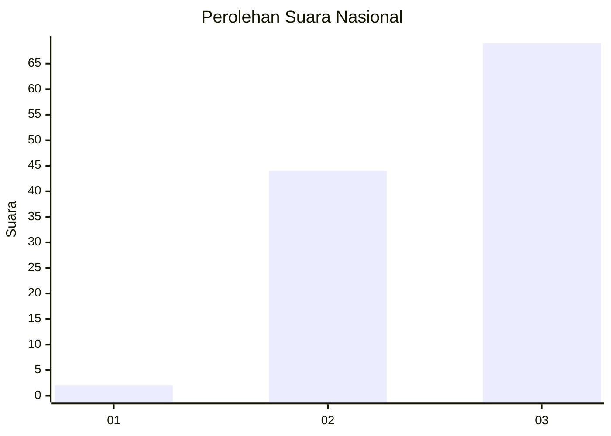
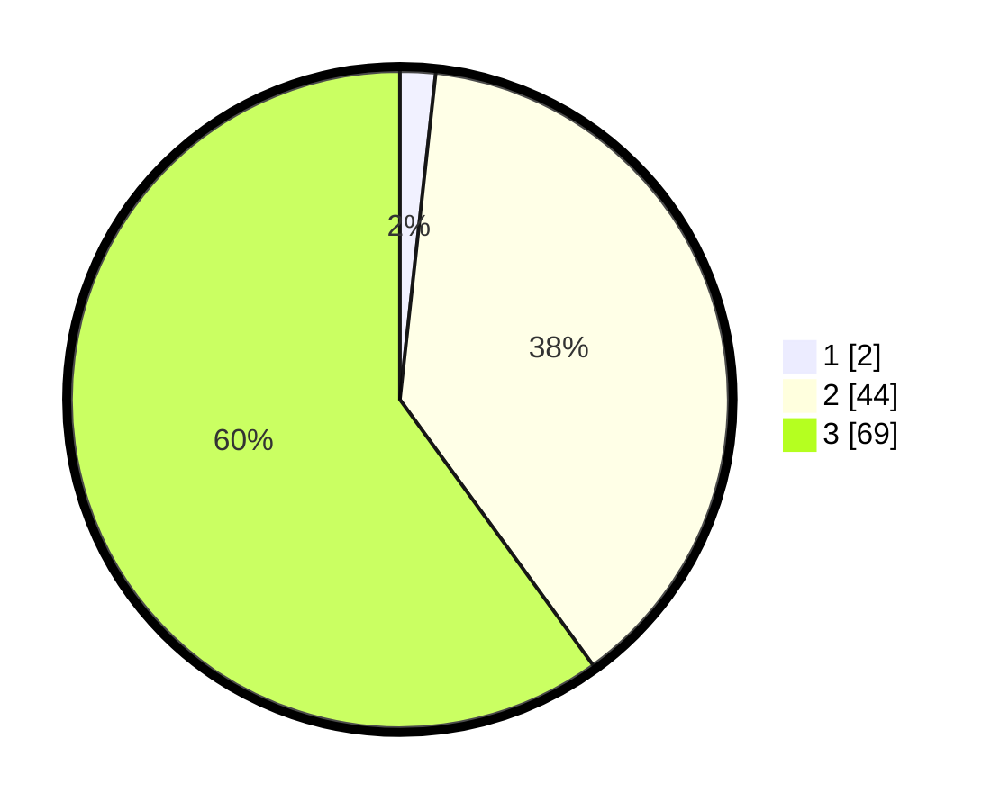

# Hasil

## Grafik

## Tabel

| No. | Nama Paslon    | Suara | Suara (raw) | Persentase |
|:--- |:-------------- | -----:| -----------:| ----------:|
| 1   | ANIES MUHAIMIN | 2     | [2][p-1]    | 1,74       |
| 2   | PRABOWO GIBRAN | 44    | [44][p-2]   | 38,26      |
| 3   | GANJAR MAHFUD  | 69    | [69][p-3]   | 60,00      |

[p-1]: https://github.com/gigit-pemilu/pemilu-2024/blob/main/pilpres/hitung-suara/sub/81-maluku/sub/01-maluku-tengah/sub/01-amahai/sub/2010-yafila/sub/002-tps/sub/paslon-1.txt
[p-2]: https://github.com/gigit-pemilu/pemilu-2024/blob/main/pilpres/hitung-suara/sub/81-maluku/sub/01-maluku-tengah/sub/01-amahai/sub/2010-yafila/sub/002-tps/sub/paslon-2.txt
[p-3]: https://github.com/gigit-pemilu/pemilu-2024/blob/main/pilpres/hitung-suara/sub/81-maluku/sub/01-maluku-tengah/sub/01-amahai/sub/2010-yafila/sub/002-tps/sub/paslon-3.txt

## Foto C Plano

https://sirekap-obj-formc.kpu.go.id/15df/pemilu/ppwp/81/01/01/20/10/8101012010002-20240215-233749--0117ecef-f84b-45b8-9301-6de2d599591b.jpg

https://sirekap-obj-formc.kpu.go.id/15df/pemilu/ppwp/81/01/01/20/10/8101012010002-20240215-140716--e1353044-3c52-423b-848f-940e2b9446be.jpg

https://sirekap-obj-formc.kpu.go.id/15df/pemilu/ppwp/81/01/01/20/10/8101012010002-20240215-140814--0df16ad9-7fcd-4558-935a-fc722fd5e01f.jpg

## Metadata

| Key        | Value               |
| ---------- | ------------------- |
| Time Stamp | 2024-02-19 06:16:00 |

