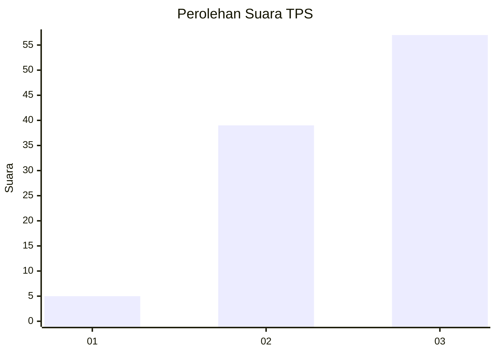
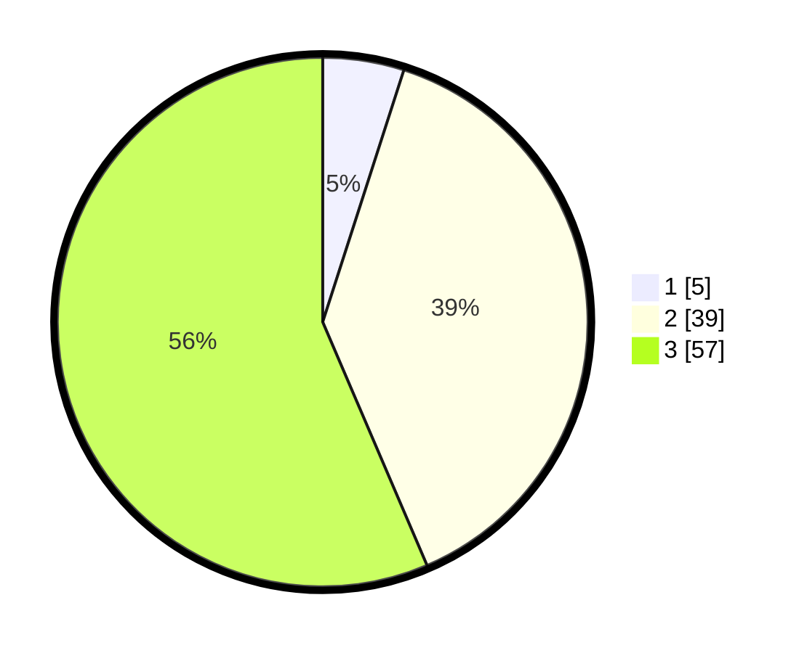

# Hasil

## Grafik

## Tabel

| No. | Nama Paslon    | Suara | Suara (raw) | Persentase |
|:--- |:-------------- | -----:| -----------:| ----------:|
| 1   | ANIES MUHAIMIN | 5     | [5][p-1]    | 4,95       |
| 2   | PRABOWO GIBRAN | 39    | [39][p-2]   | 38,61      |
| 3   | GANJAR MAHFUD  | 57    | [57][p-3]   | 56,44      |

[p-1]: https://github.com/gigit-pemilu/pemilu-2024-81-maluku/blob/main/pilpres/hitung-suara/sub/81-maluku/sub/01-maluku-tengah/sub/01-amahai/sub/2021-nua-nea/sub/002-tps/sub/paslon-1.txt
[p-2]: https://github.com/gigit-pemilu/pemilu-2024-81-maluku/blob/main/pilpres/hitung-suara/sub/81-maluku/sub/01-maluku-tengah/sub/01-amahai/sub/2021-nua-nea/sub/002-tps/sub/paslon-2.txt
[p-3]: https://github.com/gigit-pemilu/pemilu-2024-81-maluku/blob/main/pilpres/hitung-suara/sub/81-maluku/sub/01-maluku-tengah/sub/01-amahai/sub/2021-nua-nea/sub/002-tps/sub/paslon-3.txt

## Foto C Plano

https://sirekap-obj-formc.kpu.go.id/29d9/pemilu/ppwp/81/01/01/20/21/8101012021002-20240216-190028--86fff559-be2a-45ed-b176-162842da6590.jpg

https://sirekap-obj-formc.kpu.go.id/29d9/pemilu/ppwp/81/01/01/20/21/8101012021002-20240216-190135--d1350c45-f414-4594-bc3b-11283d48eca5.jpg

https://sirekap-obj-formc.kpu.go.id/29d9/pemilu/ppwp/81/01/01/20/21/8101012021002-20240216-190200--06e3d14d-609a-4fdb-9954-749e5767990e.jpg

## Metadata

| Key        | Value               |
| ---------- | ------------------- |
| Time Stamp | 2024-02-19 16:00:00 |

