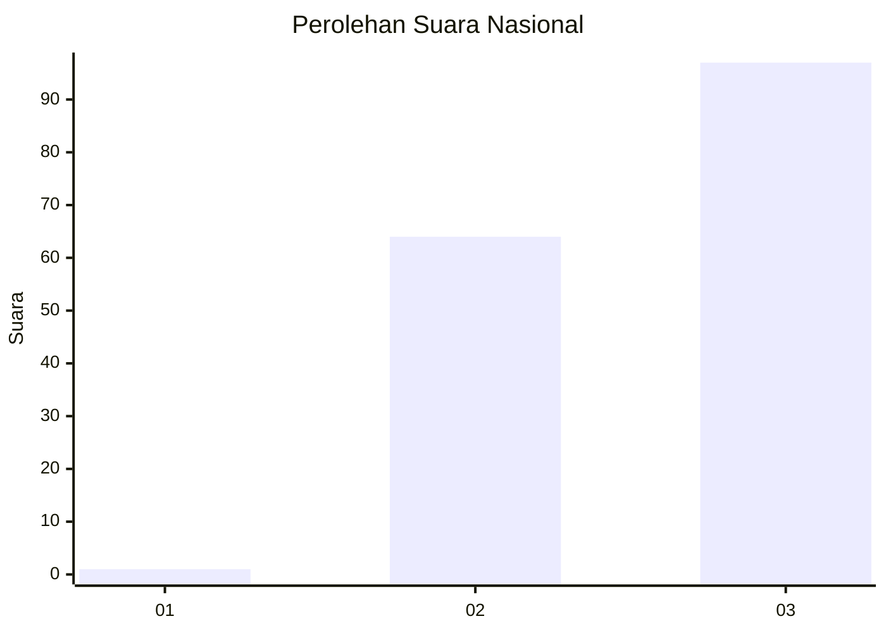
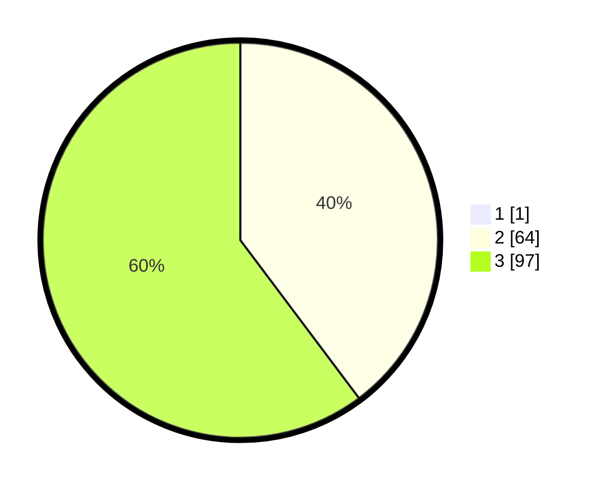

# Hasil

## Grafik

## Tabel

| No. | Nama Paslon    | Suara | Suara (raw) | Persentase |
|:--- |:-------------- | -----:| -----------:| ----------:|
| 1   | ANIES MUHAIMIN | 1     | [1][p-1]    | 0,62       |
| 2   | PRABOWO GIBRAN | 64    | [64][p-2]   | 39,51      |
| 3   | GANJAR MAHFUD  | 97    | [97][p-3]   | 59,88      |

[p-1]: https://github.com/gigit-pemilu/pemilu-2024/blob/main/pilpres/hitung-suara/sub/81-maluku/sub/01-maluku-tengah/sub/02-teon-nila-serua/sub/2002-kuralele/sub/001-tps/sub/paslon-1.txt
[p-2]: https://github.com/gigit-pemilu/pemilu-2024/blob/main/pilpres/hitung-suara/sub/81-maluku/sub/01-maluku-tengah/sub/02-teon-nila-serua/sub/2002-kuralele/sub/001-tps/sub/paslon-2.txt
[p-3]: https://github.com/gigit-pemilu/pemilu-2024/blob/main/pilpres/hitung-suara/sub/81-maluku/sub/01-maluku-tengah/sub/02-teon-nila-serua/sub/2002-kuralele/sub/001-tps/sub/paslon-3.txt

## Foto C Plano

https://sirekap-obj-formc.kpu.go.id/7b27/pemilu/ppwp/81/01/02/20/02/8101022002001-20240215-134117--3d16b4ef-9d9c-4c89-ac5e-f88e88a8df48.jpg

https://sirekap-obj-formc.kpu.go.id/7b27/pemilu/ppwp/81/01/02/20/02/8101022002001-20240215-134633--12ff5279-12fb-43a3-a3ed-fcd5df19bb18.jpg

https://sirekap-obj-formc.kpu.go.id/7b27/pemilu/ppwp/81/01/02/20/02/8101022002001-20240215-155832--0fac24a9-9038-4eff-a08f-b5f1ed9795e3.jpg

## Metadata

| Key        | Value               |
| ---------- | ------------------- |
| Time Stamp | 2024-02-16 17:00:00 |

