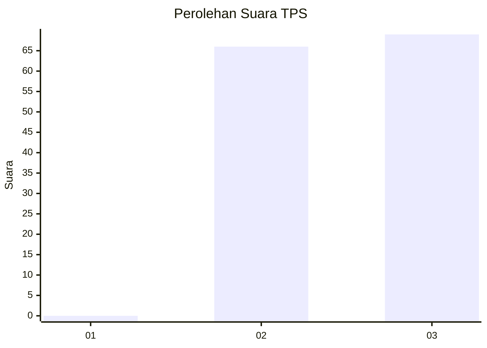
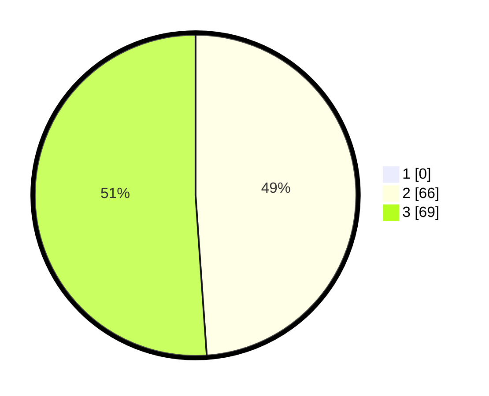

# Hasil

## Grafik

## Tabel

| No. | Nama Paslon    | Suara | Suara (raw) | Persentase |
|:--- |:-------------- | -----:| -----------:| ----------:|
| 1   | ANIES MUHAIMIN | 0     | [0][p-1]    | 0,00       |
| 2   | PRABOWO GIBRAN | 66    | [66][p-2]   | 48,89      |
| 3   | GANJAR MAHFUD  | 69    | [69][p-3]   | 51,11      |

[p-1]: https://github.com/gigit-pemilu/pemilu-2024-81-maluku/blob/main/pilpres/hitung-suara/sub/81-maluku/sub/01-maluku-tengah/sub/02-teon-nila-serua/sub/2004-messa/sub/001-tps/sub/paslon-1.txt
[p-2]: https://github.com/gigit-pemilu/pemilu-2024-81-maluku/blob/main/pilpres/hitung-suara/sub/81-maluku/sub/01-maluku-tengah/sub/02-teon-nila-serua/sub/2004-messa/sub/001-tps/sub/paslon-2.txt
[p-3]: https://github.com/gigit-pemilu/pemilu-2024-81-maluku/blob/main/pilpres/hitung-suara/sub/81-maluku/sub/01-maluku-tengah/sub/02-teon-nila-serua/sub/2004-messa/sub/001-tps/sub/paslon-3.txt

## Foto C Plano

https://sirekap-obj-formc.kpu.go.id/d1be/pemilu/ppwp/81/01/02/20/04/8101022004001-20240215-003829--0989a4a9-557f-45b1-a569-6b062373e98d.jpg

https://sirekap-obj-formc.kpu.go.id/d1be/pemilu/ppwp/81/01/02/20/04/8101022004001-20240215-004042--3f770799-659b-46df-9f7e-6dd908dfa051.jpg

https://sirekap-obj-formc.kpu.go.id/d1be/pemilu/ppwp/81/01/02/20/04/8101022004001-20240215-004305--706df36f-20aa-4e4a-927d-54e4d5428ff9.jpg

## Metadata

| Key        | Value               |
| ---------- | ------------------- |
| Time Stamp | 2024-02-15 16:00:26 |

