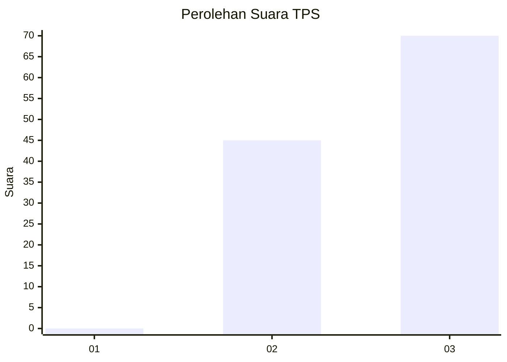
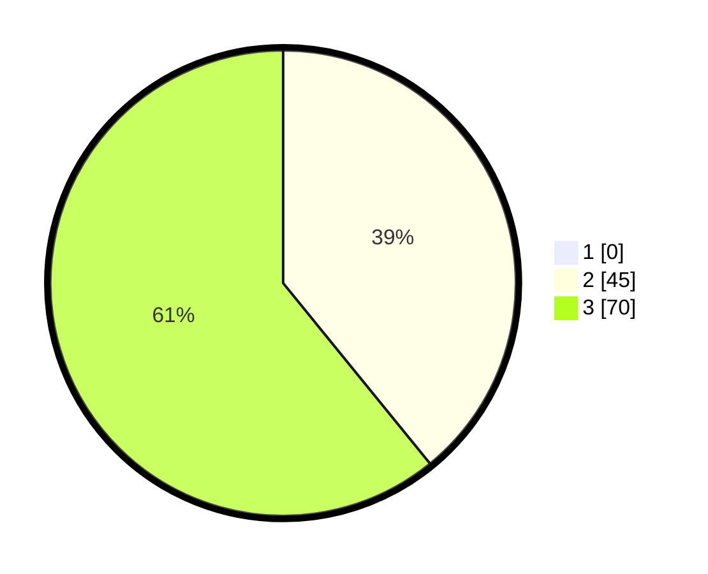

# Hasil

## Grafik

## Tabel

| No. | Nama Paslon    | Suara | Suara (raw) | Persentase |
|:--- |:-------------- | -----:| -----------:| ----------:|
| 1   | ANIES MUHAIMIN | 0     | [0][p-1]    | 0,00       |
| 2   | PRABOWO GIBRAN | 45    | [45][p-2]   | 39,13      |
| 3   | GANJAR MAHFUD  | 70    | [70][p-3]   | 60,87      |

[p-1]: https://github.com/gigit-pemilu/pemilu-2024-81-maluku/blob/main/pilpres/hitung-suara/sub/81-maluku/sub/01-maluku-tengah/sub/02-teon-nila-serua/sub/2004-messa/sub/003-tps/sub/paslon-1.txt
[p-2]: https://github.com/gigit-pemilu/pemilu-2024-81-maluku/blob/main/pilpres/hitung-suara/sub/81-maluku/sub/01-maluku-tengah/sub/02-teon-nila-serua/sub/2004-messa/sub/003-tps/sub/paslon-2.txt
[p-3]: https://github.com/gigit-pemilu/pemilu-2024-81-maluku/blob/main/pilpres/hitung-suara/sub/81-maluku/sub/01-maluku-tengah/sub/02-teon-nila-serua/sub/2004-messa/sub/003-tps/sub/paslon-3.txt

## Foto C Plano

https://sirekap-obj-formc.kpu.go.id/31fc/pemilu/ppwp/81/01/02/20/04/8101022004003-20240215-092642--2006bb59-bc70-4ceb-b159-55a79b6670df.jpg

https://sirekap-obj-formc.kpu.go.id/31fc/pemilu/ppwp/81/01/02/20/04/8101022004003-20240215-093253--63819945-23e8-42e6-ae55-eeea7a3a0292.jpg

https://sirekap-obj-formc.kpu.go.id/31fc/pemilu/ppwp/81/01/02/20/04/8101022004003-20240215-093608--f8c5a358-376b-49bb-b85e-aa19d0c35a9c.jpg

## Metadata

| Key        | Value               |
| ---------- | ------------------- |
| Time Stamp | 2024-02-19 16:00:00 |

