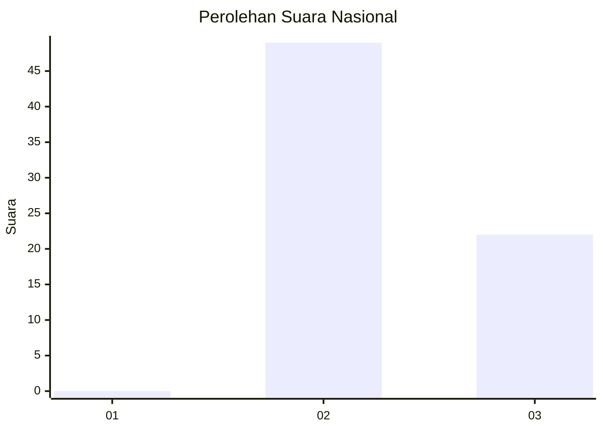
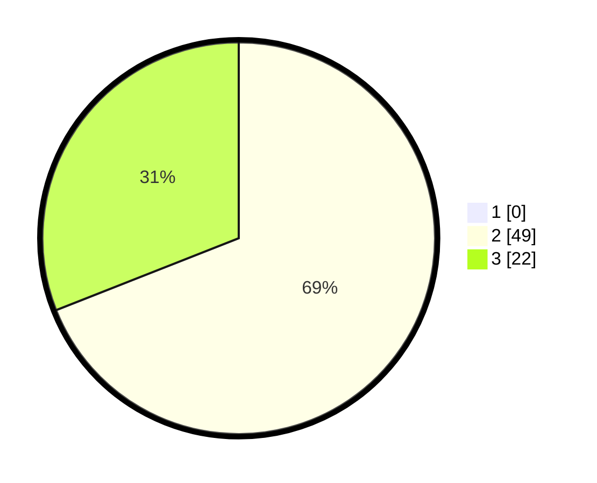

# Hasil

## Grafik

## Tabel

| No. | Nama Paslon    | Suara | Suara (raw) | Persentase |
|:--- |:-------------- | -----:| -----------:| ----------:|
| 1   | ANIES MUHAIMIN | 0     | [0][p-1]    | 0,00       |
| 2   | PRABOWO GIBRAN | 49    | [49][p-2]   | 69,01      |
| 3   | GANJAR MAHFUD  | 22    | [22][p-3]   | 30,99      |

[p-1]: https://github.com/gigit-pemilu/pemilu-2024/blob/main/pilpres/hitung-suara/sub/81-maluku/sub/01-maluku-tengah/sub/02-teon-nila-serua/sub/2011-issu/sub/003-tps/sub/paslon-1.txt
[p-2]: https://github.com/gigit-pemilu/pemilu-2024/blob/main/pilpres/hitung-suara/sub/81-maluku/sub/01-maluku-tengah/sub/02-teon-nila-serua/sub/2011-issu/sub/003-tps/sub/paslon-2.txt
[p-3]: https://github.com/gigit-pemilu/pemilu-2024/blob/main/pilpres/hitung-suara/sub/81-maluku/sub/01-maluku-tengah/sub/02-teon-nila-serua/sub/2011-issu/sub/003-tps/sub/paslon-3.txt

## Foto C Plano

https://sirekap-obj-formc.kpu.go.id/0981/pemilu/ppwp/81/01/02/20/11/8101022011003-20240215-071504--0b86f934-e085-4d16-97d4-dd150489841a.jpg

https://sirekap-obj-formc.kpu.go.id/0981/pemilu/ppwp/81/01/02/20/11/8101022011003-20240215-071120--6cd1eab3-4ea6-452c-8849-71954e6b4a30.jpg

https://sirekap-obj-formc.kpu.go.id/0981/pemilu/ppwp/81/01/02/20/11/8101022011003-20240215-071305--8cc6f5c0-4d40-4d0e-a033-0044a8bf04d4.jpg

## Metadata

| Key        | Value               |
| ---------- | ------------------- |
| Time Stamp | 2024-02-16 09:00:28 |

