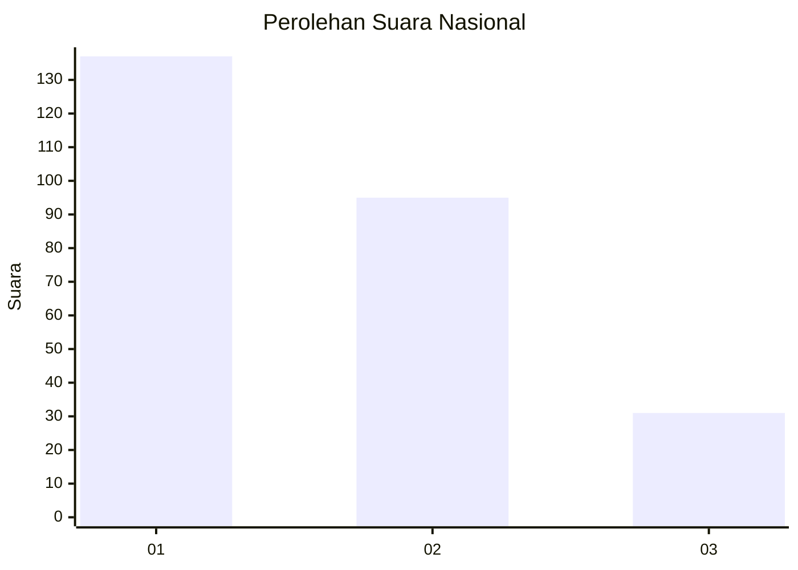
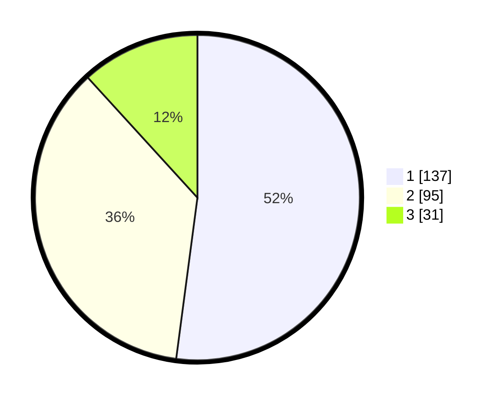

# Hasil

## Grafik

## Tabel

| No. | Nama Paslon    | Suara | Suara (raw) | Persentase |
|:--- |:-------------- | -----:| -----------:| ----------:|
| 1   | ANIES MUHAIMIN | 137   | [137][p-1]  | 52,09      |
| 2   | PRABOWO GIBRAN | 95    | [95][p-2]   | 36,12      |
| 3   | GANJAR MAHFUD  | 31    | [31][p-3]   | 11,79      |

[p-1]: https://github.com/gigit-pemilu/pemilu-2024/blob/main/pilpres/hitung-suara/sub/81-maluku/sub/01-maluku-tengah/sub/06-seram-utara/sub/2022-sawai/sub/002-tps/sub/paslon-1.txt
[p-2]: https://github.com/gigit-pemilu/pemilu-2024/blob/main/pilpres/hitung-suara/sub/81-maluku/sub/01-maluku-tengah/sub/06-seram-utara/sub/2022-sawai/sub/002-tps/sub/paslon-2.txt
[p-3]: https://github.com/gigit-pemilu/pemilu-2024/blob/main/pilpres/hitung-suara/sub/81-maluku/sub/01-maluku-tengah/sub/06-seram-utara/sub/2022-sawai/sub/002-tps/sub/paslon-3.txt

## Foto C Plano

https://sirekap-obj-formc.kpu.go.id/12bf/pemilu/ppwp/81/01/06/20/22/8101062022002-20240216-053421--2cd09aa7-0da6-4f6f-9b09-dd85ceefdc8f.jpg

https://sirekap-obj-formc.kpu.go.id/12bf/pemilu/ppwp/81/01/06/20/22/8101062022002-20240216-055623--3fbfc2c8-af75-415a-a818-2c32b7cc44d8.jpg

https://sirekap-obj-formc.kpu.go.id/12bf/pemilu/ppwp/81/01/06/20/22/8101062022002-20240216-054319--d87e6967-d2d6-46c4-9325-859d9b8ed360.jpg

## Metadata

| Key        | Value               |
| ---------- | ------------------- |
| Time Stamp | 2024-02-19 16:00:00 |

