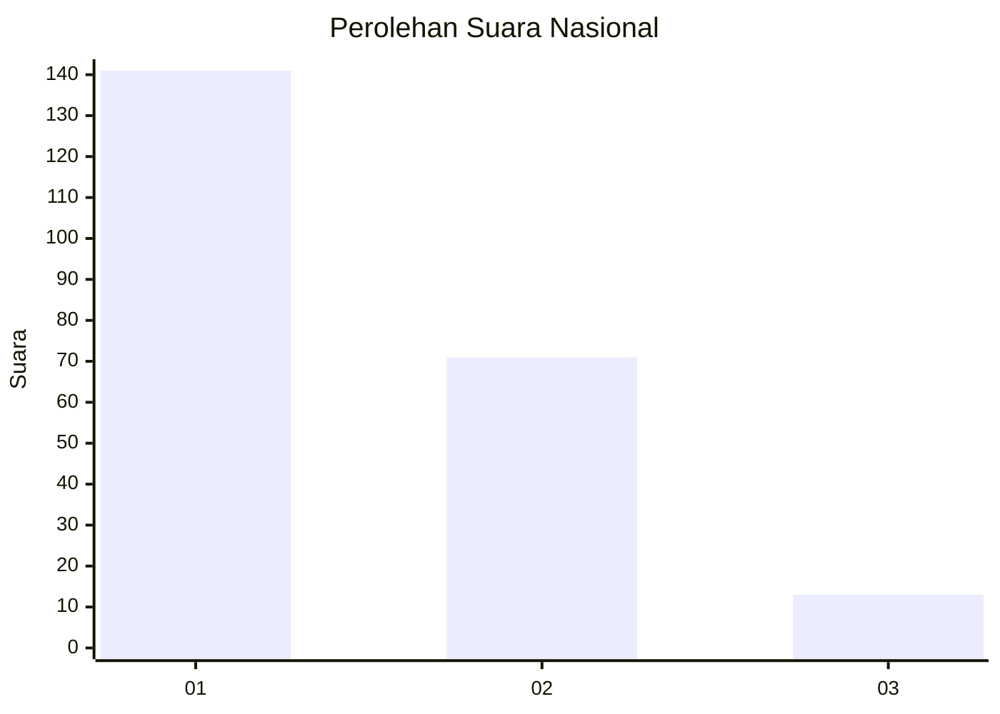
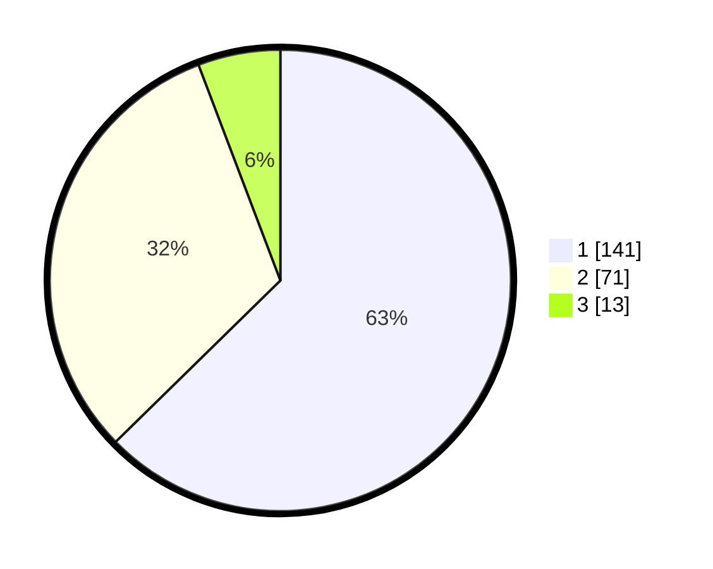

# Hasil

## Grafik

## Tabel

| No. | Nama Paslon    | Suara | Suara (raw) | Persentase |
|:--- |:-------------- | -----:| -----------:| ----------:|
| 1   | ANIES MUHAIMIN | 141   | [141][p-1]  | 62,67      |
| 2   | PRABOWO GIBRAN | 71    | [71][p-2]   | 31,56      |
| 3   | GANJAR MAHFUD  | 13    | [13][p-3]   | 5,78       |

[p-1]: https://github.com/gigit-pemilu/pemilu-2024/blob/main/pilpres/hitung-suara/sub/81-maluku/sub/01-maluku-tengah/sub/11-tehoru/sub/2011-telutih-baru/sub/001-tps/sub/paslon-1.txt
[p-2]: https://github.com/gigit-pemilu/pemilu-2024/blob/main/pilpres/hitung-suara/sub/81-maluku/sub/01-maluku-tengah/sub/11-tehoru/sub/2011-telutih-baru/sub/001-tps/sub/paslon-2.txt
[p-3]: https://github.com/gigit-pemilu/pemilu-2024/blob/main/pilpres/hitung-suara/sub/81-maluku/sub/01-maluku-tengah/sub/11-tehoru/sub/2011-telutih-baru/sub/001-tps/sub/paslon-3.txt

## Foto C Plano

https://sirekap-obj-formc.kpu.go.id/d083/pemilu/ppwp/81/01/11/20/11/8101112011001-20240215-220301--1b5158cd-f649-4436-845c-c23a1e15f763.jpg

https://sirekap-obj-formc.kpu.go.id/d083/pemilu/ppwp/81/01/11/20/11/8101112011001-20240215-152244--13eefe22-7699-4383-91a8-7eedf88e190c.jpg

https://sirekap-obj-formc.kpu.go.id/d083/pemilu/ppwp/81/01/11/20/11/8101112011001-20240215-152408--ea0b7263-c464-402d-a861-c1cd7cffd83b.jpg

## Metadata

| Key        | Value               |
| ---------- | ------------------- |
| Time Stamp | 2024-02-15 22:30:27 |

