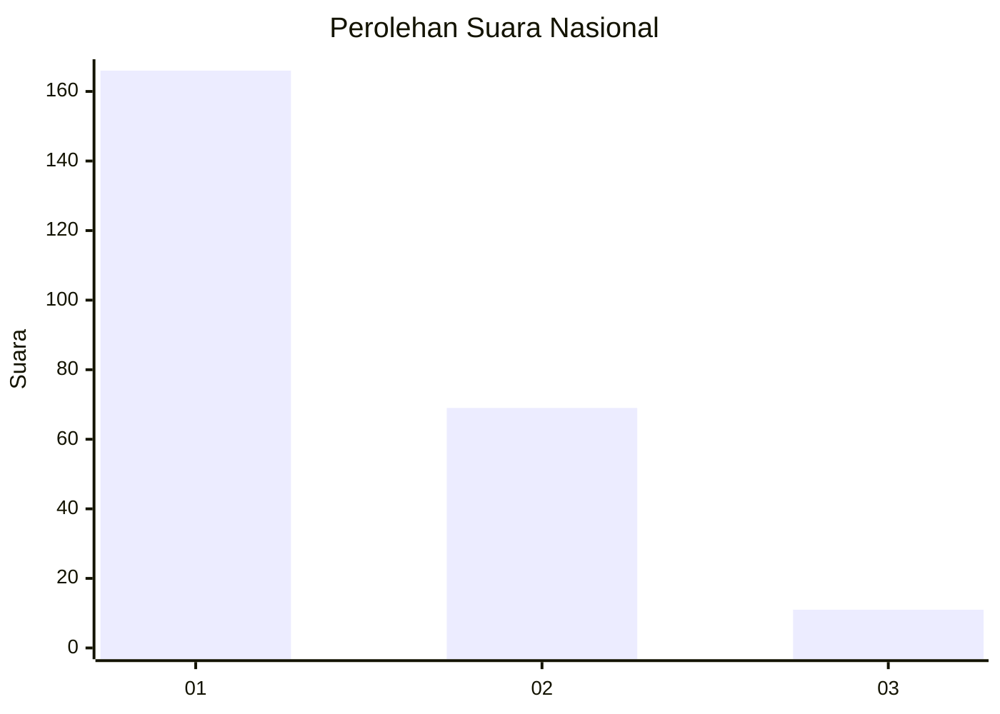
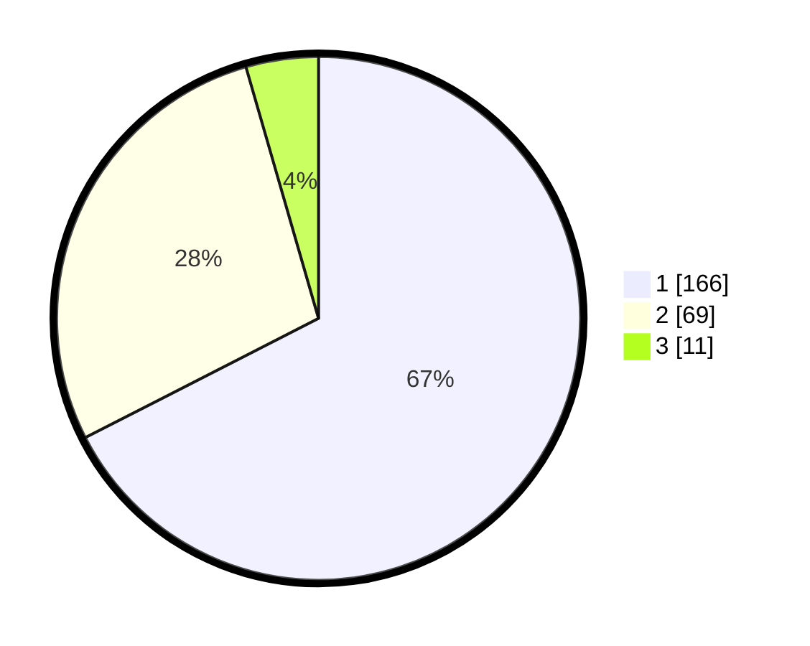

# Hasil

## Grafik

## Tabel

| No. | Nama Paslon    | Suara | Suara (raw) | Persentase |
|:--- |:-------------- | -----:| -----------:| ----------:|
| 1   | ANIES MUHAIMIN | 166   | [166][p-1]  | 67,48      |
| 2   | PRABOWO GIBRAN | 69    | [69][p-2]   | 28,05      |
| 3   | GANJAR MAHFUD  | 11    | [11][p-3]   | 4,47       |

[p-1]: https://github.com/gigit-pemilu/pemilu-2024/blob/main/pilpres/hitung-suara/sub/81-maluku/sub/01-maluku-tengah/sub/11-tehoru/sub/2011-telutih-baru/sub/002-tps/sub/paslon-1.txt
[p-2]: https://github.com/gigit-pemilu/pemilu-2024/blob/main/pilpres/hitung-suara/sub/81-maluku/sub/01-maluku-tengah/sub/11-tehoru/sub/2011-telutih-baru/sub/002-tps/sub/paslon-2.txt
[p-3]: https://github.com/gigit-pemilu/pemilu-2024/blob/main/pilpres/hitung-suara/sub/81-maluku/sub/01-maluku-tengah/sub/11-tehoru/sub/2011-telutih-baru/sub/002-tps/sub/paslon-3.txt

## Foto C Plano

https://sirekap-obj-formc.kpu.go.id/6070/pemilu/ppwp/81/01/11/20/11/8101112011002-20240216-100842--00657b30-641b-421d-91f8-b71e478cb5c6.jpg

https://sirekap-obj-formc.kpu.go.id/6070/pemilu/ppwp/81/01/11/20/11/8101112011002-20240216-100819--0f41382b-0ba3-4764-866b-469947eb3c76.jpg

https://sirekap-obj-formc.kpu.go.id/6070/pemilu/ppwp/81/01/11/20/11/8101112011002-20240215-132554--bbb75550-0988-4201-bc82-18ac86c9d365.jpg

## Metadata

| Key        | Value               |
| ---------- | ------------------- |
| Time Stamp | 2024-02-19 16:00:00 |

