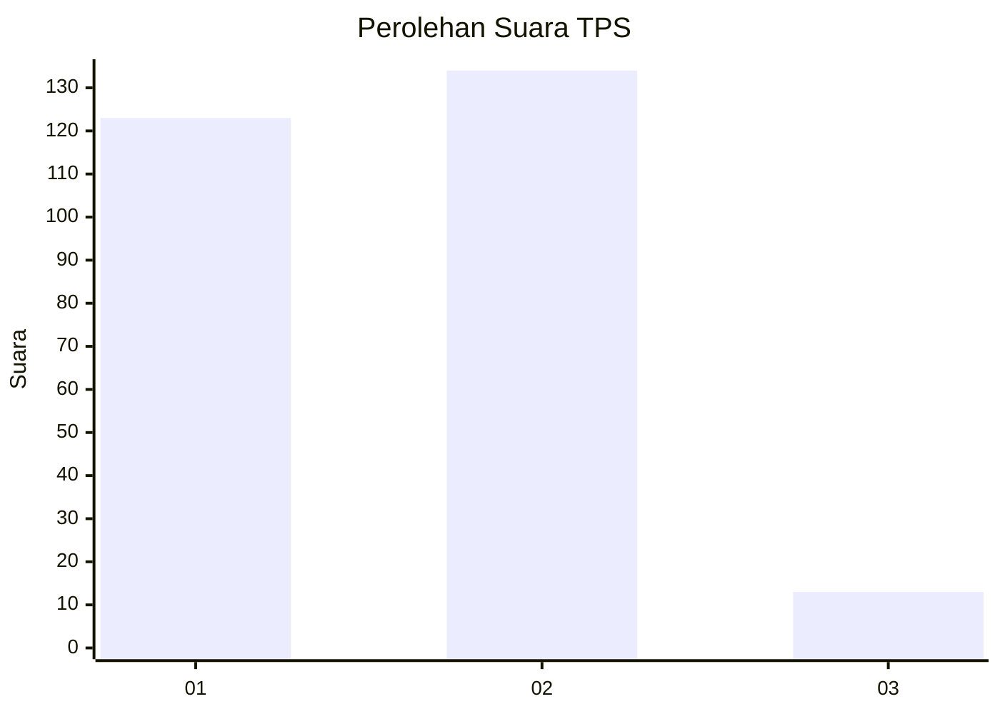
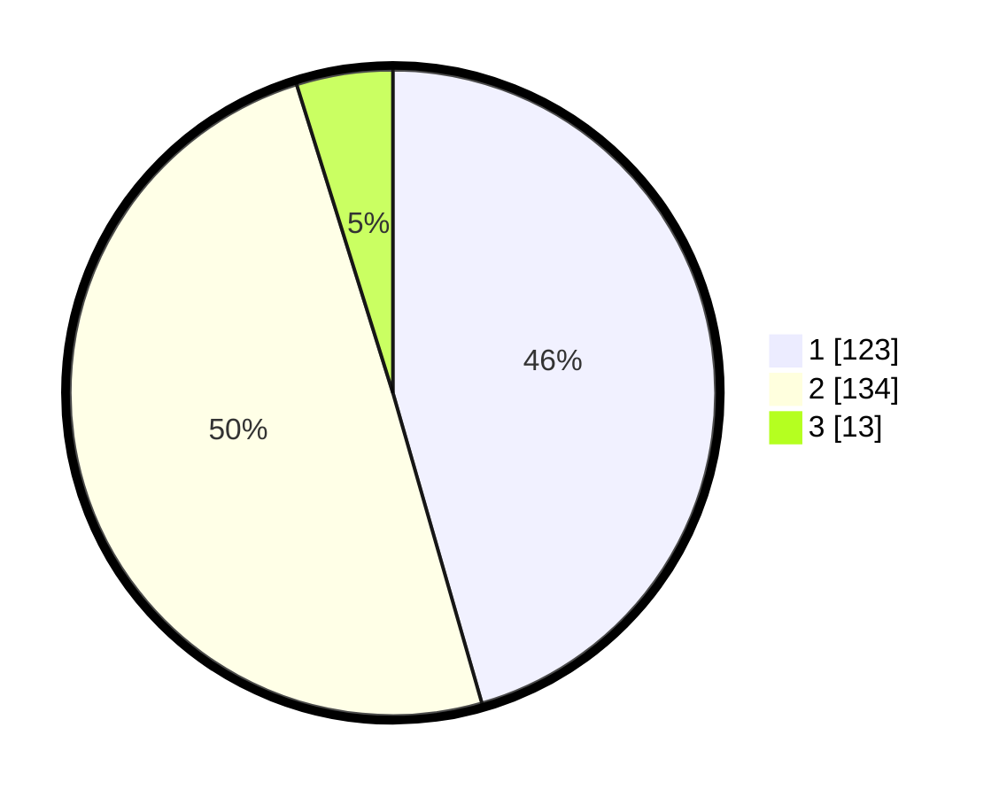

# Hasil

## Grafik

## Tabel

| No. | Nama Paslon    | Suara | Suara (raw) | Persentase |
|:--- |:-------------- | -----:| -----------:| ----------:|
| 1   | ANIES MUHAIMIN | 123   | [123][p-1]  | 45,56      |
| 2   | PRABOWO GIBRAN | 134   | [134][p-2]  | 49,63      |
| 3   | GANJAR MAHFUD  | 13    | [13][p-3]   | 4,81       |

[p-1]: https://github.com/gigit-pemilu/pemilu-2024-81-maluku/blob/main/pilpres/hitung-suara/sub/81-maluku/sub/01-maluku-tengah/sub/11-tehoru/sub/2016-yaputih/sub/003-tps/sub/paslon-1.txt
[p-2]: https://github.com/gigit-pemilu/pemilu-2024-81-maluku/blob/main/pilpres/hitung-suara/sub/81-maluku/sub/01-maluku-tengah/sub/11-tehoru/sub/2016-yaputih/sub/003-tps/sub/paslon-2.txt
[p-3]: https://github.com/gigit-pemilu/pemilu-2024-81-maluku/blob/main/pilpres/hitung-suara/sub/81-maluku/sub/01-maluku-tengah/sub/11-tehoru/sub/2016-yaputih/sub/003-tps/sub/paslon-3.txt

## Foto C Plano

https://sirekap-obj-formc.kpu.go.id/c764/pemilu/ppwp/81/01/11/20/16/8101112016003-20240215-110602--d2d778a3-0fd6-40ed-b3fb-cd88814b5f29.jpg

https://sirekap-obj-formc.kpu.go.id/c764/pemilu/ppwp/81/01/11/20/16/8101112016003-20240215-143700--13bdd2fe-4d06-40ff-b0b0-2cd47456c3e5.jpg

https://sirekap-obj-formc.kpu.go.id/c764/pemilu/ppwp/81/01/11/20/16/8101112016003-20240215-144033--1cd79671-d37c-4971-afef-9efd05577ff2.jpg

## Metadata

| Key        | Value               |
| ---------- | ------------------- |
| Time Stamp | 2024-02-19 16:00:00 |

