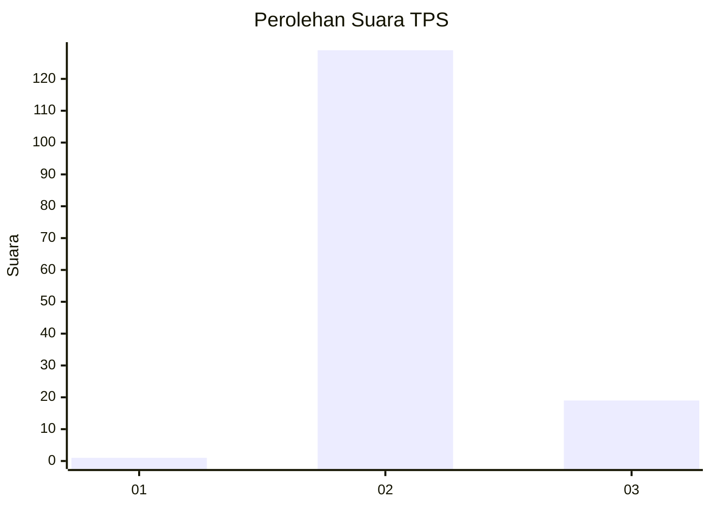
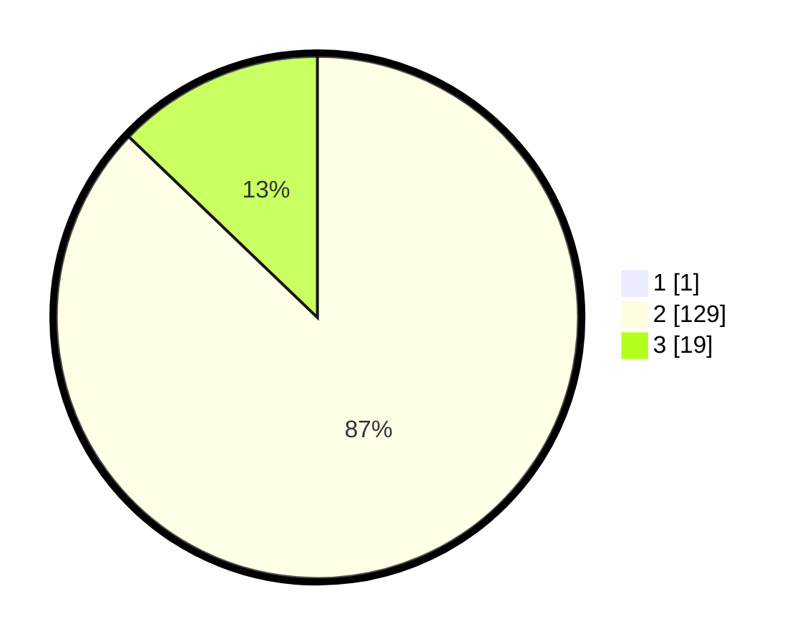

# Hasil

## Grafik

## Tabel

| No. | Nama Paslon    | Suara | Suara (raw) | Persentase |
|:--- |:-------------- | -----:| -----------:| ----------:|
| 1   | ANIES MUHAIMIN | 1     | [1][p-1]    | 0,67       |
| 2   | PRABOWO GIBRAN | 129   | [129][p-2]  | 86,58      |
| 3   | GANJAR MAHFUD  | 19    | [19][p-3]   | 12,75      |

[p-1]: https://github.com/gigit-pemilu/pemilu-2024-81-maluku/blob/main/pilpres/hitung-suara/sub/81-maluku/sub/01-maluku-tengah/sub/13-pulau-haruku/sub/2001-aboru/sub/002-tps/sub/paslon-1.txt
[p-2]: https://github.com/gigit-pemilu/pemilu-2024-81-maluku/blob/main/pilpres/hitung-suara/sub/81-maluku/sub/01-maluku-tengah/sub/13-pulau-haruku/sub/2001-aboru/sub/002-tps/sub/paslon-2.txt
[p-3]: https://github.com/gigit-pemilu/pemilu-2024-81-maluku/blob/main/pilpres/hitung-suara/sub/81-maluku/sub/01-maluku-tengah/sub/13-pulau-haruku/sub/2001-aboru/sub/002-tps/sub/paslon-3.txt

## Foto C Plano

https://sirekap-obj-formc.kpu.go.id/215d/pemilu/ppwp/81/01/13/20/01/8101132001002-20240218-151027--a64c924a-f90e-4a2d-9ceb-c8eb33237cd3.jpg

https://sirekap-obj-formc.kpu.go.id/215d/pemilu/ppwp/81/01/13/20/01/8101132001002-20240218-151215--3edb3446-1797-48b6-8d5d-107c3ccef1b4.jpg

https://sirekap-obj-formc.kpu.go.id/215d/pemilu/ppwp/81/01/13/20/01/8101132001002-20240218-151344--fdbe9b5b-72f1-4905-aa67-72e884fac6a8.jpg

## Metadata

| Key        | Value               |
| ---------- | ------------------- |
| Time Stamp | 2024-02-25 13:00:00 |

