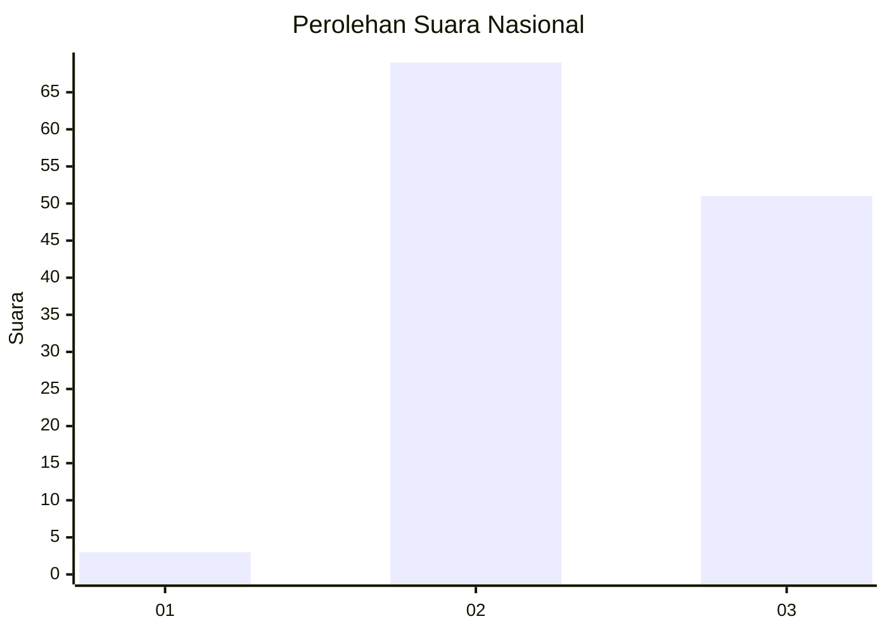
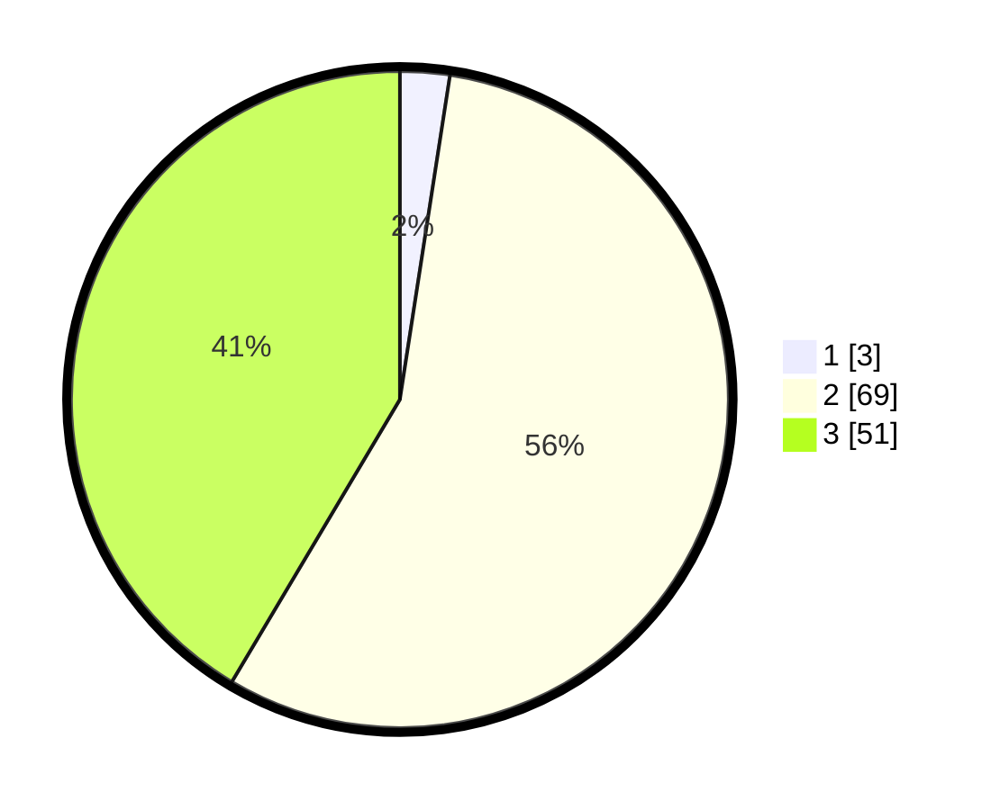

# Hasil

## Grafik

## Tabel

| No. | Nama Paslon    | Suara | Suara (raw) | Persentase |
|:--- |:-------------- | -----:| -----------:| ----------:|
| 1   | ANIES MUHAIMIN | 3     | [3][p-1]    | 2,44       |
| 2   | PRABOWO GIBRAN | 69    | [69][p-2]   | 56,10      |
| 3   | GANJAR MAHFUD  | 51    | [51][p-3]   | 41,46      |

[p-1]: https://github.com/gigit-pemilu/pemilu-2024/blob/main/pilpres/hitung-suara/sub/81-maluku/sub/01-maluku-tengah/sub/13-pulau-haruku/sub/2001-aboru/sub/003-tps/sub/paslon-1.txt
[p-2]: https://github.com/gigit-pemilu/pemilu-2024/blob/main/pilpres/hitung-suara/sub/81-maluku/sub/01-maluku-tengah/sub/13-pulau-haruku/sub/2001-aboru/sub/003-tps/sub/paslon-2.txt
[p-3]: https://github.com/gigit-pemilu/pemilu-2024/blob/main/pilpres/hitung-suara/sub/81-maluku/sub/01-maluku-tengah/sub/13-pulau-haruku/sub/2001-aboru/sub/003-tps/sub/paslon-3.txt

## Foto C Plano

https://sirekap-obj-formc.kpu.go.id/835d/pemilu/ppwp/81/01/13/20/01/8101132001003-20240214-185625--efae4ddb-d867-4348-a521-ed16acb4a21b.jpg

https://sirekap-obj-formc.kpu.go.id/835d/pemilu/ppwp/81/01/13/20/01/8101132001003-20240214-204321--61032b30-4b70-46b9-a428-bd6d524a759f.jpg

https://sirekap-obj-formc.kpu.go.id/835d/pemilu/ppwp/81/01/13/20/01/8101132001003-20240215-090036--a4936de5-0441-4f7c-9ad2-2945e60efda6.jpg

## Metadata

| Key        | Value               |
| ---------- | ------------------- |
| Time Stamp | 2024-02-15 15:00:29 |

