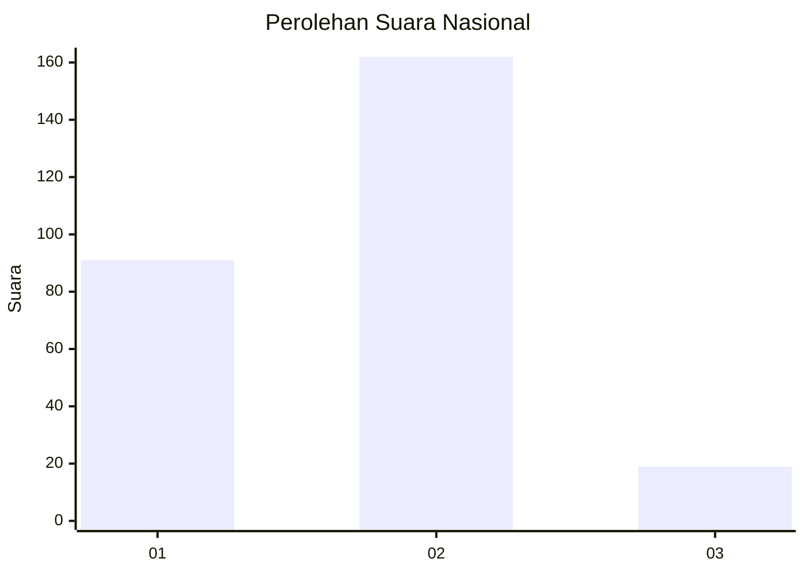
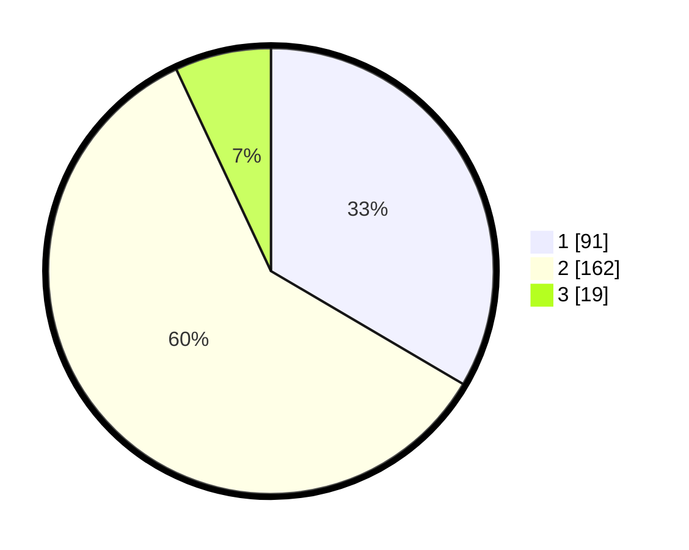

# Hasil

## Grafik

## Tabel

| No. | Nama Paslon    | Suara | Suara (raw) | Persentase |
|:--- |:-------------- | -----:| -----------:| ----------:|
| 1   | ANIES MUHAIMIN | 91    | [91][p-1]   | 33,46      |
| 2   | PRABOWO GIBRAN | 162   | [162][p-2]  | 59,56      |
| 3   | GANJAR MAHFUD  | 19    | [19][p-3]   | 6,99       |

[p-1]: https://github.com/gigit-pemilu/pemilu-2024/blob/main/pilpres/hitung-suara/sub/81-maluku/sub/01-maluku-tengah/sub/15-leihitu/sub/2006-asilulu/sub/003-tps/sub/paslon-1.txt
[p-2]: https://github.com/gigit-pemilu/pemilu-2024/blob/main/pilpres/hitung-suara/sub/81-maluku/sub/01-maluku-tengah/sub/15-leihitu/sub/2006-asilulu/sub/003-tps/sub/paslon-2.txt
[p-3]: https://github.com/gigit-pemilu/pemilu-2024/blob/main/pilpres/hitung-suara/sub/81-maluku/sub/01-maluku-tengah/sub/15-leihitu/sub/2006-asilulu/sub/003-tps/sub/paslon-3.txt

## Foto C Plano

https://sirekap-obj-formc.kpu.go.id/d1bf/pemilu/ppwp/81/01/15/20/06/8101152006003-20240229-122232--e103e9d3-b196-4fda-be09-cb3c41de4e0d.jpg

https://sirekap-obj-formc.kpu.go.id/d1bf/pemilu/ppwp/81/01/15/20/06/8101152006003-20240229-122539--8d5ba6fd-d2c7-4b45-84e6-981773ac0417.jpg

https://sirekap-obj-formc.kpu.go.id/d1bf/pemilu/ppwp/81/01/15/20/06/8101152006003-20240229-122620--7ef5f016-92d5-4db1-a0a1-246ee7da2a4a.jpg

## Metadata

| Key        | Value               |
| ---------- | ------------------- |
| Time Stamp | 2024-02-29 13:00:00 |

## DATA PEMILIH TETAP

Jumlah pemilih dalam DPT: **4**.
 * L: **0**.
 * P: **7**.

## DATA PENGGUNA HAK PILIH

Jumlah pengguna hak pilih dalam DPT: **4**.
 * L: **0**.
 * P: **7**.

Jumlah pengguna hak pilih dalam DPTb: **551**.
 * L: **0**.
 * P: **554**.

Jumlah pengguna hak pilih dalam DPK: **551**.
 * L: **777**.
 * P: **757**.

Jumlah pengguna hak pilih: **511**.
 * L: **7**.
 * P: **775**.

## JUMLAH SUARA SAH DAN TIDAK SAH

JUMLAH SELURUH SUARA SAH: **261**.

JUMLAH SUARA TIDAK SAH: **7**.

JUMLAH SELURUH SUARA SAH DAN SUARA TIDAK SAH: **0**.

