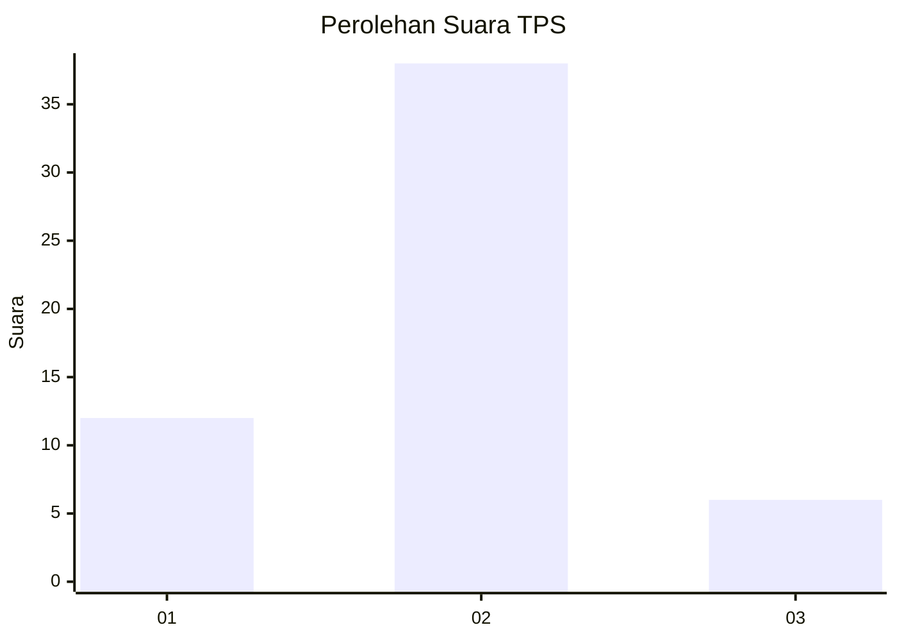

# Hasil

## Grafik

## Tabel

| No. | Nama Paslon    | Suara | Suara (raw) | Persentase |
|:--- |:-------------- | -----:| -----------:| ----------:|
| 1   | ANIES MUHAIMIN | 12    | [12][p-1]   | 21,43      |
| 2   | PRABOWO GIBRAN | 38    | [38][p-2]   | 67,86      |
| 3   | GANJAR MAHFUD  | 6     | [6][p-3]    | 10,71      |

[p-1]: https://github.com/gigit-pemilu/pemilu-2024-81-maluku/blob/main/pilpres/hitung-suara/sub/81-maluku/sub/01-maluku-tengah/sub/15-leihitu/sub/2006-asilulu/sub/019-tps/sub/paslon-1.txt
[p-2]: https://github.com/gigit-pemilu/pemilu-2024-81-maluku/blob/main/pilpres/hitung-suara/sub/81-maluku/sub/01-maluku-tengah/sub/15-leihitu/sub/2006-asilulu/sub/019-tps/sub/paslon-2.txt
[p-3]: https://github.com/gigit-pemilu/pemilu-2024-81-maluku/blob/main/pilpres/hitung-suara/sub/81-maluku/sub/01-maluku-tengah/sub/15-leihitu/sub/2006-asilulu/sub/019-tps/sub/paslon-3.txt

## Foto C Plano

https://sirekap-obj-formc.kpu.go.id/c21b/pemilu/ppwp/81/01/15/20/06/8101152006019-20240216-205521--470f8fe5-ab6f-43fc-bccb-c7a6c8ff62f9.jpg

https://sirekap-obj-formc.kpu.go.id/c21b/pemilu/ppwp/81/01/15/20/06/8101152006019-20240217-003818--d886bdaa-c4ad-4519-8533-e1aa10a2fbe1.jpg

https://sirekap-obj-formc.kpu.go.id/c21b/pemilu/ppwp/81/01/15/20/06/8101152006019-20240216-205943--b6da5571-23e8-4cbe-aeb5-6404e2e7530b.jpg

## Metadata

| Key        | Value               |
| ---------- | ------------------- |
| Time Stamp | 2024-02-19 06:16:00 |

