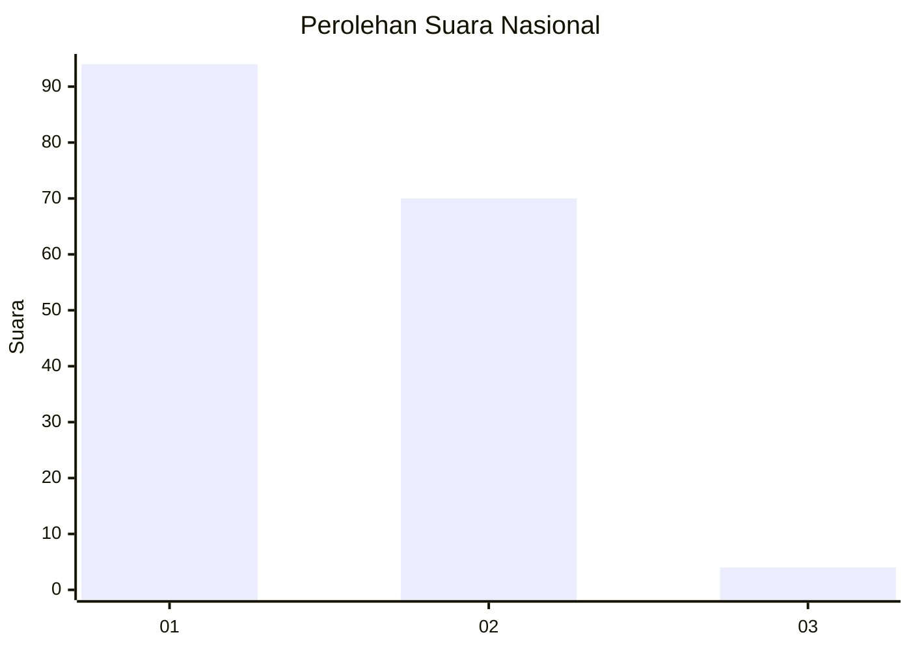
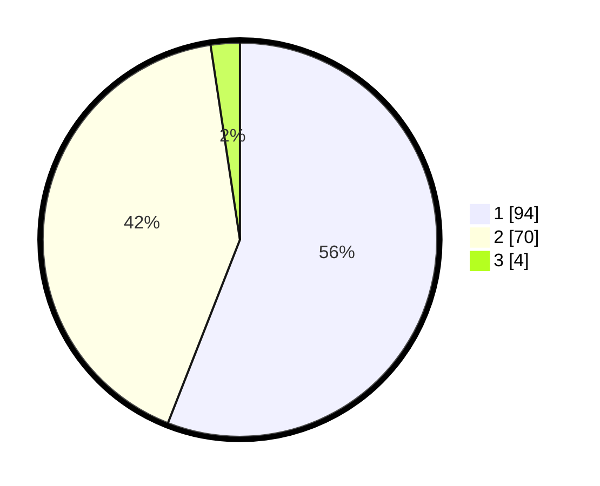

# Hasil

## Grafik

## Tabel

| No. | Nama Paslon    | Suara | Suara (raw) | Persentase |
|:--- |:-------------- | -----:| -----------:| ----------:|
| 1   | ANIES MUHAIMIN | 94    | [94][p-1]   | 55,95      |
| 2   | PRABOWO GIBRAN | 70    | [70][p-2]   | 41,67      |
| 3   | GANJAR MAHFUD  | 4     | [4][p-3]    | 2,38       |

[p-1]: https://github.com/gigit-pemilu/pemilu-2024/blob/main/pilpres/hitung-suara/sub/81-maluku/sub/01-maluku-tengah/sub/15-leihitu/sub/2007-ureng/sub/011-tps/sub/paslon-1.txt
[p-2]: https://github.com/gigit-pemilu/pemilu-2024/blob/main/pilpres/hitung-suara/sub/81-maluku/sub/01-maluku-tengah/sub/15-leihitu/sub/2007-ureng/sub/011-tps/sub/paslon-2.txt
[p-3]: https://github.com/gigit-pemilu/pemilu-2024/blob/main/pilpres/hitung-suara/sub/81-maluku/sub/01-maluku-tengah/sub/15-leihitu/sub/2007-ureng/sub/011-tps/sub/paslon-3.txt

## Foto C Plano

https://sirekap-obj-formc.kpu.go.id/d714/pemilu/ppwp/81/01/15/20/07/8101152007011-20240307-181513--f7df19e3-704d-4216-a834-0039606d1727.jpg

https://sirekap-obj-formc.kpu.go.id/d714/pemilu/ppwp/81/01/15/20/07/8101152007011-20240307-181552--8250efe4-5833-4ba9-a017-f70eb37cc413.jpg

https://sirekap-obj-formc.kpu.go.id/d714/pemilu/ppwp/81/01/15/20/07/8101152007011-20240307-181700--2c4af1cf-6729-4d00-9067-f3e2ecceab9d.jpg

## Metadata

| Key        | Value               |
| ---------- | ------------------- |
| Time Stamp | 2024-03-07 19:00:00 |

## DATA PEMILIH TETAP

Jumlah pemilih dalam DPT: **235**.
 * L: **130**.
 * P: **115**.

## DATA PENGGUNA HAK PILIH

Jumlah pengguna hak pilih dalam DPT: **649**.
 * L: **875**.
 * P: **874**.

Jumlah pengguna hak pilih dalam DPTb: **410**.
 * L: **7**.
 * P: **83**.

Jumlah pengguna hak pilih dalam DPK: **86**.
 * L: **800**.
 * P: **801**.

Jumlah pengguna hak pilih: **164**.
 * L: **822**.
 * P: **473**.

## JUMLAH SUARA SAH DAN TIDAK SAH

JUMLAH SELURUH SUARA SAH: **158**.

JUMLAH SUARA TIDAK SAH: **2**.

JUMLAH SELURUH SUARA SAH DAN SUARA TIDAK SAH: **160**.

