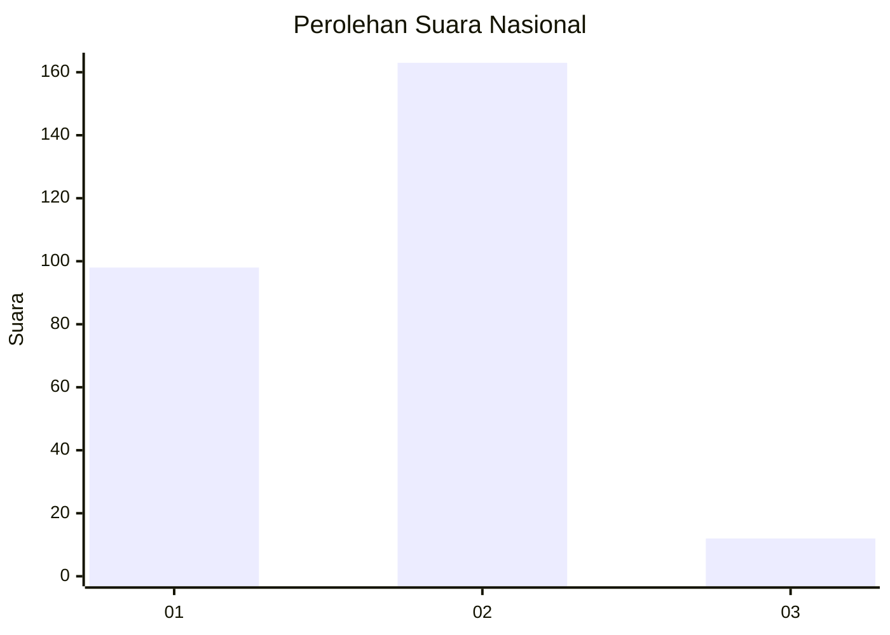
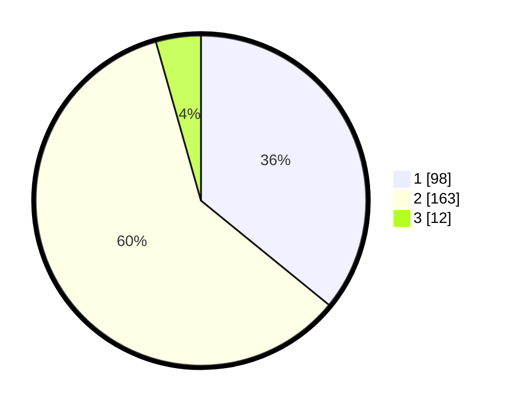

# Hasil

## Grafik

## Tabel

| No. | Nama Paslon    | Suara | Suara (raw) | Persentase |
|:--- |:-------------- | -----:| -----------:| ----------:|
| 1   | ANIES MUHAIMIN | 98    | [98][p-1]   | 35,90      |
| 2   | PRABOWO GIBRAN | 163   | [163][p-2]  | 59,71      |
| 3   | GANJAR MAHFUD  | 12    | [12][p-3]   | 4,40       |

[p-1]: https://github.com/gigit-pemilu/pemilu-2024/blob/main/pilpres/hitung-suara/sub/81-maluku/sub/01-maluku-tengah/sub/15-leihitu/sub/2009-seith/sub/006-tps/sub/paslon-1.txt
[p-2]: https://github.com/gigit-pemilu/pemilu-2024/blob/main/pilpres/hitung-suara/sub/81-maluku/sub/01-maluku-tengah/sub/15-leihitu/sub/2009-seith/sub/006-tps/sub/paslon-2.txt
[p-3]: https://github.com/gigit-pemilu/pemilu-2024/blob/main/pilpres/hitung-suara/sub/81-maluku/sub/01-maluku-tengah/sub/15-leihitu/sub/2009-seith/sub/006-tps/sub/paslon-3.txt

## Foto C Plano

https://sirekap-obj-formc.kpu.go.id/ac41/pemilu/ppwp/81/01/15/20/09/8101152009006-20240308-090709--687868fe-c829-4473-a71c-940bf15ed391.jpg

https://sirekap-obj-formc.kpu.go.id/ac41/pemilu/ppwp/81/01/15/20/09/8101152009006-20240308-084445--22f8c09f-1542-4bbb-bcfb-9c5976db5c33.jpg

https://sirekap-obj-formc.kpu.go.id/ac41/pemilu/ppwp/81/01/15/20/09/8101152009006-20240308-084811--8902e8bc-e542-4529-94a7-52aeb8d58dc1.jpg

## Metadata

| Key        | Value               |
| ---------- | ------------------- |
| Time Stamp | 2024-03-08 10:00:00 |

