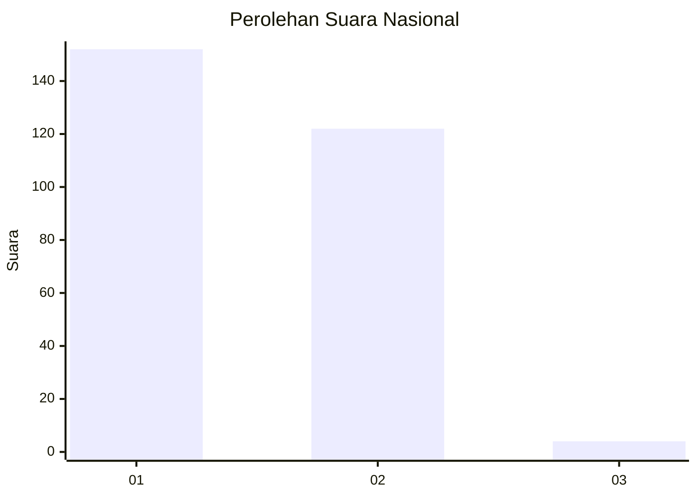
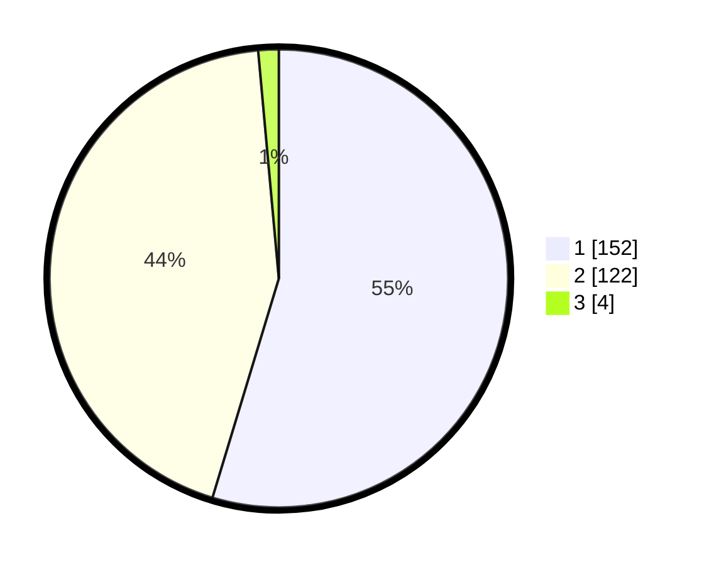

# Hasil

## Grafik

## Tabel

| No. | Nama Paslon    | Suara | Suara (raw) | Persentase |
|:--- |:-------------- | -----:| -----------:| ----------:|
| 1   | ANIES MUHAIMIN | 152   | [152][p-1]  | 54,68      |
| 2   | PRABOWO GIBRAN | 122   | [122][p-2]  | 43,88      |
| 3   | GANJAR MAHFUD  | 4     | [4][p-3]    | 1,44       |

[p-1]: https://github.com/gigit-pemilu/pemilu-2024/blob/main/pilpres/hitung-suara/sub/81-maluku/sub/01-maluku-tengah/sub/15-leihitu/sub/2012-wakal/sub/001-tps/sub/paslon-1.txt
[p-2]: https://github.com/gigit-pemilu/pemilu-2024/blob/main/pilpres/hitung-suara/sub/81-maluku/sub/01-maluku-tengah/sub/15-leihitu/sub/2012-wakal/sub/001-tps/sub/paslon-2.txt
[p-3]: https://github.com/gigit-pemilu/pemilu-2024/blob/main/pilpres/hitung-suara/sub/81-maluku/sub/01-maluku-tengah/sub/15-leihitu/sub/2012-wakal/sub/001-tps/sub/paslon-3.txt

## Foto C Plano

https://sirekap-obj-formc.kpu.go.id/5e2f/pemilu/ppwp/81/01/15/20/12/8101152012001-20240302-150625--40df38b1-f8c1-4d11-807a-cd1d57b9ac6d.jpg

https://sirekap-obj-formc.kpu.go.id/5e2f/pemilu/ppwp/81/01/15/20/12/8101152012001-20240302-150747--c7253b5d-d2eb-4247-b071-5c44325aa66e.jpg

https://sirekap-obj-formc.kpu.go.id/5e2f/pemilu/ppwp/81/01/15/20/12/8101152012001-20240302-150837--6bf3c73d-2f58-4147-be6b-69aa6aac132b.jpg

## Metadata

| Key        | Value               |
| ---------- | ------------------- |
| Time Stamp | 2024-03-02 16:00:00 |

