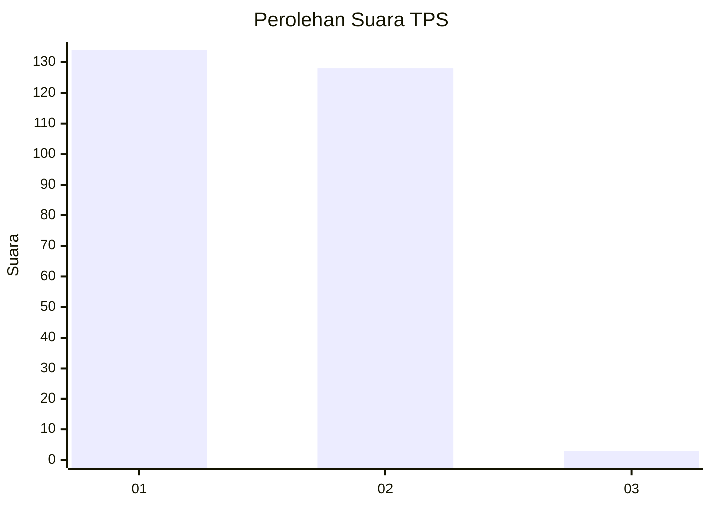
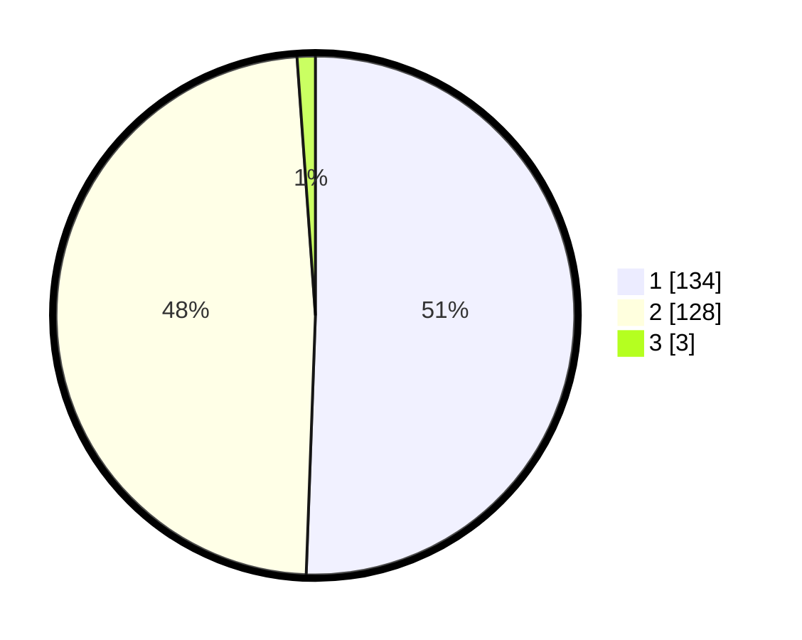

# Hasil

## Grafik

## Tabel

| No. | Nama Paslon    | Suara | Suara (raw) | Persentase |
|:--- |:-------------- | -----:| -----------:| ----------:|
| 1   | ANIES MUHAIMIN | 134   | [134][p-1]  | 50,57      |
| 2   | PRABOWO GIBRAN | 128   | [128][p-2]  | 48,30      |
| 3   | GANJAR MAHFUD  | 3     | [3][p-3]    | 1,13       |

[p-1]: https://github.com/gigit-pemilu/pemilu-2024-81-maluku/blob/main/pilpres/hitung-suara/sub/81-maluku/sub/01-maluku-tengah/sub/15-leihitu/sub/2012-wakal/sub/006-tps/sub/paslon-1.txt
[p-2]: https://github.com/gigit-pemilu/pemilu-2024-81-maluku/blob/main/pilpres/hitung-suara/sub/81-maluku/sub/01-maluku-tengah/sub/15-leihitu/sub/2012-wakal/sub/006-tps/sub/paslon-2.txt
[p-3]: https://github.com/gigit-pemilu/pemilu-2024-81-maluku/blob/main/pilpres/hitung-suara/sub/81-maluku/sub/01-maluku-tengah/sub/15-leihitu/sub/2012-wakal/sub/006-tps/sub/paslon-3.txt

## Foto C Plano

https://sirekap-obj-formc.kpu.go.id/6ad7/pemilu/ppwp/81/01/15/20/12/8101152012006-20240215-062342--1d784ada-ae48-4620-8d32-c005b7dd6d68.jpg

https://sirekap-obj-formc.kpu.go.id/6ad7/pemilu/ppwp/81/01/15/20/12/8101152012006-20240215-071704--a8817a32-5470-477e-b5e3-fd0284e7b4f4.jpg

https://sirekap-obj-formc.kpu.go.id/6ad7/pemilu/ppwp/81/01/15/20/12/8101152012006-20240215-071856--f965dd1e-ed42-4721-b4a5-ded6f4f301c6.jpg

## Metadata

| Key        | Value               |
| ---------- | ------------------- |
| Time Stamp | 2024-02-15 22:30:27 |

