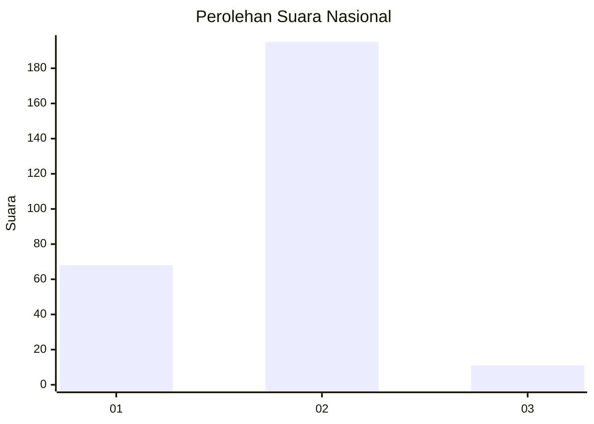
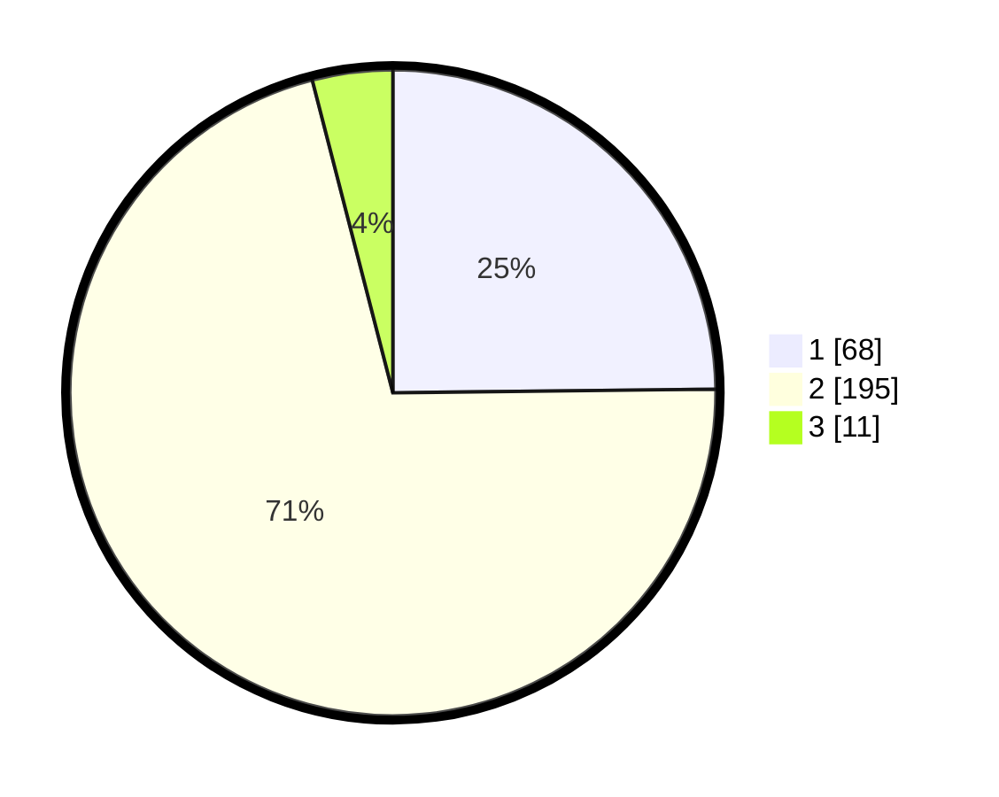

# Hasil

## Grafik

## Tabel

| No. | Nama Paslon    | Suara | Suara (raw) | Persentase |
|:--- |:-------------- | -----:| -----------:| ----------:|
| 1   | ANIES MUHAIMIN | 68    | [68][p-1]   | 24,82      |
| 2   | PRABOWO GIBRAN | 195   | [195][p-2]  | 71,17      |
| 3   | GANJAR MAHFUD  | 11    | [11][p-3]   | 4,01       |

[p-1]: https://github.com/gigit-pemilu/pemilu-2024/blob/main/pilpres/hitung-suara/sub/81-maluku/sub/01-maluku-tengah/sub/15-leihitu/sub/2012-wakal/sub/008-tps/sub/paslon-1.txt
[p-2]: https://github.com/gigit-pemilu/pemilu-2024/blob/main/pilpres/hitung-suara/sub/81-maluku/sub/01-maluku-tengah/sub/15-leihitu/sub/2012-wakal/sub/008-tps/sub/paslon-2.txt
[p-3]: https://github.com/gigit-pemilu/pemilu-2024/blob/main/pilpres/hitung-suara/sub/81-maluku/sub/01-maluku-tengah/sub/15-leihitu/sub/2012-wakal/sub/008-tps/sub/paslon-3.txt

## Foto C Plano

https://sirekap-obj-formc.kpu.go.id/4674/pemilu/ppwp/81/01/15/20/12/8101152012008-20240214-190359--1d738859-975a-4b96-9ca4-71370a9db918.jpg

https://sirekap-obj-formc.kpu.go.id/4674/pemilu/ppwp/81/01/15/20/12/8101152012008-20240214-190536--2388777e-3971-48e7-8463-3310c970e379.jpg

https://sirekap-obj-formc.kpu.go.id/4674/pemilu/ppwp/81/01/15/20/12/8101152012008-20240214-190703--2c760450-0496-4b3c-8377-d32986b3ce04.jpg

## Metadata

| Key        | Value               |
| ---------- | ------------------- |
| Time Stamp | 2024-02-16 00:00:26 |

