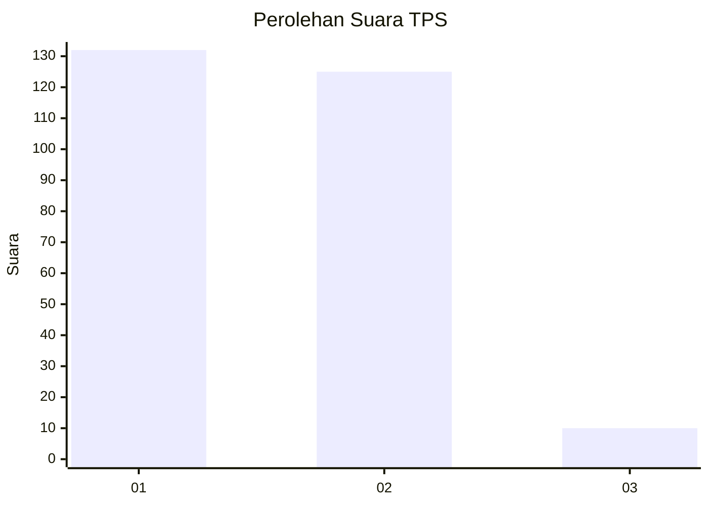
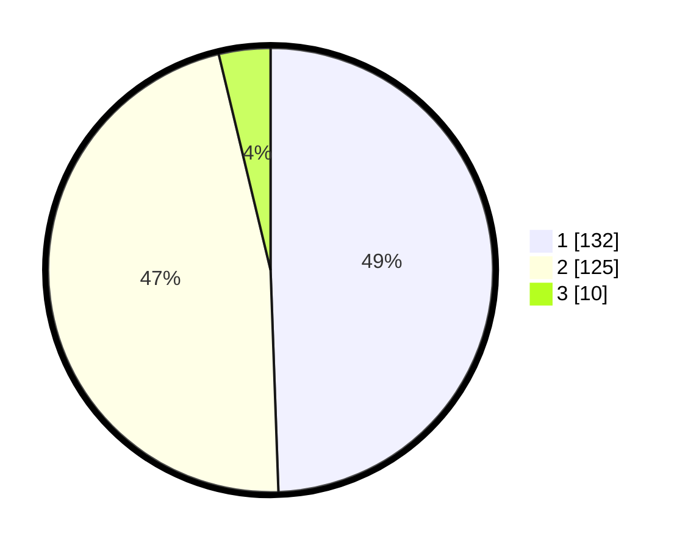

# Hasil

## Grafik

## Tabel

| No. | Nama Paslon    | Suara | Suara (raw) | Persentase |
|:--- |:-------------- | -----:| -----------:| ----------:|
| 1   | ANIES MUHAIMIN | 132   | [132][p-1]  | 49,44      |
| 2   | PRABOWO GIBRAN | 125   | [125][p-2]  | 46,82      |
| 3   | GANJAR MAHFUD  | 10    | [10][p-3]   | 3,75       |

[p-1]: https://github.com/gigit-pemilu/pemilu-2024-81-maluku/blob/main/pilpres/hitung-suara/sub/81-maluku/sub/01-maluku-tengah/sub/15-leihitu/sub/2015-mamala/sub/007-tps/sub/paslon-1.txt
[p-2]: https://github.com/gigit-pemilu/pemilu-2024-81-maluku/blob/main/pilpres/hitung-suara/sub/81-maluku/sub/01-maluku-tengah/sub/15-leihitu/sub/2015-mamala/sub/007-tps/sub/paslon-2.txt
[p-3]: https://github.com/gigit-pemilu/pemilu-2024-81-maluku/blob/main/pilpres/hitung-suara/sub/81-maluku/sub/01-maluku-tengah/sub/15-leihitu/sub/2015-mamala/sub/007-tps/sub/paslon-3.txt

## Foto C Plano

https://sirekap-obj-formc.kpu.go.id/4db1/pemilu/ppwp/81/01/15/20/15/8101152015007-20240225-084204--0b46e69e-84da-4d4c-94ec-c5bb048489b9.jpg

https://sirekap-obj-formc.kpu.go.id/4db1/pemilu/ppwp/81/01/15/20/15/8101152015007-20240225-073940--7b643091-7fd1-436f-b47e-2b3f522d1845.jpg

https://sirekap-obj-formc.kpu.go.id/4db1/pemilu/ppwp/81/01/15/20/15/8101152015007-20240225-073842--cf48ca89-2f6b-4d76-8d99-bbfa22d55dfd.jpg

## Metadata

| Key        | Value               |
| ---------- | ------------------- |
| Time Stamp | 2024-03-01 15:00:00 |

