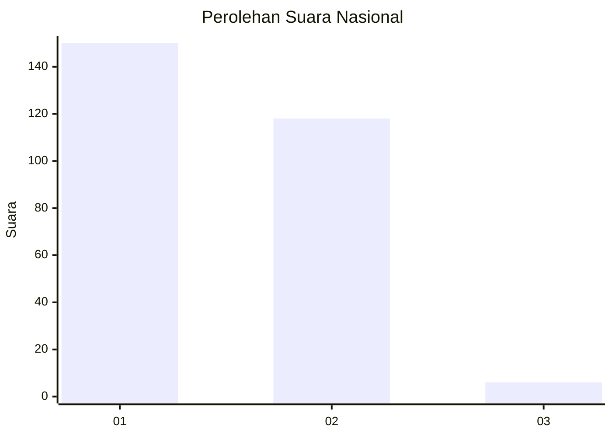
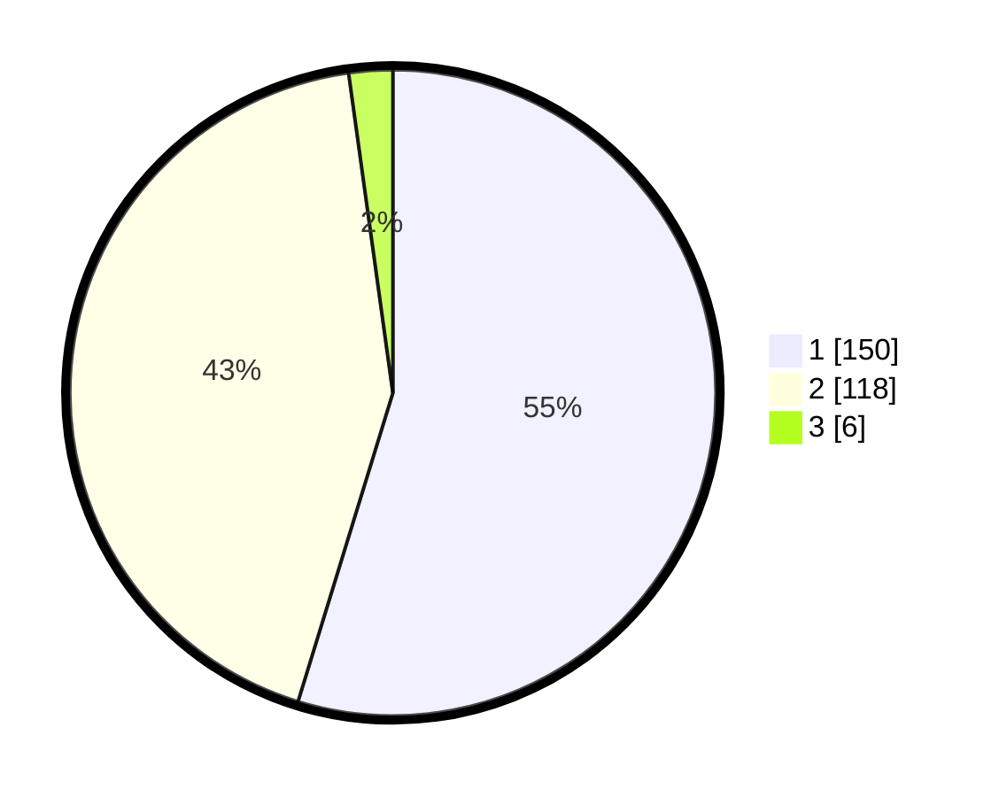

# Hasil

## Grafik

## Tabel

| No. | Nama Paslon    | Suara | Suara (raw) | Persentase |
|:--- |:-------------- | -----:| -----------:| ----------:|
| 1   | ANIES MUHAIMIN | 150   | [150][p-1]  | 54,74      |
| 2   | PRABOWO GIBRAN | 118   | [118][p-2]  | 43,07      |
| 3   | GANJAR MAHFUD  | 6     | [6][p-3]    | 2,19       |

[p-1]: https://github.com/gigit-pemilu/pemilu-2024/blob/main/pilpres/hitung-suara/sub/81-maluku/sub/01-maluku-tengah/sub/15-leihitu/sub/2016-morella/sub/008-tps/sub/paslon-1.txt
[p-2]: https://github.com/gigit-pemilu/pemilu-2024/blob/main/pilpres/hitung-suara/sub/81-maluku/sub/01-maluku-tengah/sub/15-leihitu/sub/2016-morella/sub/008-tps/sub/paslon-2.txt
[p-3]: https://github.com/gigit-pemilu/pemilu-2024/blob/main/pilpres/hitung-suara/sub/81-maluku/sub/01-maluku-tengah/sub/15-leihitu/sub/2016-morella/sub/008-tps/sub/paslon-3.txt

## Foto C Plano

https://sirekap-obj-formc.kpu.go.id/0b58/pemilu/ppwp/81/01/15/20/16/8101152016008-20240215-011907--bea0194c-dc3a-49fd-ad22-bb5270101ad0.jpg

https://sirekap-obj-formc.kpu.go.id/0b58/pemilu/ppwp/81/01/15/20/16/8101152016008-20240215-011927--8d4d5c20-0276-4cd6-a244-23af3dc0372d.jpg

https://sirekap-obj-formc.kpu.go.id/0b58/pemilu/ppwp/81/01/15/20/16/8101152016008-20240215-011946--8e3d102f-80d9-4331-a463-efbb5268bab1.jpg

## Metadata

| Key        | Value               |
| ---------- | ------------------- |
| Time Stamp | 2024-02-16 00:00:26 |

