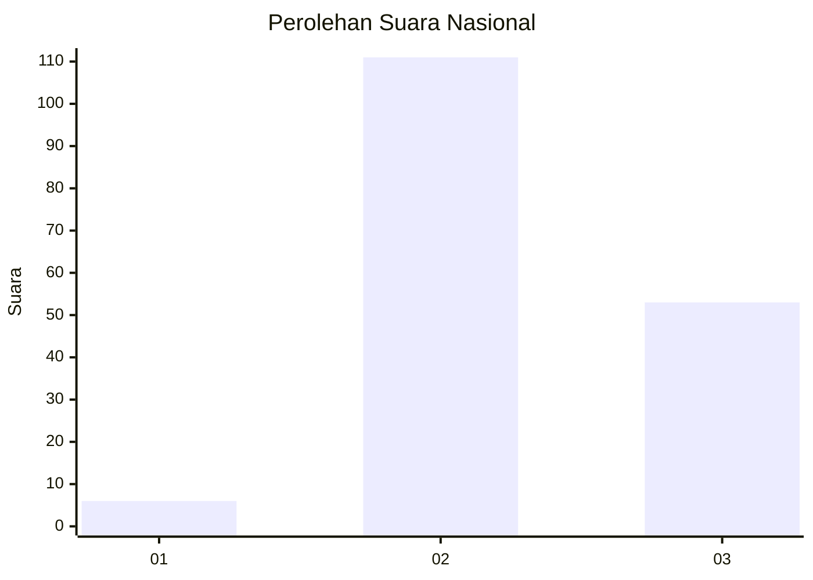
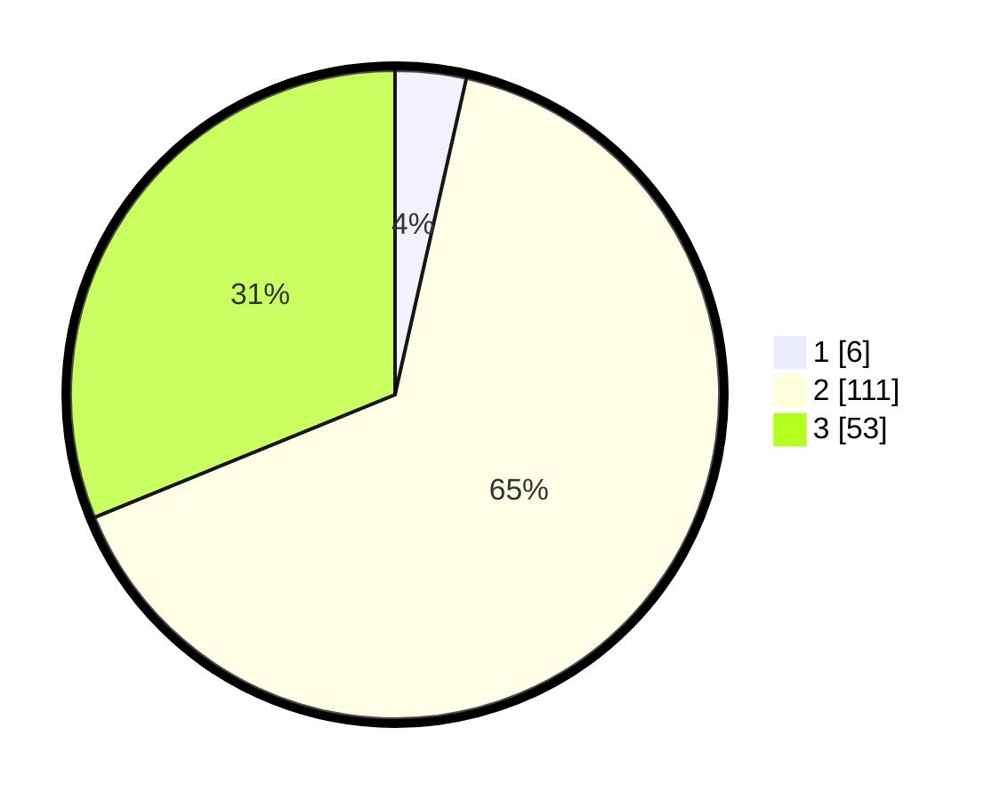

# Hasil

## Grafik

## Tabel

| No. | Nama Paslon    | Suara | Suara (raw) | Persentase |
|:--- |:-------------- | -----:| -----------:| ----------:|
| 1   | ANIES MUHAIMIN | 6     | [6][p-1]    | 3,53       |
| 2   | PRABOWO GIBRAN | 111   | [111][p-2]  | 65,29      |
| 3   | GANJAR MAHFUD  | 53    | [53][p-3]   | 31,18      |

[p-1]: https://github.com/gigit-pemilu/pemilu-2024/blob/main/pilpres/hitung-suara/sub/81-maluku/sub/01-maluku-tengah/sub/17-kota-masohi/sub/1001-namaelo/sub/001-tps/sub/paslon-1.txt
[p-2]: https://github.com/gigit-pemilu/pemilu-2024/blob/main/pilpres/hitung-suara/sub/81-maluku/sub/01-maluku-tengah/sub/17-kota-masohi/sub/1001-namaelo/sub/001-tps/sub/paslon-2.txt
[p-3]: https://github.com/gigit-pemilu/pemilu-2024/blob/main/pilpres/hitung-suara/sub/81-maluku/sub/01-maluku-tengah/sub/17-kota-masohi/sub/1001-namaelo/sub/001-tps/sub/paslon-3.txt

## Foto C Plano

https://sirekap-obj-formc.kpu.go.id/0675/pemilu/ppwp/81/01/17/10/01/8101171001001-20240215-051756--ce8d82e9-c2c7-496b-852e-218a05da13be.jpg

https://sirekap-obj-formc.kpu.go.id/0675/pemilu/ppwp/81/01/17/10/01/8101171001001-20240215-050955--c26e2cdb-5d0c-40e7-b6ac-1ec854a3a314.jpg

https://sirekap-obj-formc.kpu.go.id/0675/pemilu/ppwp/81/01/17/10/01/8101171001001-20240215-051253--f3efaa8f-7ce8-4eed-ad1f-934ff8d3a608.jpg

## Metadata

| Key        | Value               |
| ---------- | ------------------- |
| Time Stamp | 2024-02-15 23:29:50 |

