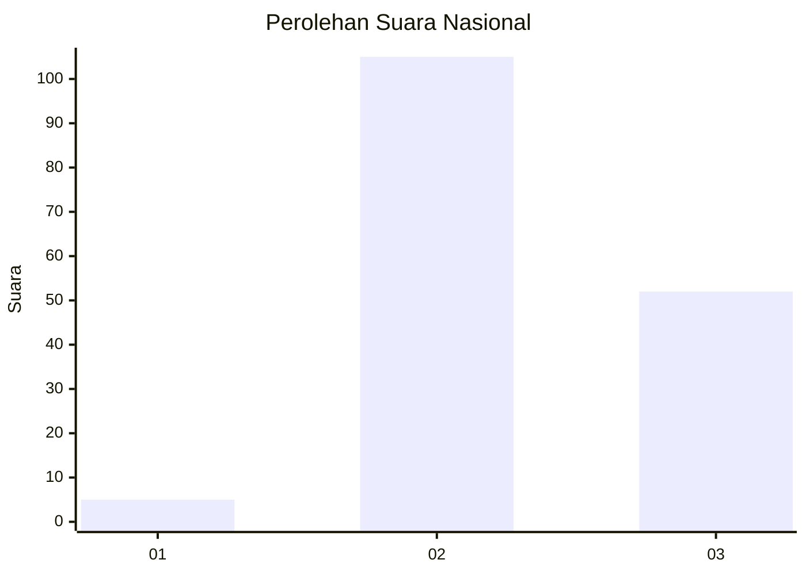
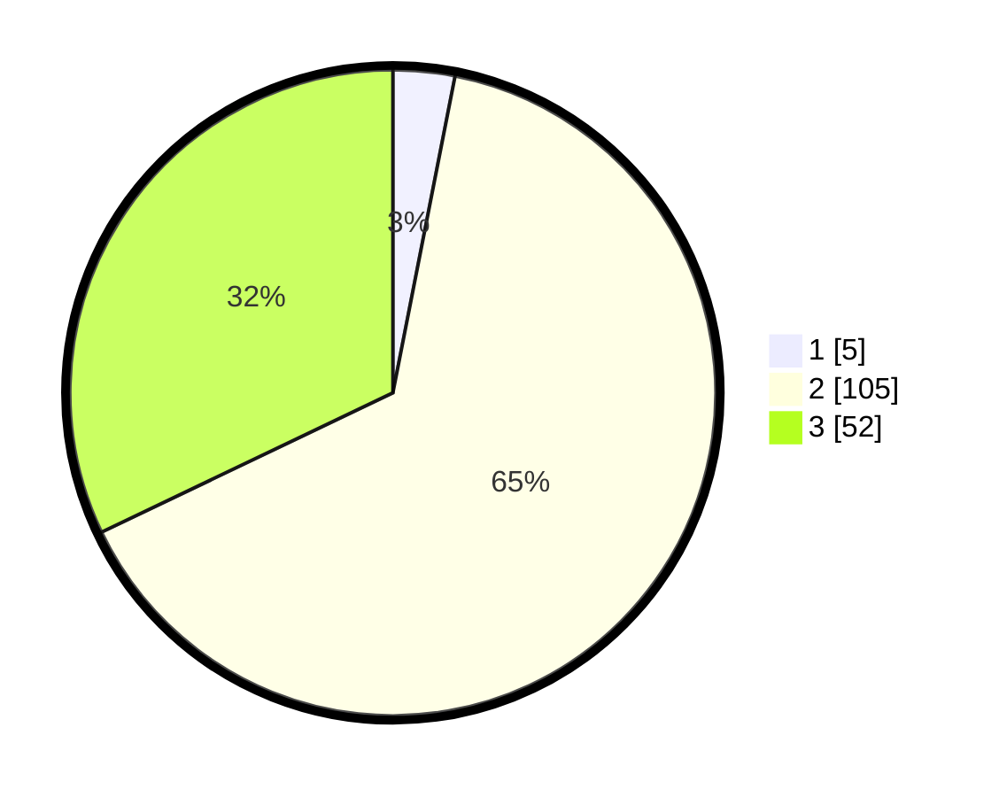

# Hasil

## Grafik

## Tabel

| No. | Nama Paslon    | Suara | Suara (raw) | Persentase |
|:--- |:-------------- | -----:| -----------:| ----------:|
| 1   | ANIES MUHAIMIN | 5     | [5][p-1]    | 3,09       |
| 2   | PRABOWO GIBRAN | 105   | [105][p-2]  | 64,81      |
| 3   | GANJAR MAHFUD  | 52    | [52][p-3]   | 32,10      |

[p-1]: https://github.com/gigit-pemilu/pemilu-2024/blob/main/pilpres/hitung-suara/sub/81-maluku/sub/01-maluku-tengah/sub/17-kota-masohi/sub/1001-namaelo/sub/002-tps/sub/paslon-1.txt
[p-2]: https://github.com/gigit-pemilu/pemilu-2024/blob/main/pilpres/hitung-suara/sub/81-maluku/sub/01-maluku-tengah/sub/17-kota-masohi/sub/1001-namaelo/sub/002-tps/sub/paslon-2.txt
[p-3]: https://github.com/gigit-pemilu/pemilu-2024/blob/main/pilpres/hitung-suara/sub/81-maluku/sub/01-maluku-tengah/sub/17-kota-masohi/sub/1001-namaelo/sub/002-tps/sub/paslon-3.txt

## Foto C Plano

https://sirekap-obj-formc.kpu.go.id/963d/pemilu/ppwp/81/01/17/10/01/8101171001002-20240214-225257--fc984dfa-f364-4d5b-aeca-eccd0eb4fa28.jpg

https://sirekap-obj-formc.kpu.go.id/963d/pemilu/ppwp/81/01/17/10/01/8101171001002-20240214-225358--7b8cd644-383b-4c62-a490-1203777137ec.jpg

https://sirekap-obj-formc.kpu.go.id/963d/pemilu/ppwp/81/01/17/10/01/8101171001002-20240214-225548--5a38bfa6-597f-4e70-928a-1c923aa3b491.jpg

## Metadata

| Key        | Value               |
| ---------- | ------------------- |
| Time Stamp | 2024-02-15 23:29:50 |

