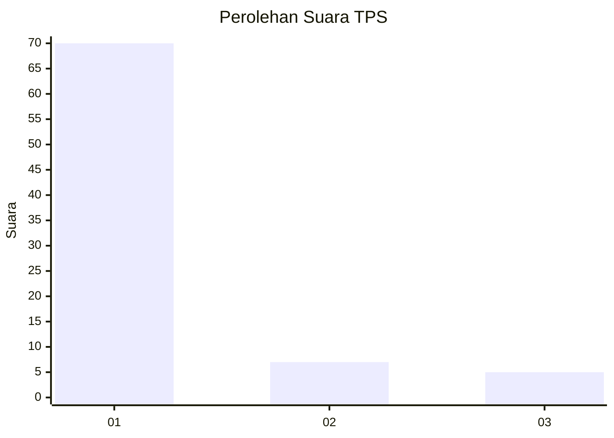
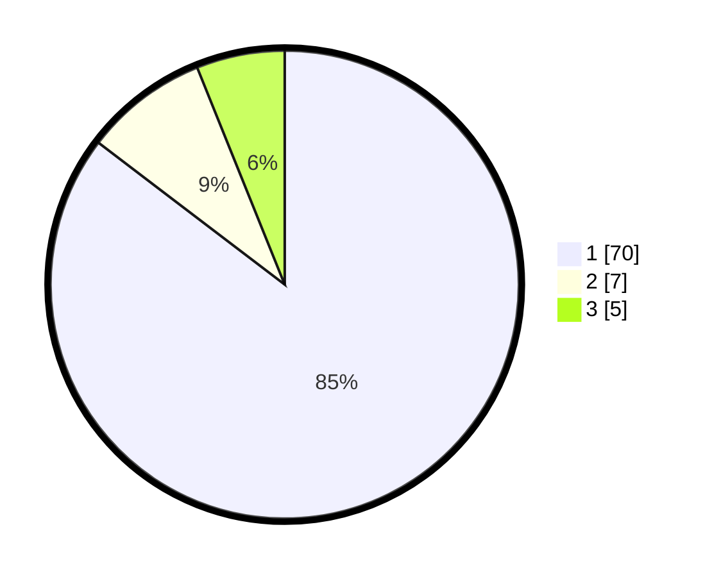

# Hasil

## Grafik

## Tabel

| No. | Nama Paslon    | Suara | Suara (raw) | Persentase |
|:--- |:-------------- | -----:| -----------:| ----------:|
| 1   | ANIES MUHAIMIN | 70    | [70][p-1]   | 85,37      |
| 2   | PRABOWO GIBRAN | 7     | [7][p-2]    | 8,54       |
| 3   | GANJAR MAHFUD  | 5     | [5][p-3]    | 6,10       |

[p-1]: https://github.com/gigit-pemilu/pemilu-2024-81-maluku/blob/main/pilpres/hitung-suara/sub/81-maluku/sub/01-maluku-tengah/sub/17-kota-masohi/sub/1001-namaelo/sub/028-tps/sub/paslon-1.txt
[p-2]: https://github.com/gigit-pemilu/pemilu-2024-81-maluku/blob/main/pilpres/hitung-suara/sub/81-maluku/sub/01-maluku-tengah/sub/17-kota-masohi/sub/1001-namaelo/sub/028-tps/sub/paslon-2.txt
[p-3]: https://github.com/gigit-pemilu/pemilu-2024-81-maluku/blob/main/pilpres/hitung-suara/sub/81-maluku/sub/01-maluku-tengah/sub/17-kota-masohi/sub/1001-namaelo/sub/028-tps/sub/paslon-3.txt

## Foto C Plano

https://sirekap-obj-formc.kpu.go.id/71fb/pemilu/ppwp/81/01/17/10/01/8101171001028-20240221-094717--72d6dd3a-4e84-4ce7-a7af-8c9c8c5ebc75.jpg

https://sirekap-obj-formc.kpu.go.id/71fb/pemilu/ppwp/81/01/17/10/01/8101171001028-20240221-094636--7c437f3d-6a37-4fc7-b819-bdac1a17f44d.jpg

https://sirekap-obj-formc.kpu.go.id/71fb/pemilu/ppwp/81/01/17/10/01/8101171001028-20240221-094544--49dd6a72-0f3c-4933-a92d-5b9f56774d88.jpg

## Metadata

| Key        | Value               |
| ---------- | ------------------- |
| Time Stamp | 2024-02-24 22:31:28 |

