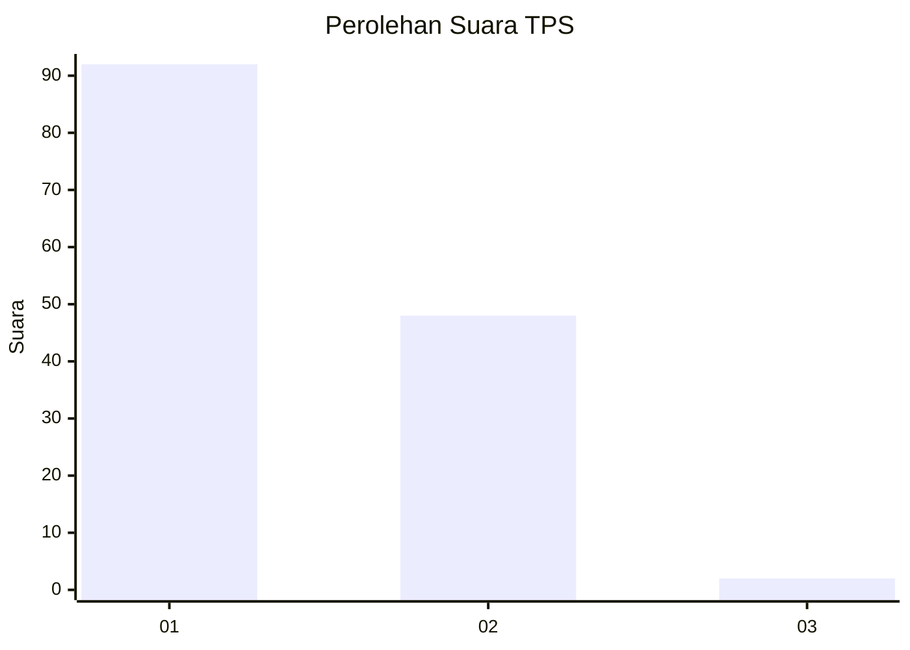
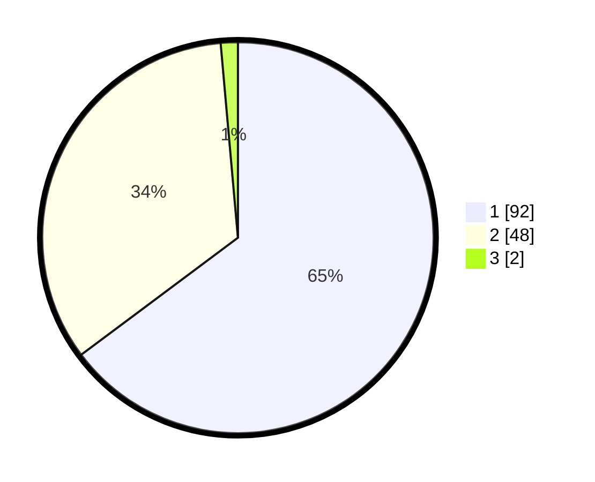

# Hasil

## Grafik

## Tabel

| No. | Nama Paslon    | Suara | Suara (raw) | Persentase |
|:--- |:-------------- | -----:| -----------:| ----------:|
| 1   | ANIES MUHAIMIN | 92    | [92][p-1]   | 64,79      |
| 2   | PRABOWO GIBRAN | 48    | [48][p-2]   | 33,80      |
| 3   | GANJAR MAHFUD  | 2     | [2][p-3]    | 1,41       |

[p-1]: https://github.com/gigit-pemilu/pemilu-2024-81-maluku/blob/main/pilpres/hitung-suara/sub/81-maluku/sub/01-maluku-tengah/sub/20-seram-utara-barat/sub/2001-saleman/sub/001-tps/sub/paslon-1.txt
[p-2]: https://github.com/gigit-pemilu/pemilu-2024-81-maluku/blob/main/pilpres/hitung-suara/sub/81-maluku/sub/01-maluku-tengah/sub/20-seram-utara-barat/sub/2001-saleman/sub/001-tps/sub/paslon-2.txt
[p-3]: https://github.com/gigit-pemilu/pemilu-2024-81-maluku/blob/main/pilpres/hitung-suara/sub/81-maluku/sub/01-maluku-tengah/sub/20-seram-utara-barat/sub/2001-saleman/sub/001-tps/sub/paslon-3.txt

## Foto C Plano

https://sirekap-obj-formc.kpu.go.id/53d7/pemilu/ppwp/81/01/20/20/01/8101202001001-20240222-074600--c93bce3e-a662-4421-8970-457963a88c50.jpg

https://sirekap-obj-formc.kpu.go.id/53d7/pemilu/ppwp/81/01/20/20/01/8101202001001-20240222-074701--9fd2664d-f3fe-4239-ba0b-54456f66f63a.jpg

https://sirekap-obj-formc.kpu.go.id/53d7/pemilu/ppwp/81/01/20/20/01/8101202001001-20240222-074729--fab83669-4a5b-4404-a066-57dc13512f24.jpg

## Metadata

| Key        | Value               |
| ---------- | ------------------- |
| Time Stamp | 2024-02-22 08:00:00 |

## DATA PEMILIH TETAP

Jumlah pemilih dalam DPT: **236**.
 * L: **823**.
 * P: **126**.

## DATA PENGGUNA HAK PILIH

Jumlah pengguna hak pilih dalam DPT: **244**.
 * L: **323**.
 * P: **121**.

Jumlah pengguna hak pilih dalam DPTb: **800**.
 * L: **88**.
 * P: **8**.

Jumlah pengguna hak pilih dalam DPK: **800**.
 * L: **800**.
 * P: **0**.

Jumlah pengguna hak pilih: **344**.
 * L: **325**.
 * P: **531**.

## JUMLAH SUARA SAH DAN TIDAK SAH

JUMLAH SELURUH SUARA SAH: **242**.

JUMLAH SUARA TIDAK SAH: **82**.

JUMLAH SELURUH SUARA SAH DAN SUARA TIDAK SAH: **234**.

