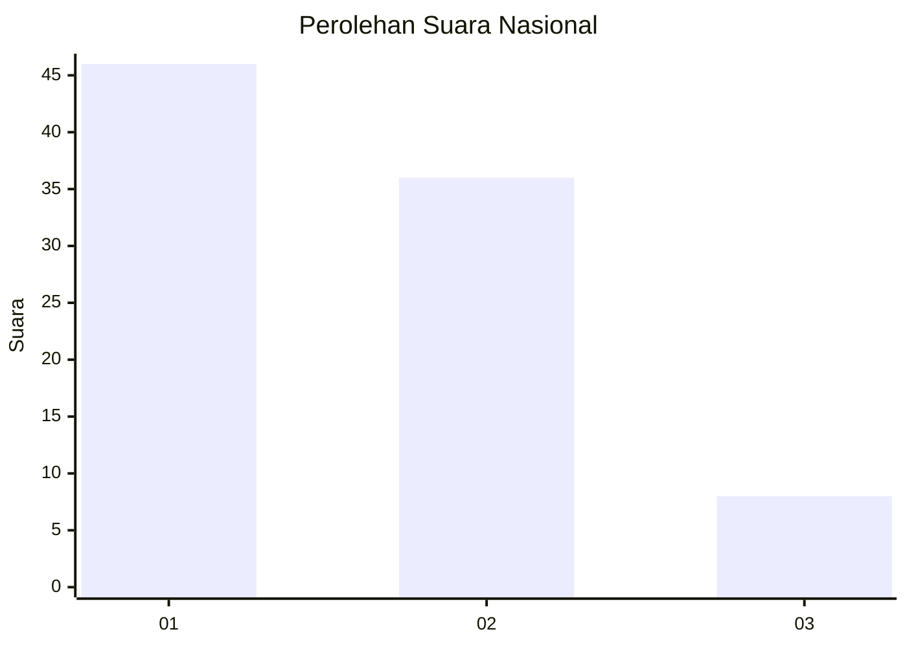
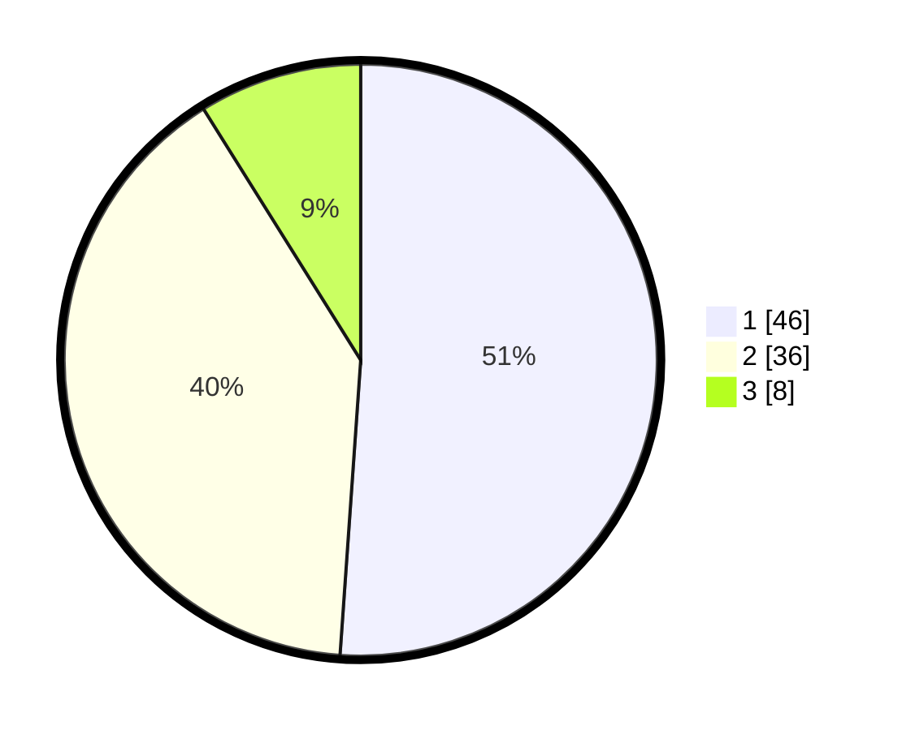

# Hasil

## Grafik

## Tabel

| No. | Nama Paslon    | Suara | Suara (raw) | Persentase |
|:--- |:-------------- | -----:| -----------:| ----------:|
| 1   | ANIES MUHAIMIN | 46    | [46][p-1]   | 51,11      |
| 2   | PRABOWO GIBRAN | 36    | [36][p-2]   | 40,00      |
| 3   | GANJAR MAHFUD  | 8     | [8][p-3]    | 8,89       |

[p-1]: https://github.com/gigit-pemilu/pemilu-2024/blob/main/pilpres/hitung-suara/sub/81-maluku/sub/01-maluku-tengah/sub/20-seram-utara-barat/sub/2001-saleman/sub/003-tps/sub/paslon-1.txt
[p-2]: https://github.com/gigit-pemilu/pemilu-2024/blob/main/pilpres/hitung-suara/sub/81-maluku/sub/01-maluku-tengah/sub/20-seram-utara-barat/sub/2001-saleman/sub/003-tps/sub/paslon-2.txt
[p-3]: https://github.com/gigit-pemilu/pemilu-2024/blob/main/pilpres/hitung-suara/sub/81-maluku/sub/01-maluku-tengah/sub/20-seram-utara-barat/sub/2001-saleman/sub/003-tps/sub/paslon-3.txt

## Foto C Plano

https://sirekap-obj-formc.kpu.go.id/e4ff/pemilu/ppwp/81/01/20/20/01/8101202001003-20240222-091200--53d7bcf5-b7a8-460f-bd0d-e529080bbeec.jpg

https://sirekap-obj-formc.kpu.go.id/e4ff/pemilu/ppwp/81/01/20/20/01/8101202001003-20240222-091345--24346311-3c26-4d00-81ee-d64315c4494d.jpg

https://sirekap-obj-formc.kpu.go.id/e4ff/pemilu/ppwp/81/01/20/20/01/8101202001003-20240222-091302--6557616a-3926-4fc5-9c6e-8ae56170642d.jpg

## Metadata

| Key        | Value               |
| ---------- | ------------------- |
| Time Stamp | 2024-02-22 10:00:00 |

## DATA PEMILIH TETAP

Jumlah pemilih dalam DPT: **288**.
 * L: **634**.
 * P: **654**.

## DATA PENGGUNA HAK PILIH

Jumlah pengguna hak pilih dalam DPT: **283**.
 * L: **230**.
 * P: **653**.

Jumlah pengguna hak pilih dalam DPTb: **0**.
 * L: **888**.
 * P: **0**.

Jumlah pengguna hak pilih dalam DPK: **0**.
 * L: **0**.
 * P: **80**.

Jumlah pengguna hak pilih: **283**.
 * L: **130**.
 * P: **153**.

## JUMLAH SUARA SAH DAN TIDAK SAH

JUMLAH SELURUH SUARA SAH: **222**.

JUMLAH SUARA TIDAK SAH: **5**.

JUMLAH SELURUH SUARA SAH DAN SUARA TIDAK SAH: **223**.

