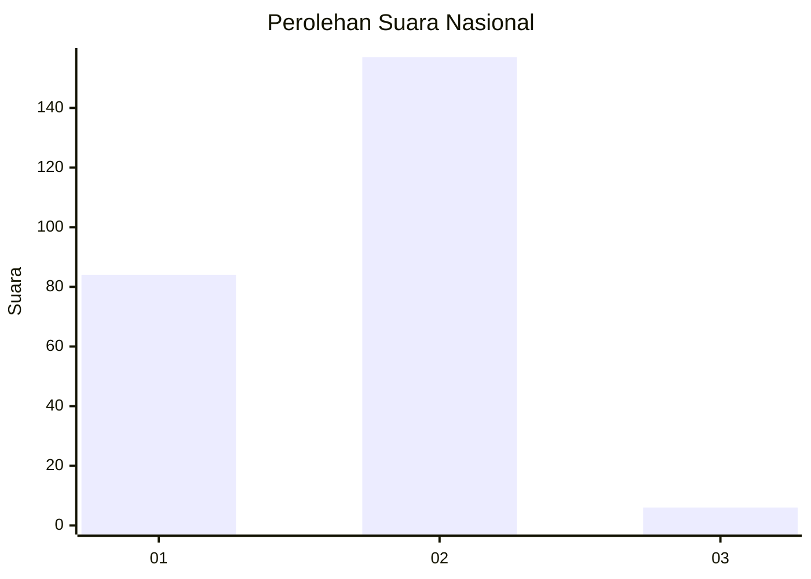
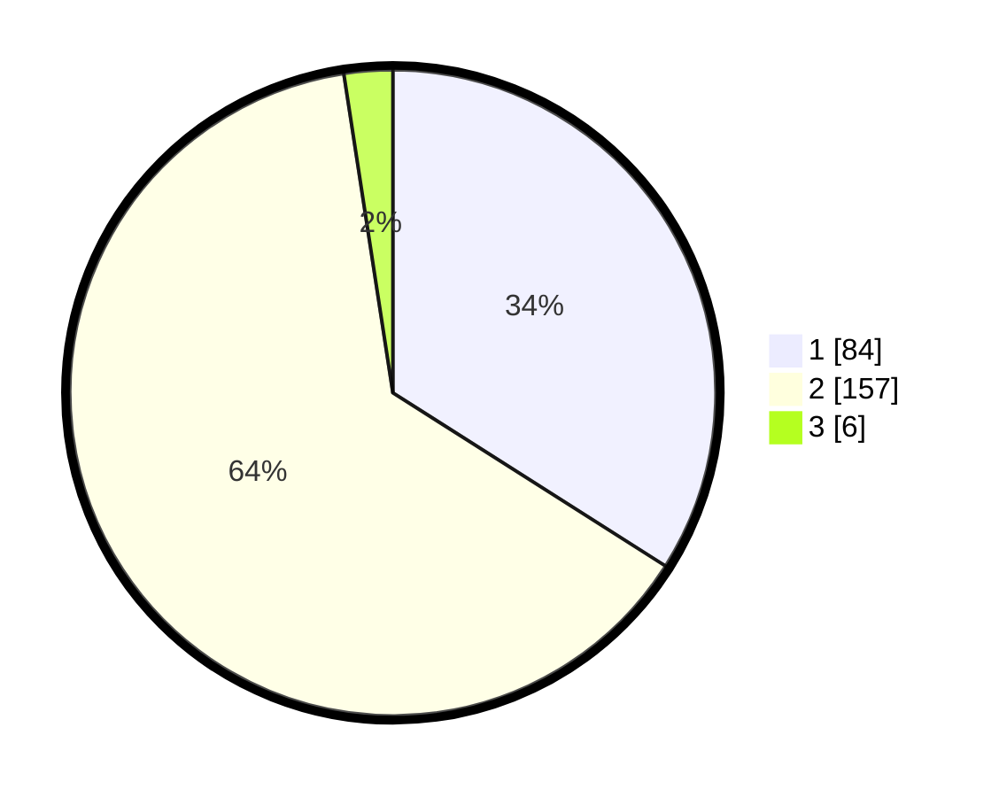

# Hasil

## Grafik

## Tabel

| No. | Nama Paslon    | Suara | Suara (raw) | Persentase |
|:--- |:-------------- | -----:| -----------:| ----------:|
| 1   | ANIES MUHAIMIN | 84    | [84][p-1]   | 34,01      |
| 2   | PRABOWO GIBRAN | 157   | [157][p-2]  | 63,56      |
| 3   | GANJAR MAHFUD  | 6     | [6][p-3]    | 2,43       |

[p-1]: https://github.com/gigit-pemilu/pemilu-2024/blob/main/pilpres/hitung-suara/sub/81-maluku/sub/01-maluku-tengah/sub/20-seram-utara-barat/sub/2001-saleman/sub/004-tps/sub/paslon-1.txt
[p-2]: https://github.com/gigit-pemilu/pemilu-2024/blob/main/pilpres/hitung-suara/sub/81-maluku/sub/01-maluku-tengah/sub/20-seram-utara-barat/sub/2001-saleman/sub/004-tps/sub/paslon-2.txt
[p-3]: https://github.com/gigit-pemilu/pemilu-2024/blob/main/pilpres/hitung-suara/sub/81-maluku/sub/01-maluku-tengah/sub/20-seram-utara-barat/sub/2001-saleman/sub/004-tps/sub/paslon-3.txt

## Foto C Plano

https://sirekap-obj-formc.kpu.go.id/5cb0/pemilu/ppwp/81/01/20/20/01/8101202001004-20240222-095915--6522df31-8fa5-425b-9346-0826df8972b4.jpg

https://sirekap-obj-formc.kpu.go.id/5cb0/pemilu/ppwp/81/01/20/20/01/8101202001004-20240222-095830--d4a04023-ff13-4320-93f6-f8330c07f607.jpg

https://sirekap-obj-formc.kpu.go.id/5cb0/pemilu/ppwp/81/01/20/20/01/8101202001004-20240222-095951--e4f56240-3f30-4387-93f7-87b466e62c23.jpg

## Metadata

| Key        | Value               |
| ---------- | ------------------- |
| Time Stamp | 2024-02-24 22:31:28 |

## DATA PEMILIH TETAP

Jumlah pemilih dalam DPT: **349**.
 * L: **338**.
 * P: **336**.

## DATA PENGGUNA HAK PILIH

Jumlah pengguna hak pilih dalam DPT: **234**.
 * L: **184**.
 * P: **439**.

Jumlah pengguna hak pilih dalam DPTb: **4**.
 * L: **2**.
 * P: **80**.

Jumlah pengguna hak pilih dalam DPK: **884**.
 * L: **83**.
 * P: **84**.

Jumlah pengguna hak pilih: **274**.
 * L: **272**.
 * P: **837**.

## JUMLAH SUARA SAH DAN TIDAK SAH

JUMLAH SELURUH SUARA SAH: **247**.

JUMLAH SUARA TIDAK SAH: **2**.

JUMLAH SELURUH SUARA SAH DAN SUARA TIDAK SAH: **249**.

