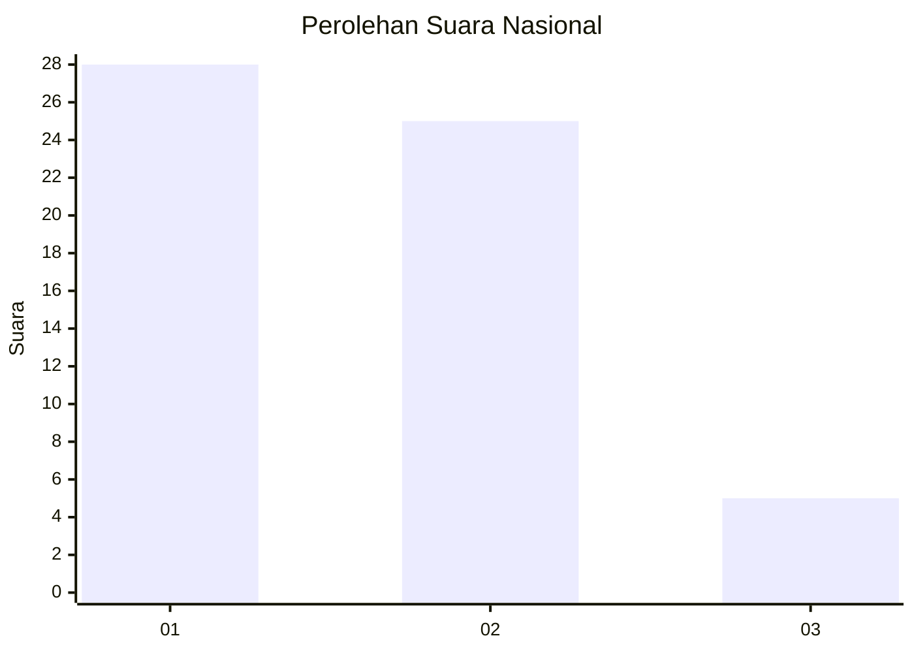
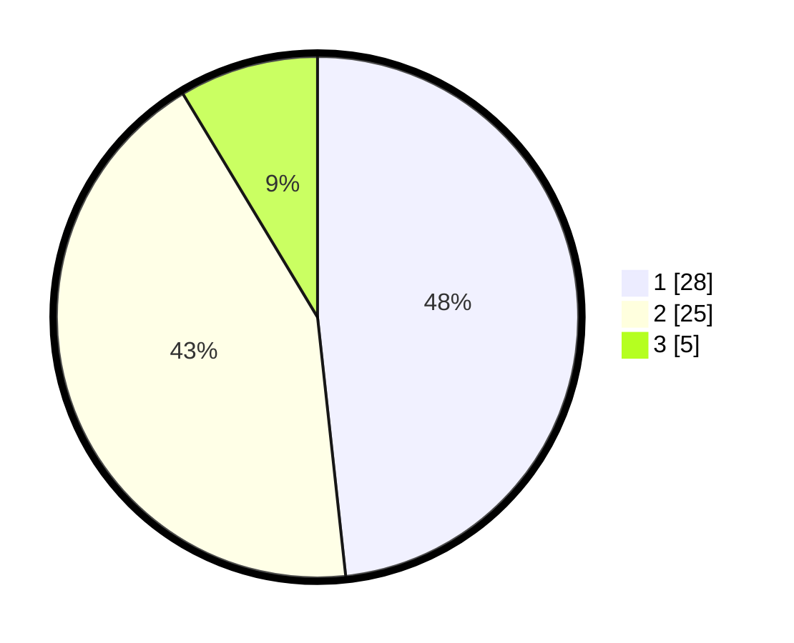

# Hasil

## Grafik

## Tabel

| No. | Nama Paslon    | Suara | Suara (raw) | Persentase |
|:--- |:-------------- | -----:| -----------:| ----------:|
| 1   | ANIES MUHAIMIN | 28    | [28][p-1]   | 48,28      |
| 2   | PRABOWO GIBRAN | 25    | [25][p-2]   | 43,10      |
| 3   | GANJAR MAHFUD  | 5     | [5][p-3]    | 8,62       |

[p-1]: https://github.com/gigit-pemilu/pemilu-2024/blob/main/pilpres/hitung-suara/sub/81-maluku/sub/01-maluku-tengah/sub/20-seram-utara-barat/sub/2001-saleman/sub/005-tps/sub/paslon-1.txt
[p-2]: https://github.com/gigit-pemilu/pemilu-2024/blob/main/pilpres/hitung-suara/sub/81-maluku/sub/01-maluku-tengah/sub/20-seram-utara-barat/sub/2001-saleman/sub/005-tps/sub/paslon-2.txt
[p-3]: https://github.com/gigit-pemilu/pemilu-2024/blob/main/pilpres/hitung-suara/sub/81-maluku/sub/01-maluku-tengah/sub/20-seram-utara-barat/sub/2001-saleman/sub/005-tps/sub/paslon-3.txt

## Foto C Plano

https://sirekap-obj-formc.kpu.go.id/1725/pemilu/ppwp/81/01/20/20/01/8101202001005-20240222-122945--93bd5d83-661a-4f0a-b613-ec904e436b05.jpg

https://sirekap-obj-formc.kpu.go.id/1725/pemilu/ppwp/81/01/20/20/01/8101202001005-20240222-123037--54e2a230-7e7e-4b5b-83eb-001cd696e73e.jpg

https://sirekap-obj-formc.kpu.go.id/1725/pemilu/ppwp/81/01/20/20/01/8101202001005-20240222-123141--465a4f86-46ff-4360-811a-a418f7ddabab.jpg

## Metadata

| Key        | Value               |
| ---------- | ------------------- |
| Time Stamp | 2024-02-22 13:00:00 |

## DATA PEMILIH TETAP

Jumlah pemilih dalam DPT: **247**.
 * L: **823**.
 * P: **525**.

## DATA PENGGUNA HAK PILIH

Jumlah pengguna hak pilih dalam DPT: **333**.
 * L: **123**.
 * P: **727**.

Jumlah pengguna hak pilih dalam DPTb: **0**.
 * L: **80**.
 * P: **0**.

Jumlah pengguna hak pilih dalam DPK: **3**.
 * L: **801**.
 * P: **0**.

Jumlah pengguna hak pilih: **345**.
 * L: **129**.
 * P: **123**.

## JUMLAH SUARA SAH DAN TIDAK SAH

JUMLAH SELURUH SUARA SAH: **342**.

JUMLAH SUARA TIDAK SAH: **2**.

JUMLAH SELURUH SUARA SAH DAN SUARA TIDAK SAH: **293**.

