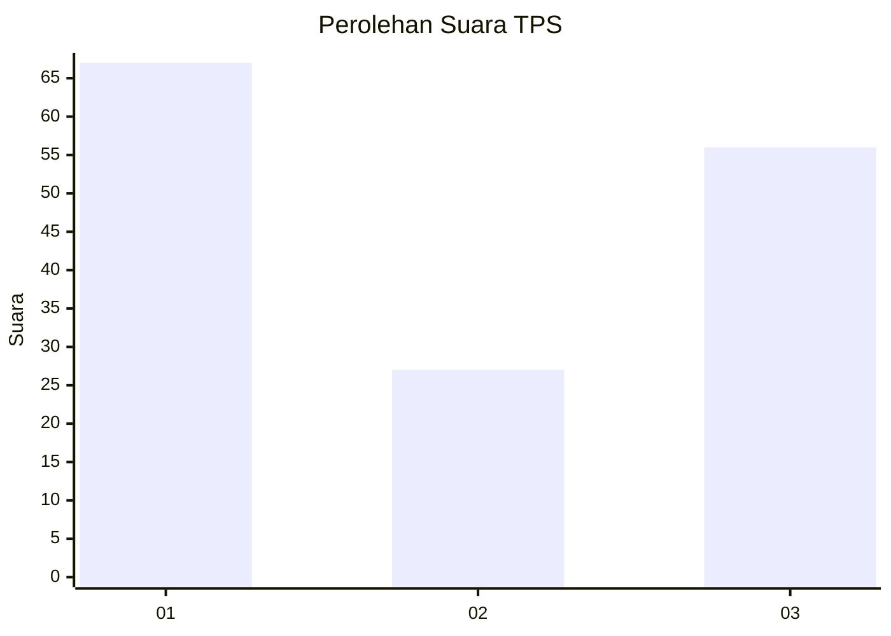
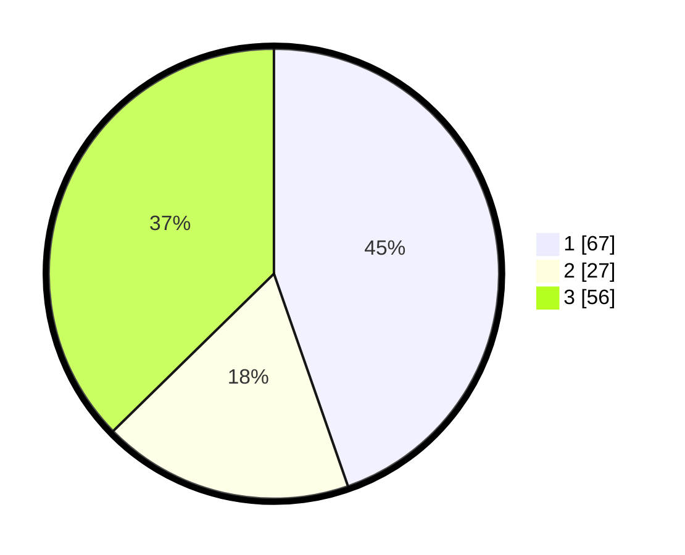

# Hasil

## Grafik

## Tabel

| No. | Nama Paslon    | Suara | Suara (raw) | Persentase |
|:--- |:-------------- | -----:| -----------:| ----------:|
| 1   | ANIES MUHAIMIN | 67    | [67][p-1]   | 44,67      |
| 2   | PRABOWO GIBRAN | 27    | [27][p-2]   | 18,00      |
| 3   | GANJAR MAHFUD  | 56    | [56][p-3]   | 37,33      |

[p-1]: https://github.com/gigit-pemilu/pemilu-2024-81-maluku/blob/main/pilpres/hitung-suara/sub/81-maluku/sub/01-maluku-tengah/sub/20-seram-utara-barat/sub/2007-labuan/sub/003-tps/sub/paslon-1.txt
[p-2]: https://github.com/gigit-pemilu/pemilu-2024-81-maluku/blob/main/pilpres/hitung-suara/sub/81-maluku/sub/01-maluku-tengah/sub/20-seram-utara-barat/sub/2007-labuan/sub/003-tps/sub/paslon-2.txt
[p-3]: https://github.com/gigit-pemilu/pemilu-2024-81-maluku/blob/main/pilpres/hitung-suara/sub/81-maluku/sub/01-maluku-tengah/sub/20-seram-utara-barat/sub/2007-labuan/sub/003-tps/sub/paslon-3.txt

## Foto C Plano

https://sirekap-obj-formc.kpu.go.id/39c0/pemilu/ppwp/81/01/20/20/07/8101202007003-20240221-201900--194ff472-e106-49f6-ab88-0ca31fd80f3d.jpg

https://sirekap-obj-formc.kpu.go.id/39c0/pemilu/ppwp/81/01/20/20/07/8101202007003-20240221-202008--0ed462c9-c6a2-4581-b154-42ddfde925aa.jpg

https://sirekap-obj-formc.kpu.go.id/39c0/pemilu/ppwp/81/01/20/20/07/8101202007003-20240221-202041--8132bea7-22f6-4fa6-be2a-296043f1a0d4.jpg

## Metadata

| Key        | Value               |
| ---------- | ------------------- |
| Time Stamp | 2024-02-21 21:00:04 |

## DATA PEMILIH TETAP

Jumlah pemilih dalam DPT: **488**.
 * L: **555**.
 * P: **782**.

## DATA PENGGUNA HAK PILIH

Jumlah pengguna hak pilih dalam DPT: **88**.
 * L: **95**.
 * P: **98**.

Jumlah pengguna hak pilih dalam DPTb: **8**.
 * L: **8**.
 * P: **808**.

Jumlah pengguna hak pilih dalam DPK: **828**.
 * L: **8**.
 * P: **7**.

Jumlah pengguna hak pilih: **293**.
 * L: **899**.
 * P: **98**.

## JUMLAH SUARA SAH DAN TIDAK SAH

JUMLAH SELURUH SUARA SAH: **395**.

JUMLAH SUARA TIDAK SAH: **882**.

JUMLAH SELURUH SUARA SAH DAN SUARA TIDAK SAH: **797**.

