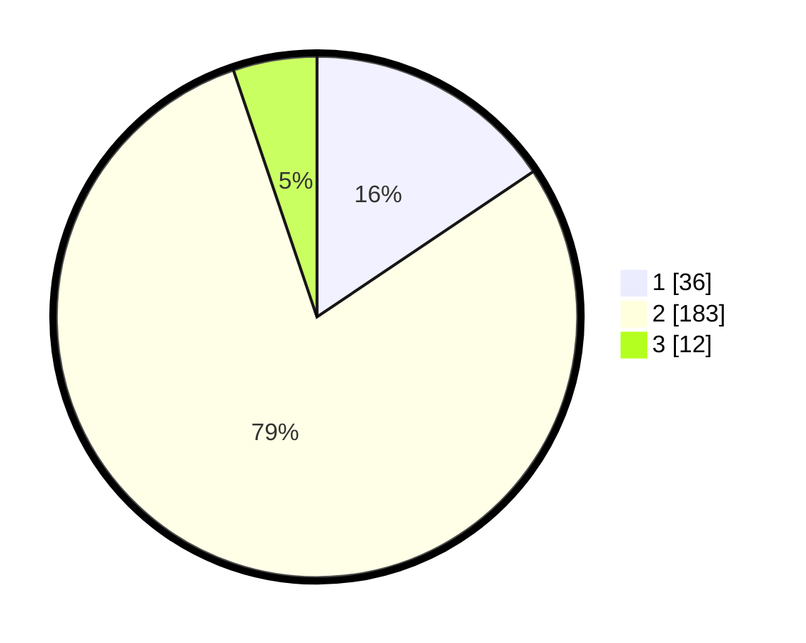

# Hasil

## Grafik

## Tabel

| No. | Nama Paslon    | Suara | Suara (raw) | Persentase |
|:--- |:-------------- | -----:| -----------:| ----------:|
| 1   | ANIES MUHAIMIN | 36    | [36][p-1]   | 15,58      |
| 2   | PRABOWO GIBRAN | 183   | [183][p-2]  | 79,22      |
| 3   | GANJAR MAHFUD  | 12    | [12][p-3]   | 5,19       |

[p-1]: https://github.com/gigit-pemilu/pemilu-2024-81-maluku/blob/main/pilpres/hitung-suara/sub/81-maluku/sub/01-maluku-tengah/sub/20-seram-utara-barat/sub/2009-latea/sub/002-tps/sub/paslon-1.txt
[p-2]: https://github.com/gigit-pemilu/pemilu-2024-81-maluku/blob/main/pilpres/hitung-suara/sub/81-maluku/sub/01-maluku-tengah/sub/20-seram-utara-barat/sub/2009-latea/sub/002-tps/sub/paslon-2.txt
[p-3]: https://github.com/gigit-pemilu/pemilu-2024-81-maluku/blob/main/pilpres/hitung-suara/sub/81-maluku/sub/01-maluku-tengah/sub/20-seram-utara-barat/sub/2009-latea/sub/002-tps/sub/paslon-3.txt

## Foto C Plano

https://sirekap-obj-formc.kpu.go.id/d128/pemilu/ppwp/81/01/20/20/09/8101202009002-20240221-074614--46f95b07-e44c-442d-9669-fd5ff5e8a4ec.jpg

https://sirekap-obj-formc.kpu.go.id/d128/pemilu/ppwp/81/01/20/20/09/8101202009002-20240221-074649--3cade458-24ef-4f0c-92c4-17cc32665a68.jpg

https://sirekap-obj-formc.kpu.go.id/d128/pemilu/ppwp/81/01/20/20/09/8101202009002-20240221-074718--5c6559b2-0b3f-456d-9df1-c17320917925.jpg

## Metadata

| Key        | Value               |
| ---------- | ------------------- |
| Time Stamp | 2024-02-24 22:31:28 |

## DATA PEMILIH TETAP

Jumlah pemilih dalam DPT: **285**.
 * L: **702**.
 * P: **843**.

## DATA PENGGUNA HAK PILIH

Jumlah pengguna hak pilih dalam DPT: **238**.
 * L: **455**.
 * P: **838**.

Jumlah pengguna hak pilih dalam DPTb: **880**.
 * L: **368**.
 * P: **888**.

Jumlah pengguna hak pilih dalam DPK: **208**.
 * L: **800**.
 * P: **88**.

Jumlah pengguna hak pilih: **231**.
 * L: **665**.
 * P: **805**.

## JUMLAH SUARA SAH DAN TIDAK SAH

JUMLAH SELURUH SUARA SAH: **231**.

JUMLAH SUARA TIDAK SAH: **0**.

JUMLAH SELURUH SUARA SAH DAN SUARA TIDAK SAH: **231**.

