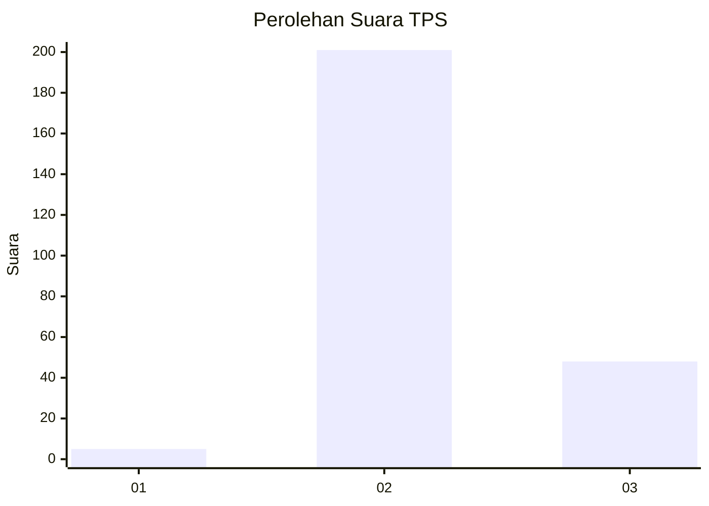
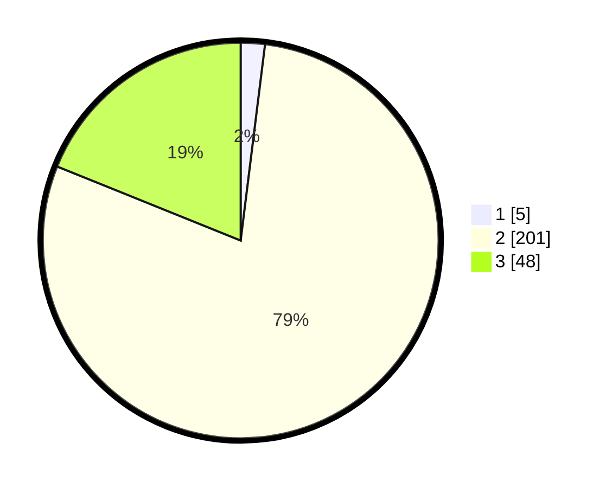

# Hasil

## Grafik

## Tabel

| No. | Nama Paslon    | Suara | Suara (raw) | Persentase |
|:--- |:-------------- | -----:| -----------:| ----------:|
| 1   | ANIES MUHAIMIN | 5     | [5][p-1]    | 1,97       |
| 2   | PRABOWO GIBRAN | 201   | [201][p-2]  | 79,13      |
| 3   | GANJAR MAHFUD  | 48    | [48][p-3]   | 18,90      |

[p-1]: https://github.com/gigit-pemilu/pemilu-2024-81-maluku/blob/main/pilpres/hitung-suara/sub/81-maluku/sub/01-maluku-tengah/sub/21-teluk-elpaputih/sub/2001-waraka/sub/001-tps/sub/paslon-1.txt
[p-2]: https://github.com/gigit-pemilu/pemilu-2024-81-maluku/blob/main/pilpres/hitung-suara/sub/81-maluku/sub/01-maluku-tengah/sub/21-teluk-elpaputih/sub/2001-waraka/sub/001-tps/sub/paslon-2.txt
[p-3]: https://github.com/gigit-pemilu/pemilu-2024-81-maluku/blob/main/pilpres/hitung-suara/sub/81-maluku/sub/01-maluku-tengah/sub/21-teluk-elpaputih/sub/2001-waraka/sub/001-tps/sub/paslon-3.txt

## Foto C Plano

https://sirekap-obj-formc.kpu.go.id/40be/pemilu/ppwp/81/01/21/20/01/8101212001001-20240215-082542--3caef32c-fce9-4b82-8b0f-2a4ee0871ae6.jpg

https://sirekap-obj-formc.kpu.go.id/40be/pemilu/ppwp/81/01/21/20/01/8101212001001-20240215-082711--2d7f2e1d-1c46-453d-91bb-b1ed5c1b42fb.jpg

https://sirekap-obj-formc.kpu.go.id/40be/pemilu/ppwp/81/01/21/20/01/8101212001001-20240215-082829--ad657620-efcb-43c6-a320-6031f54605c8.jpg

## Metadata

| Key        | Value               |
| ---------- | ------------------- |
| Time Stamp | 2024-02-25 16:00:00 |

