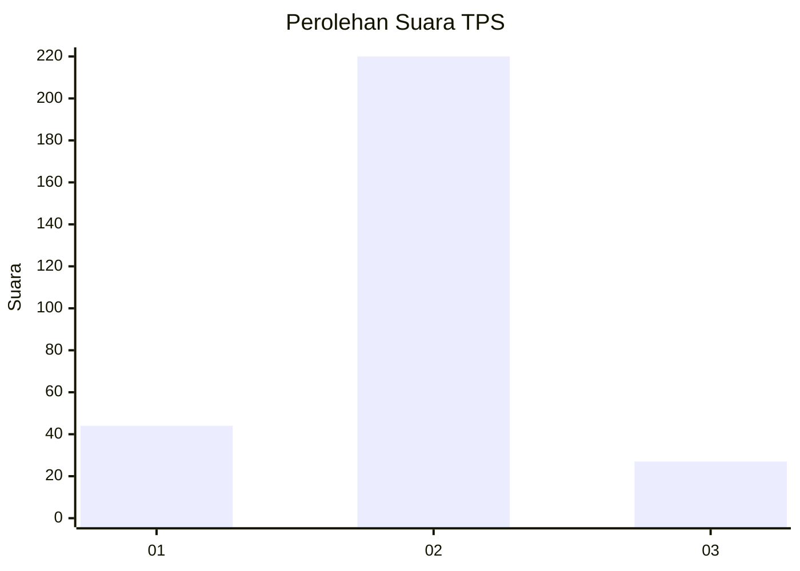
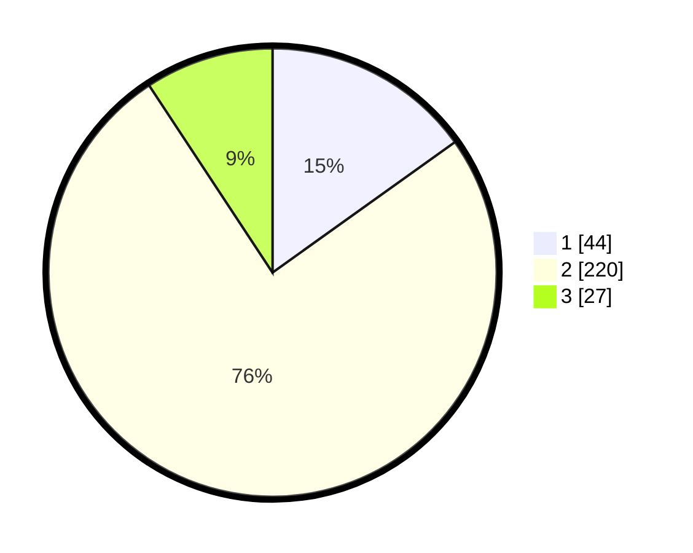

# Hasil

## Grafik

## Tabel

| No. | Nama Paslon    | Suara | Suara (raw) | Persentase |
|:--- |:-------------- | -----:| -----------:| ----------:|
| 1   | ANIES MUHAIMIN | 44    | [44][p-1]   | 15,12      |
| 2   | PRABOWO GIBRAN | 220   | [220][p-2]  | 75,60      |
| 3   | GANJAR MAHFUD  | 27    | [27][p-3]   | 9,28       |

[p-1]: https://github.com/gigit-pemilu/pemilu-2024-81-maluku/blob/main/pilpres/hitung-suara/sub/81-maluku/sub/01-maluku-tengah/sub/23-telutih/sub/2001-ulahahan/sub/001-tps/sub/paslon-1.txt
[p-2]: https://github.com/gigit-pemilu/pemilu-2024-81-maluku/blob/main/pilpres/hitung-suara/sub/81-maluku/sub/01-maluku-tengah/sub/23-telutih/sub/2001-ulahahan/sub/001-tps/sub/paslon-2.txt
[p-3]: https://github.com/gigit-pemilu/pemilu-2024-81-maluku/blob/main/pilpres/hitung-suara/sub/81-maluku/sub/01-maluku-tengah/sub/23-telutih/sub/2001-ulahahan/sub/001-tps/sub/paslon-3.txt

## Foto C Plano

https://sirekap-obj-formc.kpu.go.id/810f/pemilu/ppwp/81/01/23/20/01/8101232001001-20240220-155353--4a197dd2-41bc-4f61-afdc-a7599eb701f8.jpg

https://sirekap-obj-formc.kpu.go.id/810f/pemilu/ppwp/81/01/23/20/01/8101232001001-20240220-161154--89ba97e6-3f50-4266-8362-1ed0aa24d432.jpg

https://sirekap-obj-formc.kpu.go.id/810f/pemilu/ppwp/81/01/23/20/01/8101232001001-20240220-162603--95424d18-34e6-47da-bd05-a71919ccba81.jpg

## Metadata

| Key        | Value               |
| ---------- | ------------------- |
| Time Stamp | 2024-02-20 17:00:00 |

