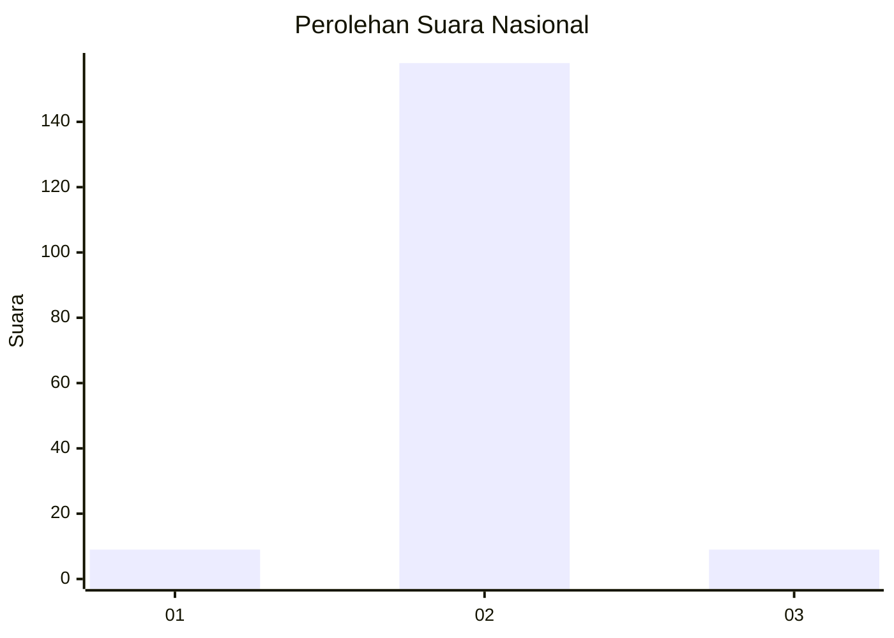
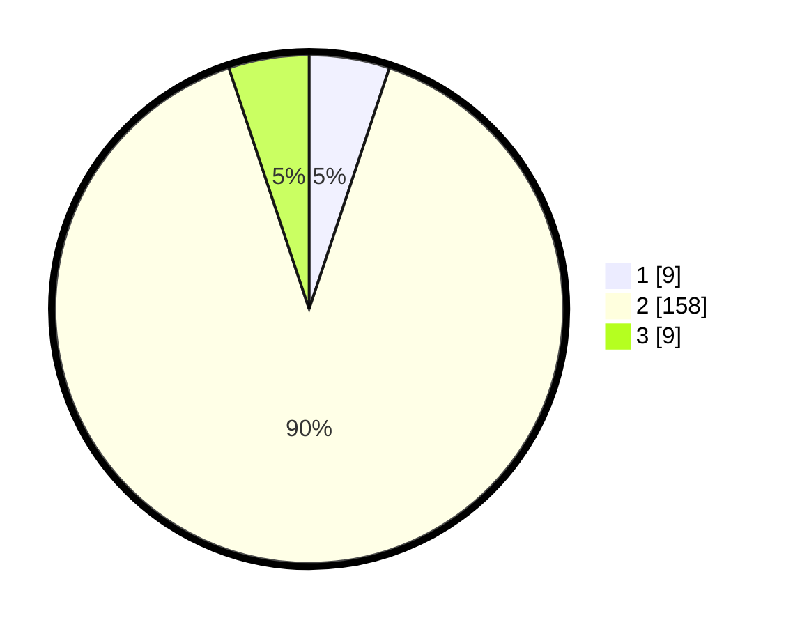

# Hasil

## Grafik

## Tabel

| No. | Nama Paslon    | Suara | Suara (raw) | Persentase |
|:--- |:-------------- | -----:| -----------:| ----------:|
| 1   | ANIES MUHAIMIN | 9     | [9][p-1]    | 5,11       |
| 2   | PRABOWO GIBRAN | 158   | [158][p-2]  | 89,77      |
| 3   | GANJAR MAHFUD  | 9     | [9][p-3]    | 5,11       |

[p-1]: https://github.com/gigit-pemilu/pemilu-2024/blob/main/pilpres/hitung-suara/sub/81-maluku/sub/01-maluku-tengah/sub/23-telutih/sub/2003-lafa/sub/003-tps/sub/paslon-1.txt
[p-2]: https://github.com/gigit-pemilu/pemilu-2024/blob/main/pilpres/hitung-suara/sub/81-maluku/sub/01-maluku-tengah/sub/23-telutih/sub/2003-lafa/sub/003-tps/sub/paslon-2.txt
[p-3]: https://github.com/gigit-pemilu/pemilu-2024/blob/main/pilpres/hitung-suara/sub/81-maluku/sub/01-maluku-tengah/sub/23-telutih/sub/2003-lafa/sub/003-tps/sub/paslon-3.txt

## Foto C Plano

https://sirekap-obj-formc.kpu.go.id/31dc/pemilu/ppwp/81/01/23/20/03/8101232003003-20240214-191420--7579838e-116e-4e8b-b9da-5145d8ac896e.jpg

https://sirekap-obj-formc.kpu.go.id/31dc/pemilu/ppwp/81/01/23/20/03/8101232003003-20240215-063524--ccb8b77f-3f2d-4503-b042-47990dc34fc9.jpg

https://sirekap-obj-formc.kpu.go.id/31dc/pemilu/ppwp/81/01/23/20/03/8101232003003-20240214-190959--4e1a3049-ea14-4b3a-b80d-18530ce513bb.jpg

## Metadata

| Key        | Value               |
| ---------- | ------------------- |
| Time Stamp | 2024-02-15 17:00:25 |

