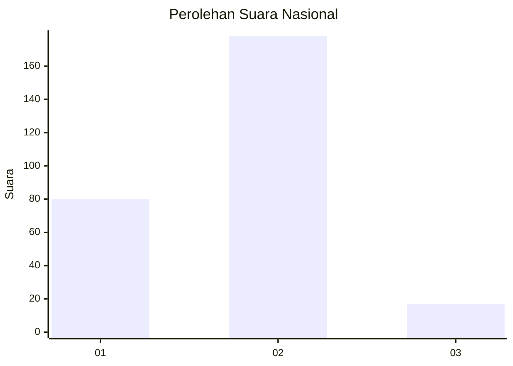
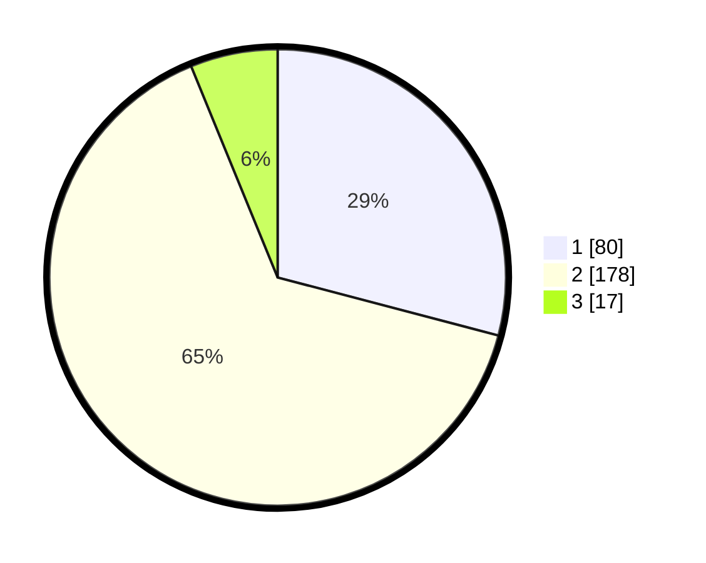

# Hasil

## Grafik

## Tabel

| No. | Nama Paslon    | Suara | Suara (raw) | Persentase |
|:--- |:-------------- | -----:| -----------:| ----------:|
| 1   | ANIES MUHAIMIN | 80    | [80][p-1]   | 29,09      |
| 2   | PRABOWO GIBRAN | 178   | [178][p-2]  | 64,73      |
| 3   | GANJAR MAHFUD  | 17    | [17][p-3]   | 6,18       |

[p-1]: https://github.com/gigit-pemilu/pemilu-2024/blob/main/pilpres/hitung-suara/sub/81-maluku/sub/01-maluku-tengah/sub/23-telutih/sub/2008-tehua/sub/001-tps/sub/paslon-1.txt
[p-2]: https://github.com/gigit-pemilu/pemilu-2024/blob/main/pilpres/hitung-suara/sub/81-maluku/sub/01-maluku-tengah/sub/23-telutih/sub/2008-tehua/sub/001-tps/sub/paslon-2.txt
[p-3]: https://github.com/gigit-pemilu/pemilu-2024/blob/main/pilpres/hitung-suara/sub/81-maluku/sub/01-maluku-tengah/sub/23-telutih/sub/2008-tehua/sub/001-tps/sub/paslon-3.txt

## Foto C Plano

https://sirekap-obj-formc.kpu.go.id/8805/pemilu/ppwp/81/01/23/20/08/8101232008001-20240215-071608--b6da5e58-f280-4e5c-a2ce-5edf9ef37270.jpg

https://sirekap-obj-formc.kpu.go.id/8805/pemilu/ppwp/81/01/23/20/08/8101232008001-20240214-155353--657d28f9-4e36-4f49-b89e-ace3118d8d10.jpg

https://sirekap-obj-formc.kpu.go.id/8805/pemilu/ppwp/81/01/23/20/08/8101232008001-20240215-071829--c1f461f6-640e-40fd-95f2-d40cf19a6449.jpg

## Metadata

| Key        | Value               |
| ---------- | ------------------- |
| Time Stamp | 2024-02-15 16:30:25 |

