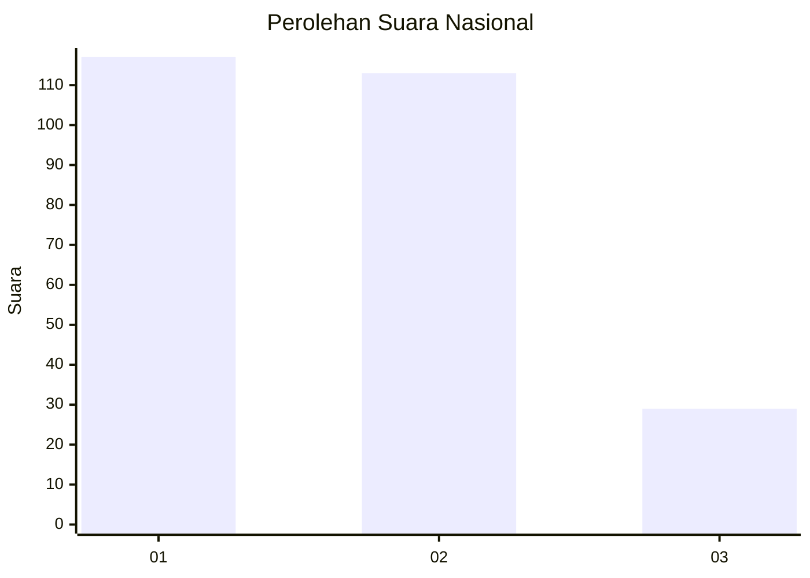
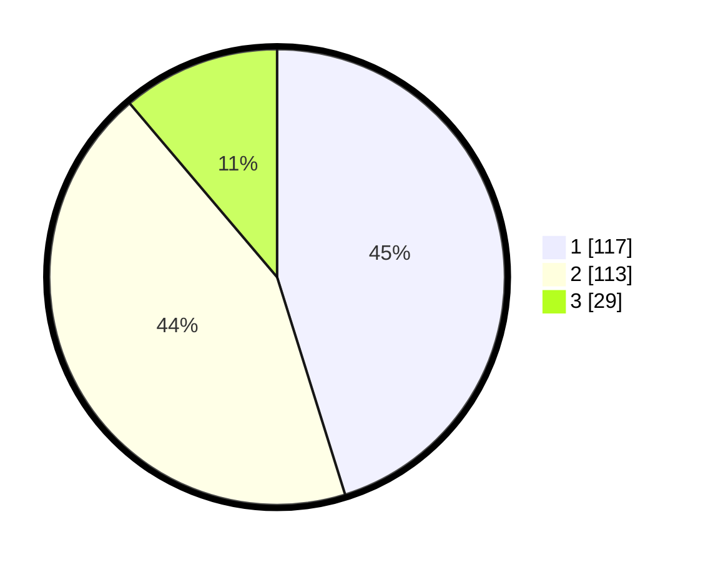

# Hasil

## Grafik

## Tabel

| No. | Nama Paslon    | Suara | Suara (raw) | Persentase |
|:--- |:-------------- | -----:| -----------:| ----------:|
| 1   | ANIES MUHAIMIN | 117   | [117][p-1]  | 45,17      |
| 2   | PRABOWO GIBRAN | 113   | [113][p-2]  | 43,63      |
| 3   | GANJAR MAHFUD  | 29    | [29][p-3]   | 11,20      |

[p-1]: https://github.com/gigit-pemilu/pemilu-2024/blob/main/pilpres/hitung-suara/sub/81-maluku/sub/01-maluku-tengah/sub/23-telutih/sub/2008-tehua/sub/005-tps/sub/paslon-1.txt
[p-2]: https://github.com/gigit-pemilu/pemilu-2024/blob/main/pilpres/hitung-suara/sub/81-maluku/sub/01-maluku-tengah/sub/23-telutih/sub/2008-tehua/sub/005-tps/sub/paslon-2.txt
[p-3]: https://github.com/gigit-pemilu/pemilu-2024/blob/main/pilpres/hitung-suara/sub/81-maluku/sub/01-maluku-tengah/sub/23-telutih/sub/2008-tehua/sub/005-tps/sub/paslon-3.txt

## Foto C Plano

https://sirekap-obj-formc.kpu.go.id/e778/pemilu/ppwp/81/01/23/20/08/8101232008005-20240215-123754--d1a1d843-1344-4135-beb5-b09ec1018c74.jpg

https://sirekap-obj-formc.kpu.go.id/e778/pemilu/ppwp/81/01/23/20/08/8101232008005-20240215-161641--2f2e3412-b278-4ba2-9e5b-d4680cc3b03a.jpg

https://sirekap-obj-formc.kpu.go.id/e778/pemilu/ppwp/81/01/23/20/08/8101232008005-20240215-145841--4db74943-6f82-4a5a-b51d-94e10b76e49f.jpg

## Metadata

| Key        | Value               |
| ---------- | ------------------- |
| Time Stamp | 2024-02-21 19:00:00 |

