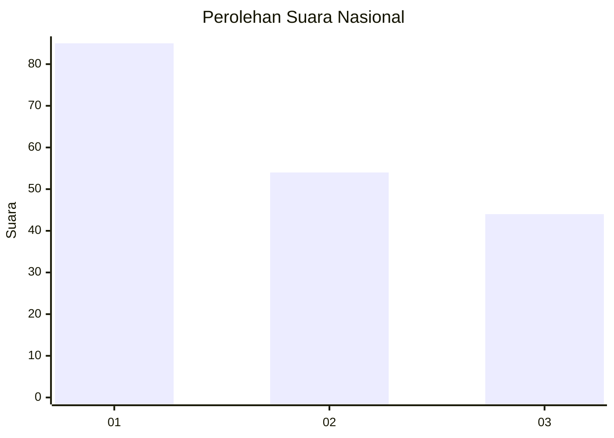
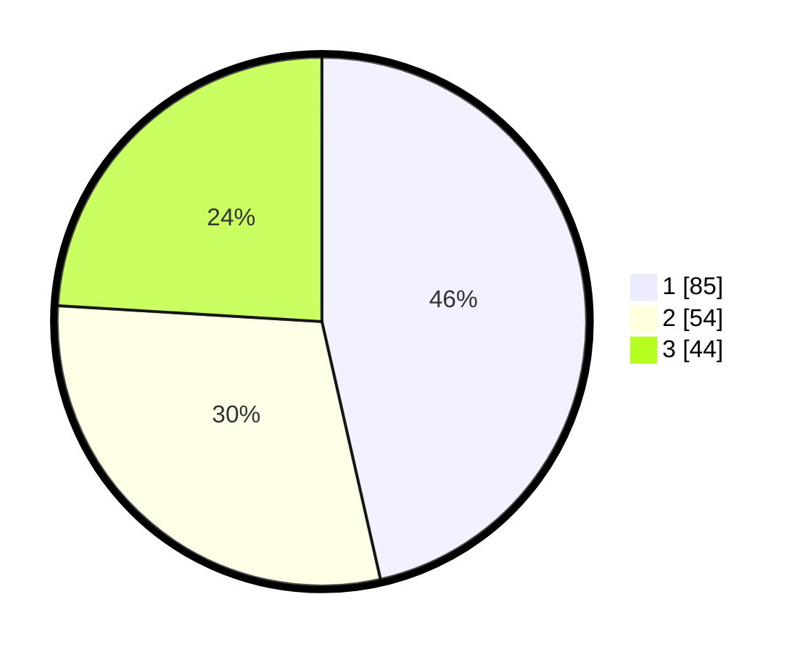

# Hasil

## Grafik

## Tabel

| No. | Nama Paslon    | Suara | Suara (raw) | Persentase |
|:--- |:-------------- | -----:| -----------:| ----------:|
| 1   | ANIES MUHAIMIN | 85    | [85][p-1]   | 46,45      |
| 2   | PRABOWO GIBRAN | 54    | [54][p-2]   | 29,51      |
| 3   | GANJAR MAHFUD  | 44    | [44][p-3]   | 24,04      |

[p-1]: https://github.com/gigit-pemilu/pemilu-2024/blob/main/pilpres/hitung-suara/sub/81-maluku/sub/01-maluku-tengah/sub/24-seram-utara-timur-seti/sub/2001-seti/sub/004-tps/sub/paslon-1.txt
[p-2]: https://github.com/gigit-pemilu/pemilu-2024/blob/main/pilpres/hitung-suara/sub/81-maluku/sub/01-maluku-tengah/sub/24-seram-utara-timur-seti/sub/2001-seti/sub/004-tps/sub/paslon-2.txt
[p-3]: https://github.com/gigit-pemilu/pemilu-2024/blob/main/pilpres/hitung-suara/sub/81-maluku/sub/01-maluku-tengah/sub/24-seram-utara-timur-seti/sub/2001-seti/sub/004-tps/sub/paslon-3.txt

## Foto C Plano

https://sirekap-obj-formc.kpu.go.id/6e9f/pemilu/ppwp/81/01/24/20/01/8101242001004-20240223-124610--34e2c496-b50f-4ae4-ab0d-3040c9b9ee47.jpg

https://sirekap-obj-formc.kpu.go.id/6e9f/pemilu/ppwp/81/01/24/20/01/8101242001004-20240223-124713--2edcf2b3-11f4-4114-af44-614c33182d4d.jpg

https://sirekap-obj-formc.kpu.go.id/6e9f/pemilu/ppwp/81/01/24/20/01/8101242001004-20240223-124929--5a6b15a7-d3a9-4839-87b2-697b857f6b13.jpg

## Metadata

| Key        | Value               |
| ---------- | ------------------- |
| Time Stamp | 2024-02-24 22:31:28 |

## DATA PEMILIH TETAP

Jumlah pemilih dalam DPT: **882**.
 * L: **93**.
 * P: **89**.

## DATA PENGGUNA HAK PILIH

Jumlah pengguna hak pilih dalam DPT: **476**.
 * L: **84**.
 * P: **87**.

Jumlah pengguna hak pilih dalam DPTb: **500**.
 * L: **373**.
 * P: **525**.

Jumlah pengguna hak pilih dalam DPK: **757**.
 * L: **77**.
 * P: **355**.

Jumlah pengguna hak pilih: **476**.
 * L: **39**.
 * P: **87**.

## JUMLAH SUARA SAH DAN TIDAK SAH

JUMLAH SELURUH SUARA SAH: **664**.

JUMLAH SUARA TIDAK SAH: **2**.

JUMLAH SELURUH SUARA SAH DAN SUARA TIDAK SAH: **566**.

