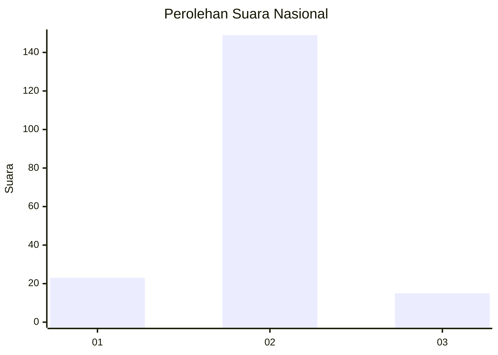
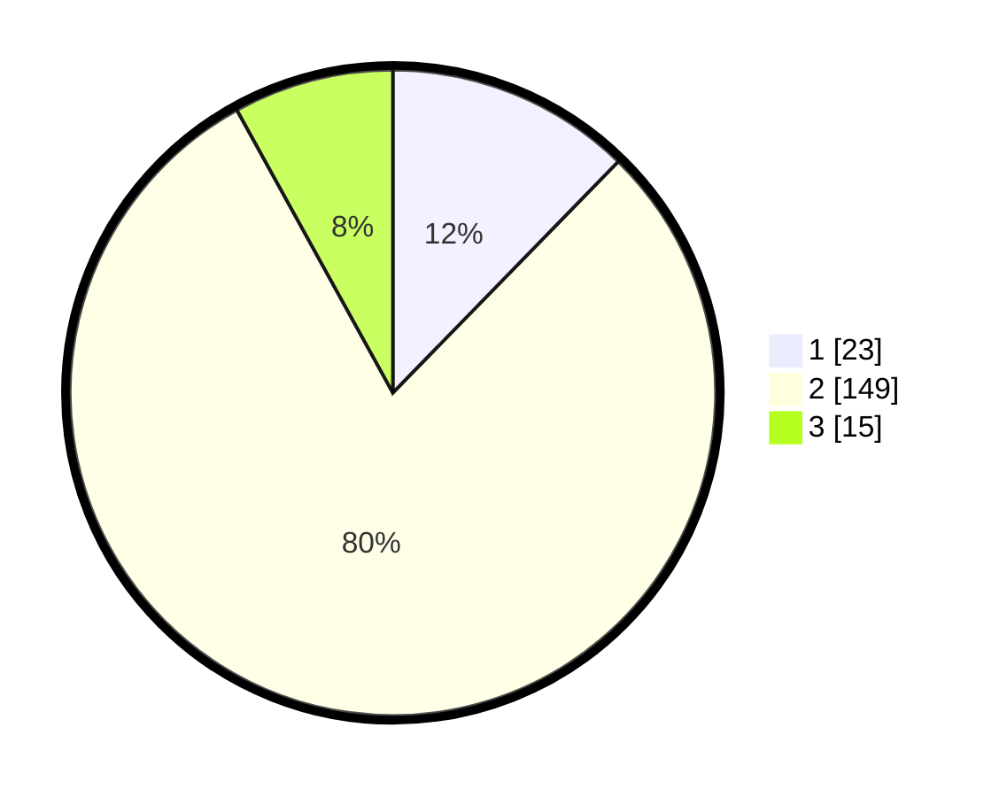

# Hasil

## Grafik

## Tabel

| No. | Nama Paslon    | Suara | Suara (raw) | Persentase |
|:--- |:-------------- | -----:| -----------:| ----------:|
| 1   | ANIES MUHAIMIN | 23    | [23][p-1]   | 12,30      |
| 2   | PRABOWO GIBRAN | 149   | [149][p-2]  | 79,68      |
| 3   | GANJAR MAHFUD  | 15    | [15][p-3]   | 8,02       |

[p-1]: https://github.com/gigit-pemilu/pemilu-2024/blob/main/pilpres/hitung-suara/sub/81-maluku/sub/01-maluku-tengah/sub/24-seram-utara-timur-seti/sub/2007-waimusal/sub/001-tps/sub/paslon-1.txt
[p-2]: https://github.com/gigit-pemilu/pemilu-2024/blob/main/pilpres/hitung-suara/sub/81-maluku/sub/01-maluku-tengah/sub/24-seram-utara-timur-seti/sub/2007-waimusal/sub/001-tps/sub/paslon-2.txt
[p-3]: https://github.com/gigit-pemilu/pemilu-2024/blob/main/pilpres/hitung-suara/sub/81-maluku/sub/01-maluku-tengah/sub/24-seram-utara-timur-seti/sub/2007-waimusal/sub/001-tps/sub/paslon-3.txt

## Foto C Plano

https://sirekap-obj-formc.kpu.go.id/f043/pemilu/ppwp/81/01/24/20/07/8101242007001-20240217-211143--3a20ebe0-3f12-413b-81f7-c24bc7b6fcd8.jpg

https://sirekap-obj-formc.kpu.go.id/f043/pemilu/ppwp/81/01/24/20/07/8101242007001-20240217-221802--68448c53-bbb4-4a4b-b1ca-982853f79b41.jpg

https://sirekap-obj-formc.kpu.go.id/f043/pemilu/ppwp/81/01/24/20/07/8101242007001-20240217-221802--03dacd31-8815-46db-af2e-08fd4c0ac852.jpg

## Metadata

| Key        | Value               |
| ---------- | ------------------- |
| Time Stamp | 2024-02-19 15:00:00 |

## DATA PEMILIH TETAP

Jumlah pemilih dalam DPT: **248**.
 * L: **628**.
 * P: **420**.

## DATA PENGGUNA HAK PILIH

Jumlah pengguna hak pilih dalam DPT: **485**.
 * L: **895**.
 * P: **840**.

Jumlah pengguna hak pilih dalam DPTb: **88**.
 * L: **880**.
 * P: **88**.

Jumlah pengguna hak pilih dalam DPK: **89**.
 * L: **883**.
 * P: **802**.

Jumlah pengguna hak pilih: **640**.
 * L: **898**.
 * P: **92**.

## JUMLAH SUARA SAH DAN TIDAK SAH

JUMLAH SELURUH SUARA SAH: **187**.

JUMLAH SUARA TIDAK SAH: **3**.

JUMLAH SELURUH SUARA SAH DAN SUARA TIDAK SAH: **190**.

