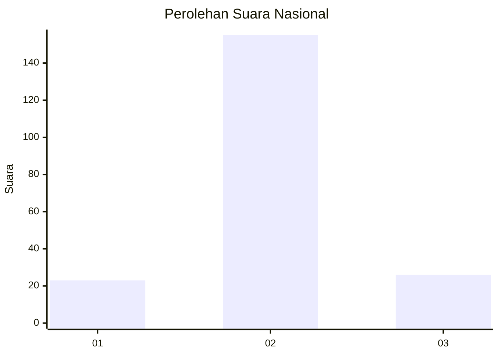
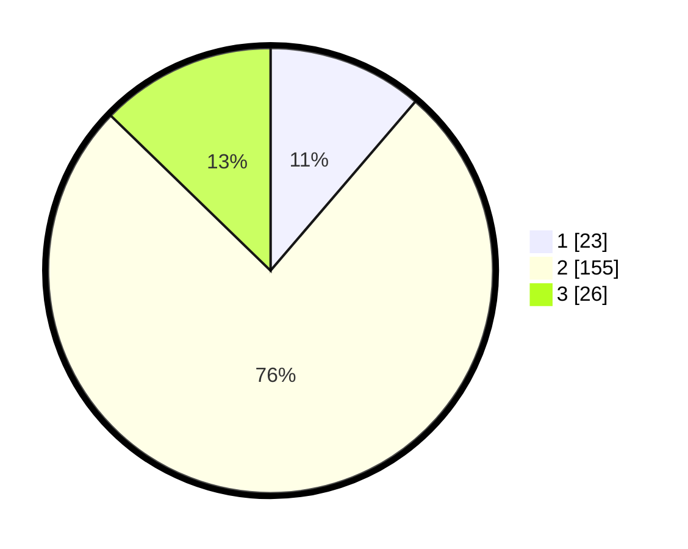

# Hasil

## Grafik

## Tabel

| No. | Nama Paslon    | Suara | Suara (raw) | Persentase |
|:--- |:-------------- | -----:| -----------:| ----------:|
| 1   | ANIES MUHAIMIN | 23    | [23][p-1]   | 11,27      |
| 2   | PRABOWO GIBRAN | 155   | [155][p-2]  | 75,98      |
| 3   | GANJAR MAHFUD  | 26    | [26][p-3]   | 12,75      |

[p-1]: https://github.com/gigit-pemilu/pemilu-2024/blob/main/pilpres/hitung-suara/sub/81-maluku/sub/01-maluku-tengah/sub/25-seram-utara-timur-kobi/sub/2001-kobi/sub/002-tps/sub/paslon-1.txt
[p-2]: https://github.com/gigit-pemilu/pemilu-2024/blob/main/pilpres/hitung-suara/sub/81-maluku/sub/01-maluku-tengah/sub/25-seram-utara-timur-kobi/sub/2001-kobi/sub/002-tps/sub/paslon-2.txt
[p-3]: https://github.com/gigit-pemilu/pemilu-2024/blob/main/pilpres/hitung-suara/sub/81-maluku/sub/01-maluku-tengah/sub/25-seram-utara-timur-kobi/sub/2001-kobi/sub/002-tps/sub/paslon-3.txt

## Foto C Plano

https://sirekap-obj-formc.kpu.go.id/8c44/pemilu/ppwp/81/01/25/20/01/8101252001002-20240215-130220--737c3304-accf-44ae-b039-c1fa52d6236a.jpg

https://sirekap-obj-formc.kpu.go.id/8c44/pemilu/ppwp/81/01/25/20/01/8101252001002-20240224-191554--76f85d1f-8914-40ca-a45b-cacb61364d75.jpg

https://sirekap-obj-formc.kpu.go.id/8c44/pemilu/ppwp/81/01/25/20/01/8101252001002-20240224-191902--7e4078fb-8b44-4cd9-8533-3b46bbc528d0.jpg

## Metadata

| Key        | Value               |
| ---------- | ------------------- |
| Time Stamp | 2024-02-24 22:31:28 |

