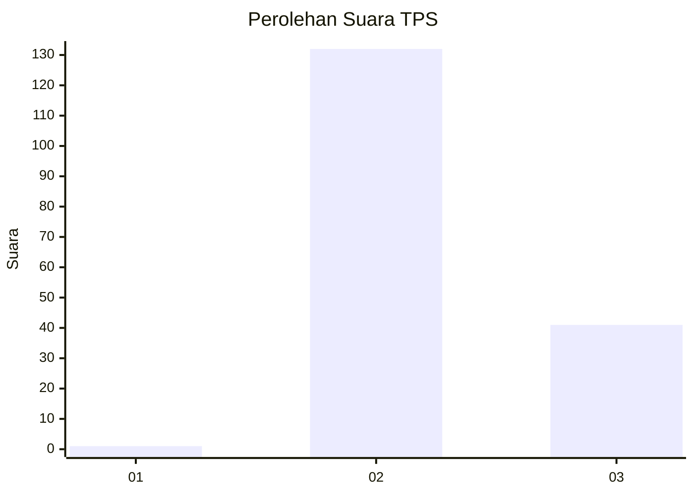
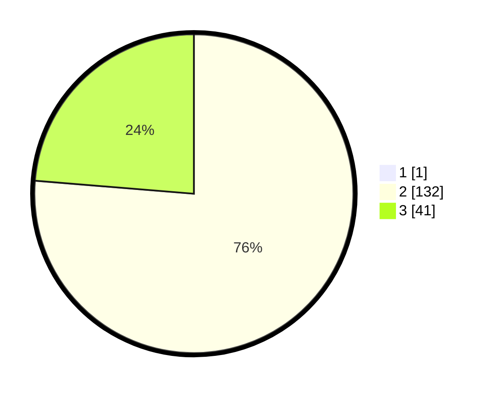

# Hasil

## Grafik

## Tabel

| No. | Nama Paslon    | Suara | Suara (raw) | Persentase |
|:--- |:-------------- | -----:| -----------:| ----------:|
| 1   | ANIES MUHAIMIN | 1     | [1][p-1]    | 0,57       |
| 2   | PRABOWO GIBRAN | 132   | [132][p-2]  | 75,86      |
| 3   | GANJAR MAHFUD  | 41    | [41][p-3]   | 23,56      |

[p-1]: https://github.com/gigit-pemilu/pemilu-2024-81-maluku/blob/main/pilpres/hitung-suara/sub/81-maluku/sub/01-maluku-tengah/sub/26-saparua-timur/sub/2001-ouw/sub/002-tps/sub/paslon-1.txt
[p-2]: https://github.com/gigit-pemilu/pemilu-2024-81-maluku/blob/main/pilpres/hitung-suara/sub/81-maluku/sub/01-maluku-tengah/sub/26-saparua-timur/sub/2001-ouw/sub/002-tps/sub/paslon-2.txt
[p-3]: https://github.com/gigit-pemilu/pemilu-2024-81-maluku/blob/main/pilpres/hitung-suara/sub/81-maluku/sub/01-maluku-tengah/sub/26-saparua-timur/sub/2001-ouw/sub/002-tps/sub/paslon-3.txt

## Foto C Plano

https://sirekap-obj-formc.kpu.go.id/8b2e/pemilu/ppwp/81/01/26/20/01/8101262001002-20240215-154923--425a138d-7afb-4283-9ee4-9abc63ad3fe4.jpg

https://sirekap-obj-formc.kpu.go.id/8b2e/pemilu/ppwp/81/01/26/20/01/8101262001002-20240215-155029--f2aede1d-287a-42c1-9891-be0e87f66a7e.jpg

https://sirekap-obj-formc.kpu.go.id/8b2e/pemilu/ppwp/81/01/26/20/01/8101262001002-20240215-155048--f42bb96c-c8a3-4a76-9865-3bc1345c2494.jpg

## Metadata

| Key        | Value               |
| ---------- | ------------------- |
| Time Stamp | 2024-02-15 23:29:50 |

