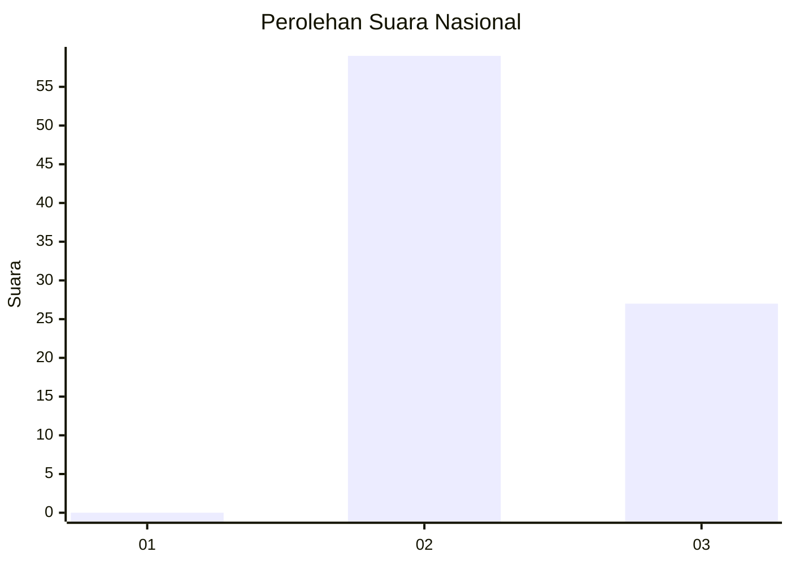
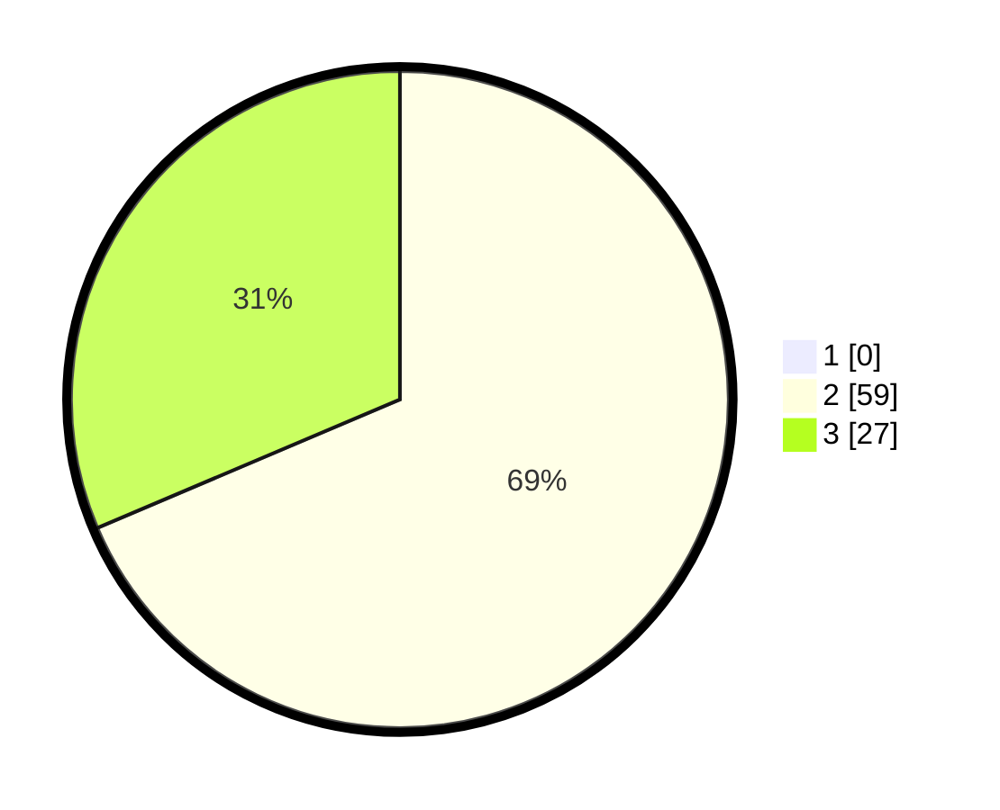

# Hasil

## Grafik

## Tabel

| No. | Nama Paslon    | Suara | Suara (raw) | Persentase |
|:--- |:-------------- | -----:| -----------:| ----------:|
| 1   | ANIES MUHAIMIN | 0     | [0][p-1]    | 0,00       |
| 2   | PRABOWO GIBRAN | 59    | [59][p-2]   | 68,60      |
| 3   | GANJAR MAHFUD  | 27    | [27][p-3]   | 31,40      |

[p-1]: https://github.com/gigit-pemilu/pemilu-2024/blob/main/pilpres/hitung-suara/sub/81-maluku/sub/01-maluku-tengah/sub/26-saparua-timur/sub/2001-ouw/sub/005-tps/sub/paslon-1.txt
[p-2]: https://github.com/gigit-pemilu/pemilu-2024/blob/main/pilpres/hitung-suara/sub/81-maluku/sub/01-maluku-tengah/sub/26-saparua-timur/sub/2001-ouw/sub/005-tps/sub/paslon-2.txt
[p-3]: https://github.com/gigit-pemilu/pemilu-2024/blob/main/pilpres/hitung-suara/sub/81-maluku/sub/01-maluku-tengah/sub/26-saparua-timur/sub/2001-ouw/sub/005-tps/sub/paslon-3.txt

## Foto C Plano

https://sirekap-obj-formc.kpu.go.id/614f/pemilu/ppwp/81/01/26/20/01/8101262001005-20240215-193453--2d0c7668-5406-43f3-b449-5e56b060fdec.jpg

https://sirekap-obj-formc.kpu.go.id/614f/pemilu/ppwp/81/01/26/20/01/8101262001005-20240215-193528--6819678a-f251-4c36-92a2-7b5ca07c30a6.jpg

https://sirekap-obj-formc.kpu.go.id/614f/pemilu/ppwp/81/01/26/20/01/8101262001005-20240215-193555--5c6302a7-e668-4f8e-b589-9c81e8297943.jpg

## Metadata

| Key        | Value               |
| ---------- | ------------------- |
| Time Stamp | 2024-02-15 22:00:27 |

