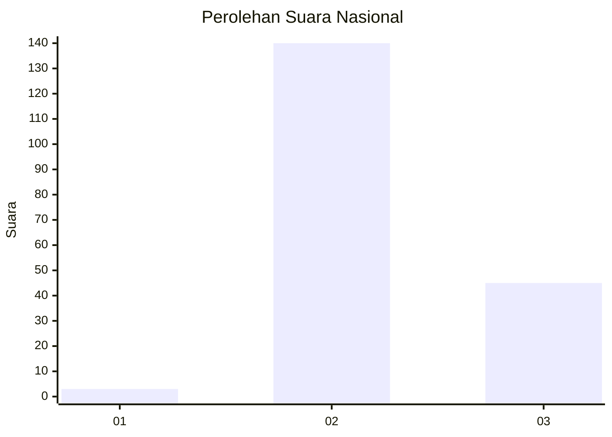
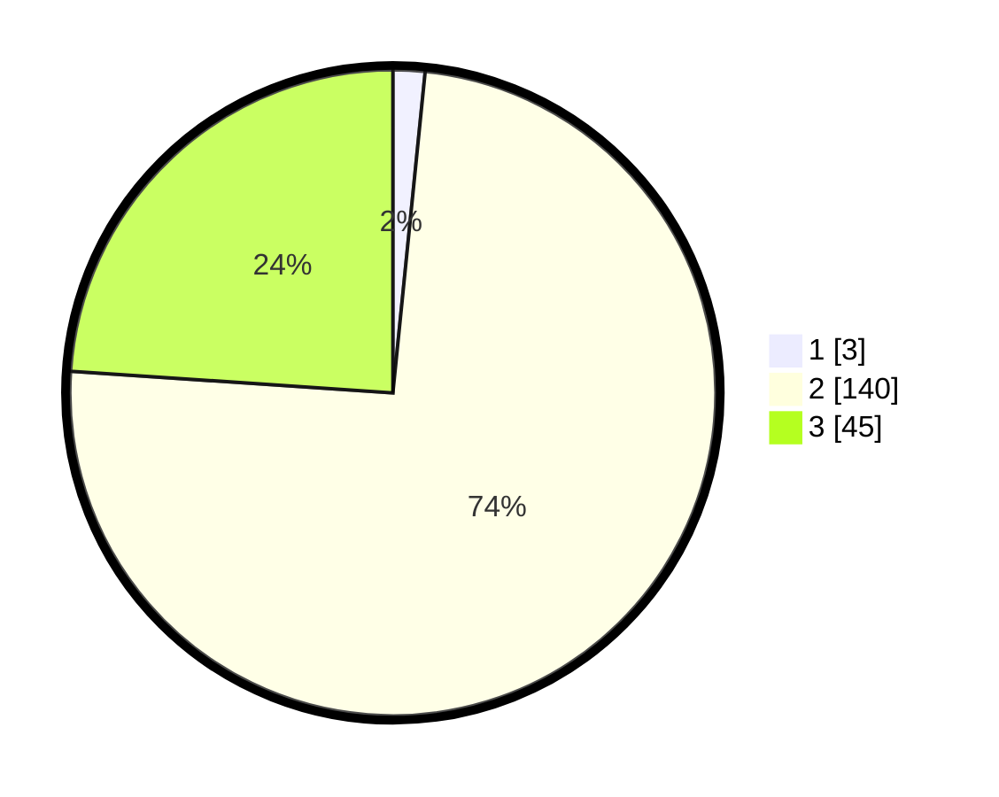

# Hasil

## Grafik

## Tabel

| No. | Nama Paslon    | Suara | Suara (raw) | Persentase |
|:--- |:-------------- | -----:| -----------:| ----------:|
| 1   | ANIES MUHAIMIN | 3     | [3][p-1]    | 1,60       |
| 2   | PRABOWO GIBRAN | 140   | [140][p-2]  | 74,47      |
| 3   | GANJAR MAHFUD  | 45    | [45][p-3]   | 23,94      |

[p-1]: https://github.com/gigit-pemilu/pemilu-2024/blob/main/pilpres/hitung-suara/sub/81-maluku/sub/02-maluku-tenggara/sub/01-kei-kecil/sub/1013-ohoijang-watdek/sub/009-tps/sub/paslon-1.txt
[p-2]: https://github.com/gigit-pemilu/pemilu-2024/blob/main/pilpres/hitung-suara/sub/81-maluku/sub/02-maluku-tenggara/sub/01-kei-kecil/sub/1013-ohoijang-watdek/sub/009-tps/sub/paslon-2.txt
[p-3]: https://github.com/gigit-pemilu/pemilu-2024/blob/main/pilpres/hitung-suara/sub/81-maluku/sub/02-maluku-tenggara/sub/01-kei-kecil/sub/1013-ohoijang-watdek/sub/009-tps/sub/paslon-3.txt

## Foto C Plano

https://sirekap-obj-formc.kpu.go.id/5872/pemilu/ppwp/81/02/01/10/13/8102011013009-20240215-035416--79bdda79-f521-46bf-80dd-de375bc20f99.jpg

https://sirekap-obj-formc.kpu.go.id/5872/pemilu/ppwp/81/02/01/10/13/8102011013009-20240215-035533--af0557e7-aab4-4c41-89c3-74b99235ddb5.jpg

https://sirekap-obj-formc.kpu.go.id/5872/pemilu/ppwp/81/02/01/10/13/8102011013009-20240215-035722--3dd14f1c-9c16-456f-b86c-22742e9a33ff.jpg

## Metadata

| Key        | Value               |
| ---------- | ------------------- |
| Time Stamp | 2024-02-16 16:25:10 |

