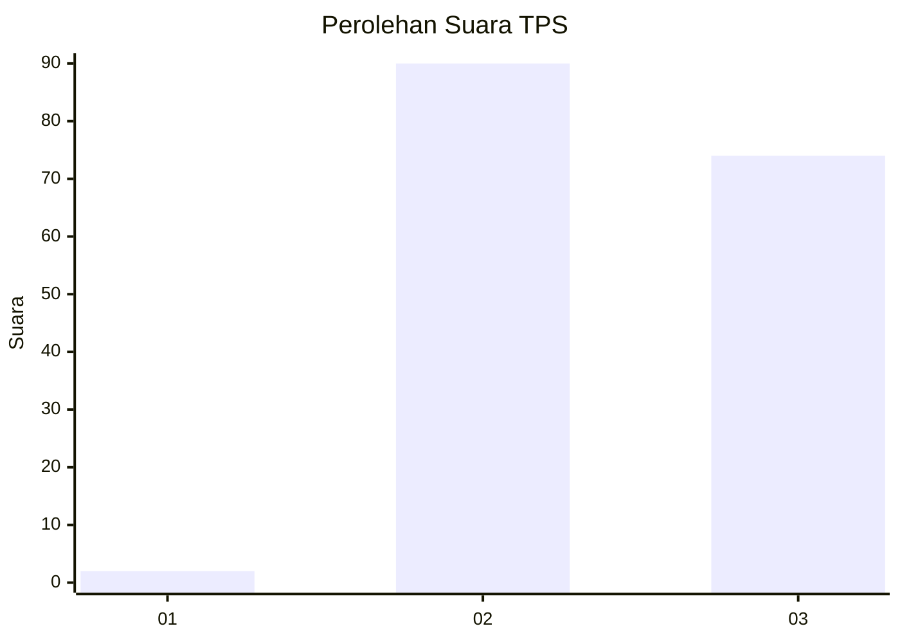
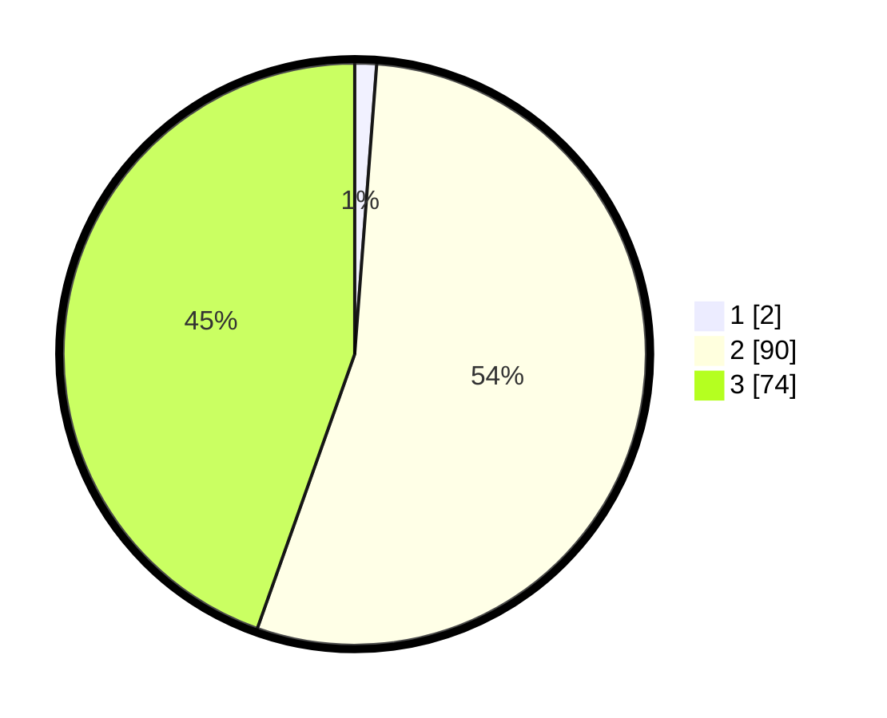

# Hasil

## Grafik

## Tabel

| No. | Nama Paslon    | Suara | Suara (raw) | Persentase |
|:--- |:-------------- | -----:| -----------:| ----------:|
| 1   | ANIES MUHAIMIN | 2     | [2][p-1]    | 1,20       |
| 2   | PRABOWO GIBRAN | 90    | [90][p-2]   | 54,22      |
| 3   | GANJAR MAHFUD  | 74    | [74][p-3]   | 44,58      |

[p-1]: https://github.com/gigit-pemilu/pemilu-2024-81-maluku/blob/main/pilpres/hitung-suara/sub/81-maluku/sub/02-maluku-tenggara/sub/01-kei-kecil/sub/1013-ohoijang-watdek/sub/012-tps/sub/paslon-1.txt
[p-2]: https://github.com/gigit-pemilu/pemilu-2024-81-maluku/blob/main/pilpres/hitung-suara/sub/81-maluku/sub/02-maluku-tenggara/sub/01-kei-kecil/sub/1013-ohoijang-watdek/sub/012-tps/sub/paslon-2.txt
[p-3]: https://github.com/gigit-pemilu/pemilu-2024-81-maluku/blob/main/pilpres/hitung-suara/sub/81-maluku/sub/02-maluku-tenggara/sub/01-kei-kecil/sub/1013-ohoijang-watdek/sub/012-tps/sub/paslon-3.txt

## Foto C Plano

https://sirekap-obj-formc.kpu.go.id/8bd6/pemilu/ppwp/81/02/01/10/13/8102011013012-20240227-162337--2c268d34-bce9-4b36-b78c-2eb5175715ec.jpg

https://sirekap-obj-formc.kpu.go.id/8bd6/pemilu/ppwp/81/02/01/10/13/8102011013012-20240227-162422--3fbcc59c-7e51-4952-966a-f917ada5c120.jpg

https://sirekap-obj-formc.kpu.go.id/8bd6/pemilu/ppwp/81/02/01/10/13/8102011013012-20240227-162500--0aea05d8-6f70-4c3c-962a-fab542774bbe.jpg

## Metadata

| Key        | Value               |
| ---------- | ------------------- |
| Time Stamp | 2024-02-28 21:00:00 |

