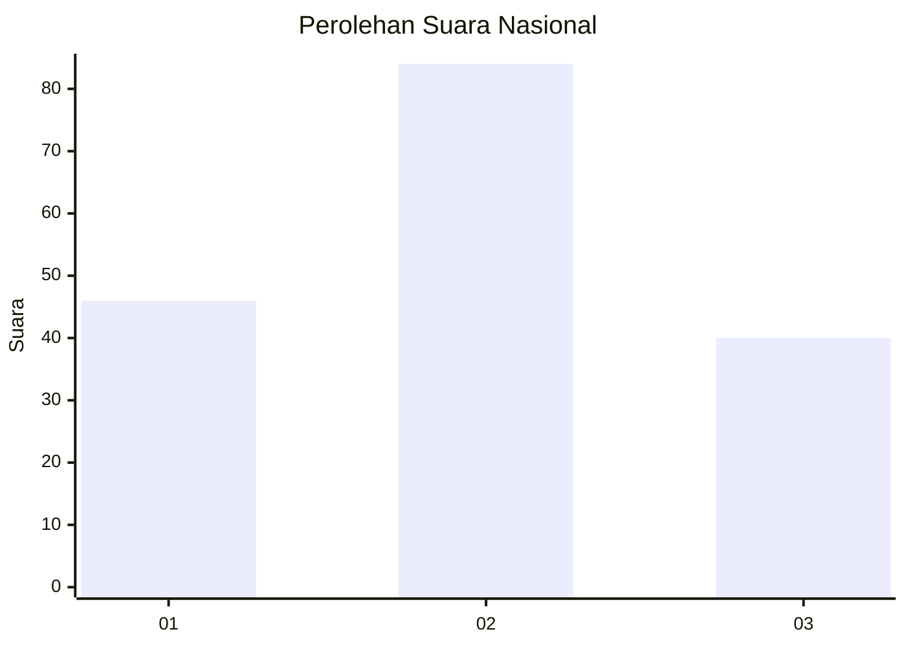
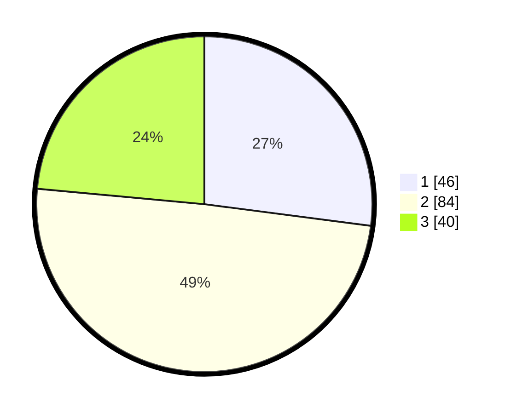

# Hasil

## Grafik

## Tabel

| No. | Nama Paslon    | Suara | Suara (raw) | Persentase |
|:--- |:-------------- | -----:| -----------:| ----------:|
| 1   | ANIES MUHAIMIN | 46    | [46][p-1]   | 27,06      |
| 2   | PRABOWO GIBRAN | 84    | [84][p-2]   | 49,41      |
| 3   | GANJAR MAHFUD  | 40    | [40][p-3]   | 23,53      |

[p-1]: https://github.com/gigit-pemilu/pemilu-2024/blob/main/pilpres/hitung-suara/sub/81-maluku/sub/02-maluku-tenggara/sub/01-kei-kecil/sub/1013-ohoijang-watdek/sub/021-tps/sub/paslon-1.txt
[p-2]: https://github.com/gigit-pemilu/pemilu-2024/blob/main/pilpres/hitung-suara/sub/81-maluku/sub/02-maluku-tenggara/sub/01-kei-kecil/sub/1013-ohoijang-watdek/sub/021-tps/sub/paslon-2.txt
[p-3]: https://github.com/gigit-pemilu/pemilu-2024/blob/main/pilpres/hitung-suara/sub/81-maluku/sub/02-maluku-tenggara/sub/01-kei-kecil/sub/1013-ohoijang-watdek/sub/021-tps/sub/paslon-3.txt

## Foto C Plano

https://sirekap-obj-formc.kpu.go.id/33cb/pemilu/ppwp/81/02/01/10/13/8102011013021-20240214-225945--7da10c85-eaa8-4852-a5e7-d988169f4d6a.jpg

https://sirekap-obj-formc.kpu.go.id/33cb/pemilu/ppwp/81/02/01/10/13/8102011013021-20240214-230300--d32c7b19-9960-49ba-8e2c-0ecea93b32fc.jpg

https://sirekap-obj-formc.kpu.go.id/33cb/pemilu/ppwp/81/02/01/10/13/8102011013021-20240214-225911--a39cf28d-3c84-4068-a641-f680abefe6f1.jpg

## Metadata

| Key        | Value               |
| ---------- | ------------------- |
| Time Stamp | 2024-02-15 20:30:46 |

